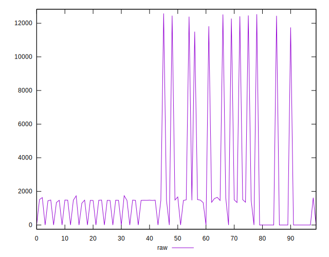
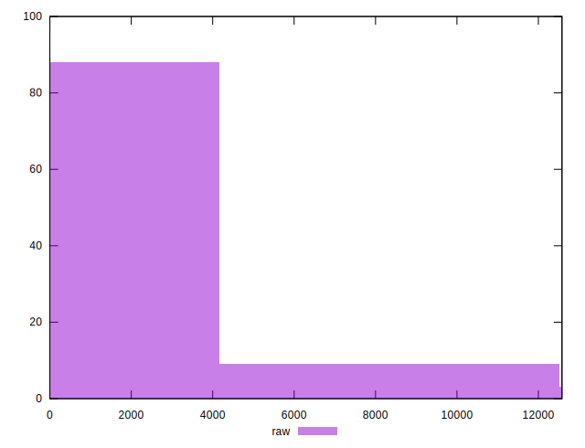
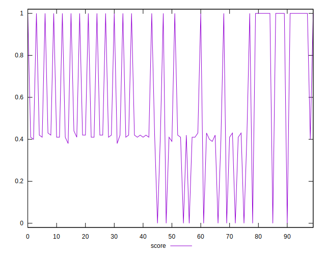
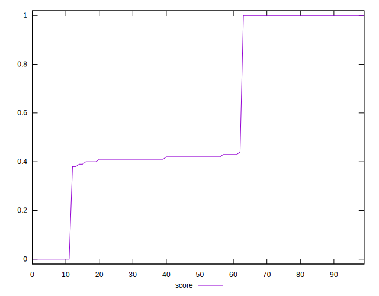
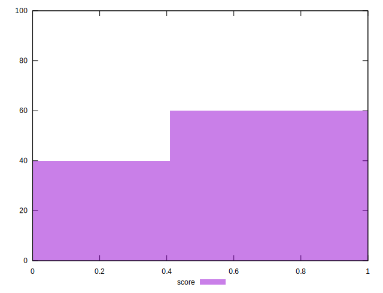
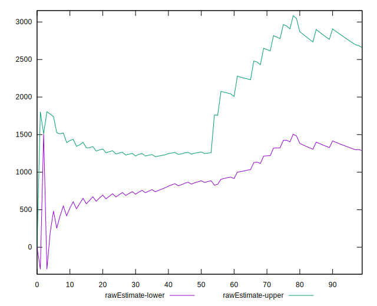
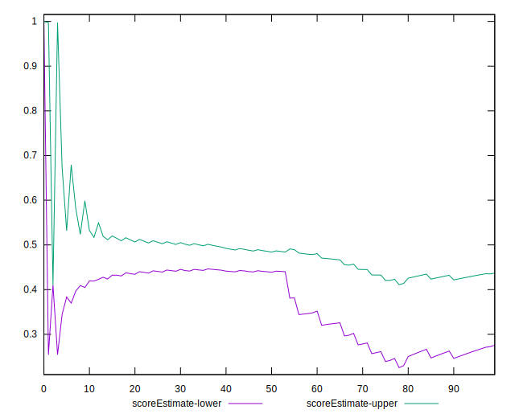
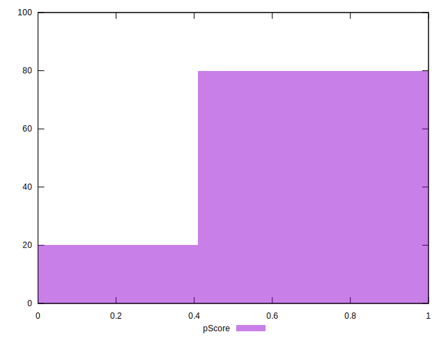
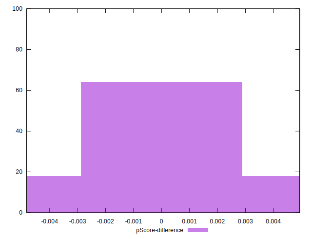

# //uses-rel-preload/samples/pages

[→ Parent](../..)


## Raw


```yaml
p90min: 0
p90max: 12462
p90range: 12462
p90mean: 1972.0851063829787
p90median: 1463.5
p90stdev: 3391.4059648306356
p90skewness: 2.537280377144178
p90eccentricity: 1
p90discretization: 1.9183673469387754
outlandishness: 1.2788418584635202
confidence: 1477.9777605218524
p90confidence: 1371.1783252050466

```


## Score


```yaml
p90min: 0
p90max: 1
p90range: 1
p90mean: 0.5858510638297872
p90median: 0.42
p90stdev: 0.33340732730868944
p90skewness: 0.0973056400793353
p90eccentricity: 0.9999999999999992
p90discretization: 10.444444444444445
outlandishness: 0.9824924151505808
confidence: 0.1357373818073928
p90confidence: 0.13479981618568918

```


## Raw Estimate


## Score Estimate


## P Score


```yaml
p90min: 0
p90max: 1
p90range: 1
p90mean: 0.5858923654568212
p90median: 0.41605882352941176
p90stdev: 0.3333620056350499
p90skewness: 0.09730069287809706
p90eccentricity: 1.0000000000000022
p90discretization: 2.292682926829268
outlandishness: 0.9824852590380464
confidence: 0.1357215291700621
p90confidence: 0.13478149219345678

```


## Score Difference


```yaml
p90min: 0
p90max: 5.551115123125783e-17
p90range: 5.551115123125783e-17
p90mean: 1.0039250754589182e-17
p90median: 0
p90stdev: 2.136594980741552e-17
p90skewness: 1.6583699784683468
p90eccentricity: 1.0000000000000007
p90discretization: 47
outlandishness: 1.222975778546713
confidence: 8.703988572289728e-18
p90confidence: 8.638460737863965e-18

```


## P Score Difference


```yaml
p90min: -0.004588235294117615
p90max: 0.004705882352941171
p90range: 0.009294117647058786
p90mean: 0.00003754693366708632
p90median: 0
p90stdev: 0.0023422920949897528
p90skewness: -0.1013943126443851
p90eccentricity: 0.9999999999999979
p90discretization: 2.6857142857142855
outlandishness: 1.0691560000000309
confidence: 0.001002657178392657
p90confidence: 0.0009470114121561554

```

