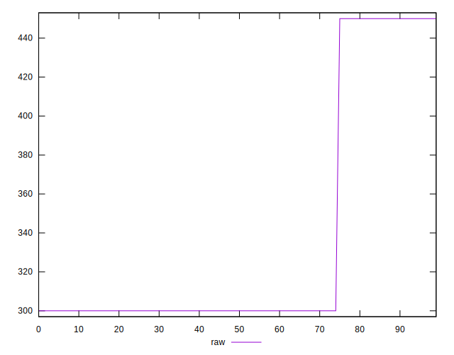

# //uses-text-compression/samples/pages+cached+noadtech+nomedia+nocss

[→ Parent](../..)


## Raw


```yaml
p90min: 300
p90max: 450
p90range: 150
p90mean: 335.1063829787234
p90median: 300
p90stdev: 63.50983641106082
p90skewness: 1.256297269074018
p90eccentricity: 1.0000000000000022
p90discretization: 47
outlandishness: 1.0143367346938774
confidence: 25.460679016713872
p90confidence: 25.677642849965835

```


## Score


```yaml
p90min: 0.67
p90max: 0.75
p90range: 0.07999999999999996
p90mean: 0.7312765957446811
p90median: 0.75
p90stdev: 0.0338719127525658
p90skewness: -1.2562972690740293
p90eccentricity: 0.9999999999999979
p90discretization: 47
outlandishness: 0.9965116305646792
confidence: 0.013579028808914054
p90confidence: 0.013694742853315123

```


## Raw Estimate


## Score Estimate


## P Score


```yaml
p90min: 0.6666666666666666
p90max: 0.75
p90range: 0.08333333333333337
p90mean: 0.7304964539007089
p90median: 0.75
p90stdev: 0.035283242450589405
p90skewness: -1.2562972690739882
p90eccentricity: 0.9999999999999971
p90discretization: 47
outlandishness: 0.996362537114715
confidence: 0.01414482167595216
p90confidence: 0.014265357138869934

```


## Score Difference


```yaml
p90min: 0
p90max: 0
p90range: 0
p90mean: 0
p90median: 0
p90stdev: 0
p90skewness: .nan
p90eccentricity: .nan
p90discretization: 94
outlandishness: .nan
confidence: 0
p90confidence: 0

```


## P Score Difference


```yaml
p90min: -0.0033333333333334103
p90max: 0
p90range: 0.0033333333333334103
p90mean: -0.0007801418439716492
p90median: 0
p90stdev: 0.0014113296980236075
p90skewness: -1.2562972690740157
p90eccentricity: 1.0000000000000002
p90discretization: 47
outlandishness: 1.1410123966942147
confidence: 0.0005657928670380987
p90confidence: 0.00057061428555481

```

