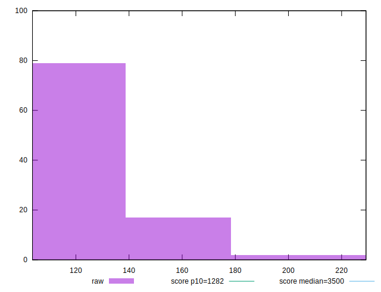
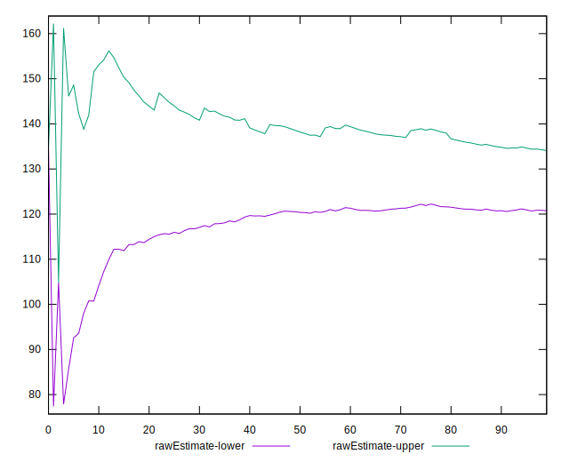
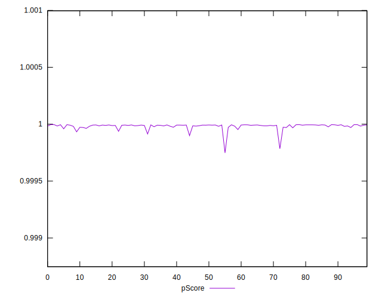
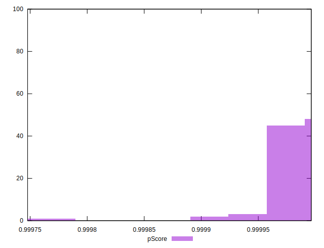
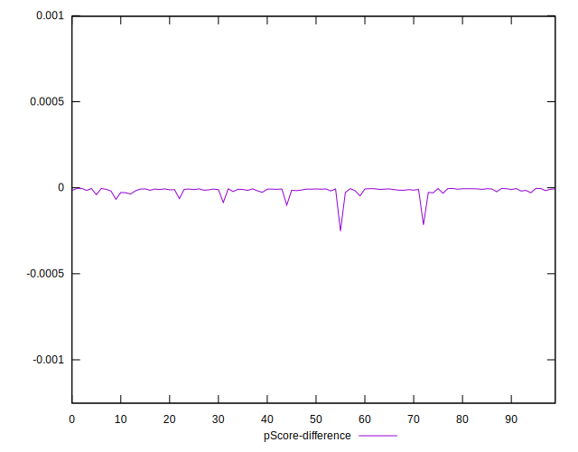
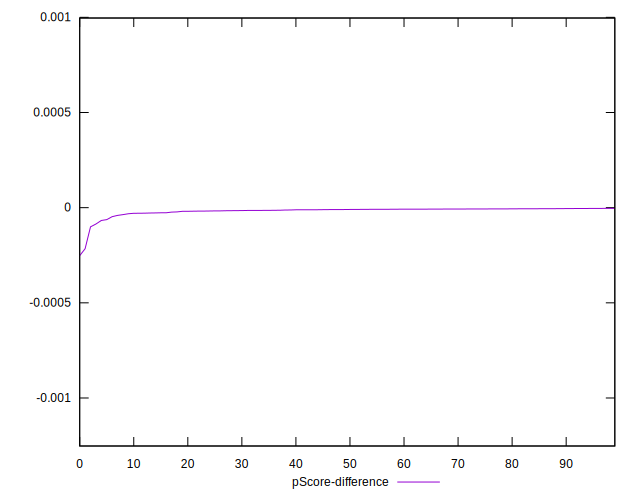

# //bootup-time/samples/pages+cached+noadtech+nomedia+nocss

[→ Parent](../..)


## Raw


```yaml
p90min: 105.58399999999997
p90max: 184.21599999999995
p90range: 78.63199999999998
p90mean: 127.42259574468085
p90median: 122.89599999999996
p90stdev: 16.108425565469755
p90skewness: 1.2277027294282572
p90eccentricity: 1.0000000000000002
p90discretization: 1
outlandishness: 1.0300316885517722
confidence: 8.659416483100152
p90confidence: 6.512792693532344

```


## Score


```yaml
p90min: 1
p90max: 1
p90range: 0
p90mean: 1
p90median: 1
p90stdev: 0
p90skewness: .nan
p90eccentricity: .nan
p90discretization: 94
outlandishness: 1
confidence: 0
p90confidence: 0

```


## Raw Estimate


## Score Estimate


## P Score


```yaml
p90min: 0.999914026357885
p90max: 0.9999960364208397
p90range: 0.00008201006295471824
p90mean: 0.9999853971192733
p90median: 0.9999903746975496
p90stdev: 0.000013618491066126992
p90skewness: -2.885067375237039
p90eccentricity: 1.0000000000000004
p90discretization: 1
outlandishness: 0.9999901551397401
confidence: 0.000013562010533313093
p90confidence: 0.00000550608802529615

```


## Score Difference


```yaml
p90min: 0
p90max: 0
p90range: 0
p90mean: 0
p90median: 0
p90stdev: 0
p90skewness: .nan
p90eccentricity: .nan
p90discretization: 94
outlandishness: .nan
confidence: 0
p90confidence: 0

```


## P Score Difference


```yaml
p90min: -0.00008597364211504477
p90max: -0.000003963579160326525
p90range: 0.00008201006295471824
p90mean: -0.00001460288072689398
p90median: -0.000009625302450411155
p90stdev: 0.000013618491066126997
p90skewness: -2.8850673752284464
p90eccentricity: 0.9999999999999996
p90discretization: 1
outlandishness: 1.7877886633411106
confidence: 0.000013562010533313096
p90confidence: 0.000005506088025296151

```

