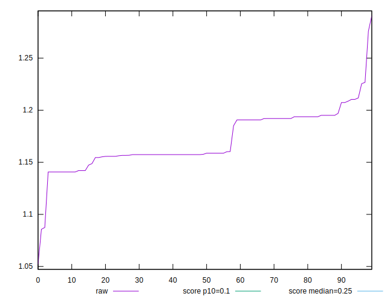
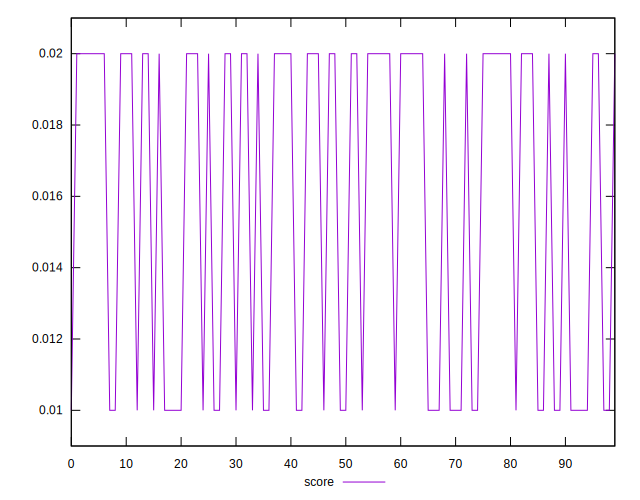
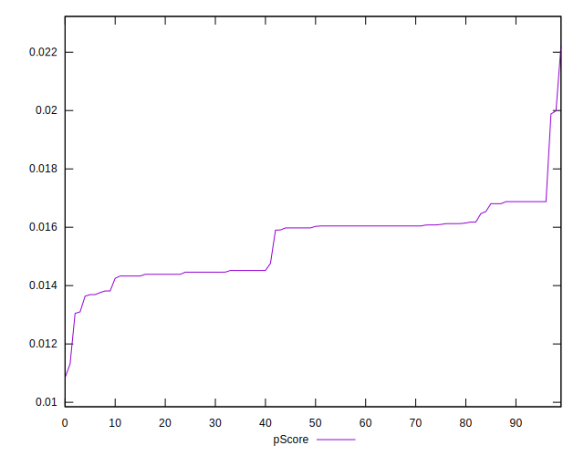

# //cumulative-layout-shift/samples/pages+cached

[→ Parent](../..)


## Raw


```yaml
p90min: 1.1406689402262369
p90max: 1.2254139862060547
p90range: 0.0847450459798178
p90mean: 1.1710476635691693
p90median: 1.158188471476237
p90stdev: 0.022210650480292245
p90skewness: 0.3546615873272871
p90eccentricity: 1
p90discretization: 3.2413793103448274
outlandishness: 0.9998657844645125
confidence: 0.012592918441850757
p90confidence: 0.00897998141275389

```


## Score


```yaml
p90min: 0.01
p90max: 0.02
p90range: 0.01
p90mean: 0.015851063829787244
p90median: 0.02
p90stdev: 0.004927036671025281
p90skewness: -0.34546681367003046
p90eccentricity: 0.9999999999999987
p90discretization: 47
outlandishness: 0.993567424890771
confidence: 0.0019347137966335896
p90confidence: 0.0019920487139727236

```


## Raw Estimate


## Score Estimate


## P Score


```yaml
p90min: 0.013100293117394857
p90max: 0.016877152400296802
p90range: 0.0037768592829019454
p90mean: 0.015434600534718955
p90median: 0.01600393824851018
p90stdev: 0.0010158691561539391
p90skewness: -0.28087249342670423
p90eccentricity: 0.9999999999999999
p90discretization: 3.357142857142857
outlandishness: 1.0060989443934216
confidence: 0.0005908469317778553
p90confidence: 0.0004107257528610806

```


## Score Difference


```yaml
p90min: 0
p90max: 0
p90range: 0
p90mean: 0
p90median: 0
p90stdev: 0
p90skewness: .nan
p90eccentricity: .nan
p90discretization: 94
outlandishness: .nan
confidence: 0
p90confidence: 0

```


## P Score Difference


```yaml
p90min: -0.004022029635621965
p90max: 0.004519133420604513
p90range: 0.008541163056226478
p90mean: -0.0003556066888310763
p90median: -0.0031228475997031983
p90stdev: 0.0038581130680810246
p90skewness: 0.2973243804746411
p90eccentricity: 0.9999999999999991
p90discretization: 3.032258064516129
outlandishness: 0.8017079144822448
confidence: 0.0015253398527666194
p90confidence: 0.001559872533693332

```

