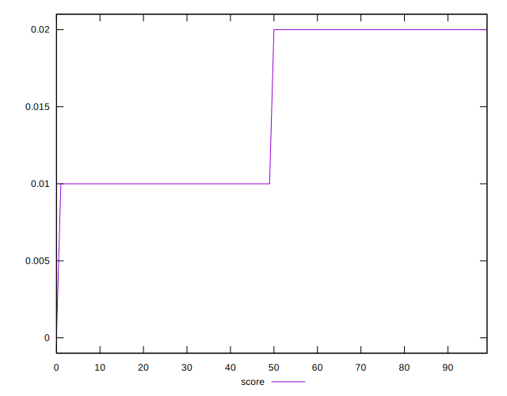
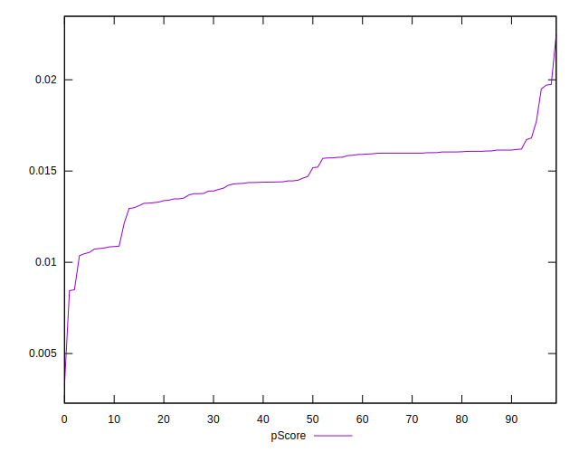
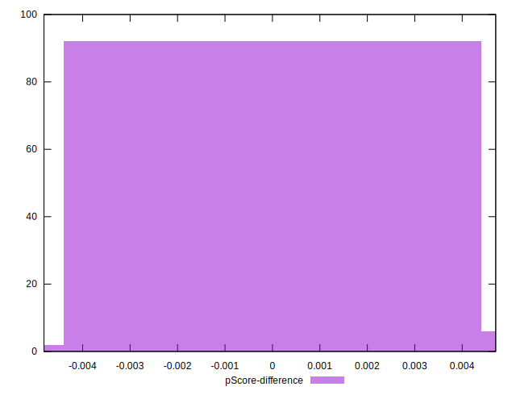

# //cumulative-layout-shift/samples/pages

[→ Parent](../..)


## Raw


```yaml
p90min: 1.093710659450955
p90max: 1.3067596842447917
p90range: 0.2130490247938368
p90mean: 1.189920860056054
p90median: 1.1810043784247504
p90stdev: 0.043547583026929654
p90skewness: 1.1247230770293373
p90eccentricity: 0.9999999999999999
p90discretization: 1.146341463414634
outlandishness: 1.0099760177441013
confidence: 0.030243196361208854
p90confidence: 0.01760671019064362

```


## Score


```yaml
p90min: 0.01
p90max: 0.02
p90range: 0.01
p90mean: 0.015000000000000012
p90median: 0.015
p90stdev: 0.004999999999999998
p90skewness: -6.7711793618893856e-15
p90eccentricity: 1.0000000000000002
p90discretization: 47
outlandishness: 0.9867111111111108
confidence: 0.0020364770911604634
p90confidence: 0.0020215484955566528

```


## Raw Estimate


## Score Estimate


## P Score


```yaml
p90min: 0.01035808192855403
p90max: 0.01949947396285412
p90range: 0.009141392034300089
p90mean: 0.014683000742785553
p90median: 0.01494520726794879
p90stdev: 0.0017674304642020596
p90skewness: -0.7344429089968582
p90eccentricity: 1
p90discretization: 1.175
outlandishness: 0.9919248543176248
confidence: 0.000969903139014579
p90confidence: 0.0007145892791817342

```


## Score Difference


```yaml
p90min: 0
p90max: 0
p90range: 0
p90mean: 0
p90median: 0
p90stdev: 0
p90skewness: .nan
p90eccentricity: .nan
p90discretization: 94
outlandishness: .nan
confidence: 0
p90confidence: 0

```


## P Score Difference


```yaml
p90min: -0.0042827726166462625
p90max: 0.004461182548883011
p90range: 0.008743955165529274
p90mean: -0.00029304898555014336
p90median: -0.00027159977170169644
p90stdev: 0.003582415772322338
p90skewness: 0.12054581333300671
p90eccentricity: 0.9999999999999991
p90discretization: 1.175
outlandishness: 0.8896217716063196
confidence: 0.0014322764776132726
p90confidence: 0.0014484054429993298

```

