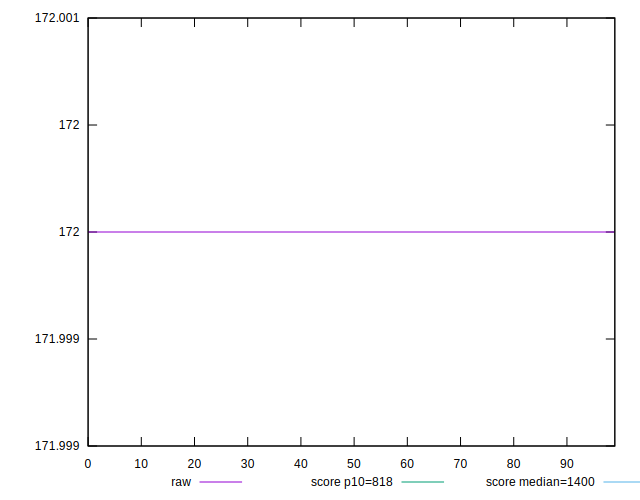
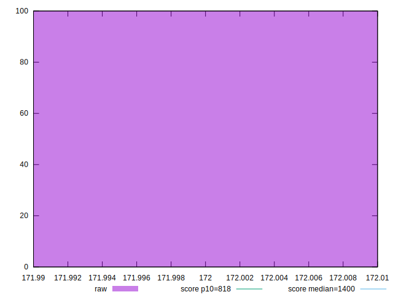
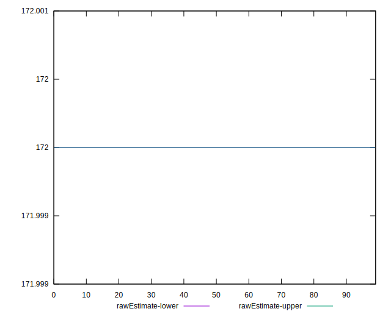
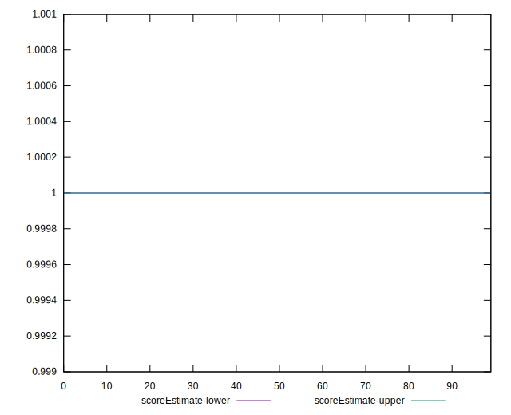
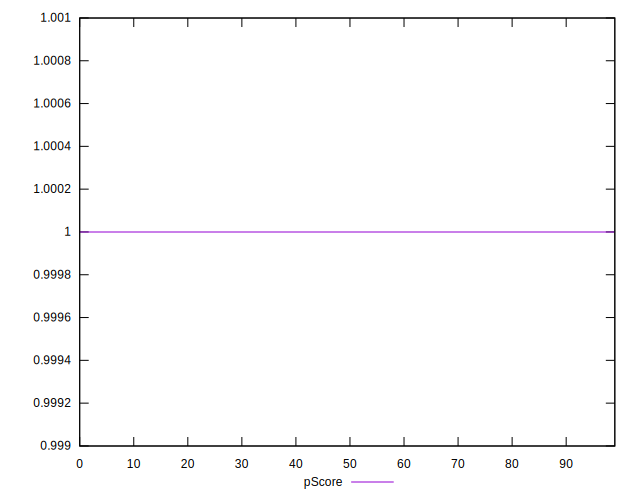
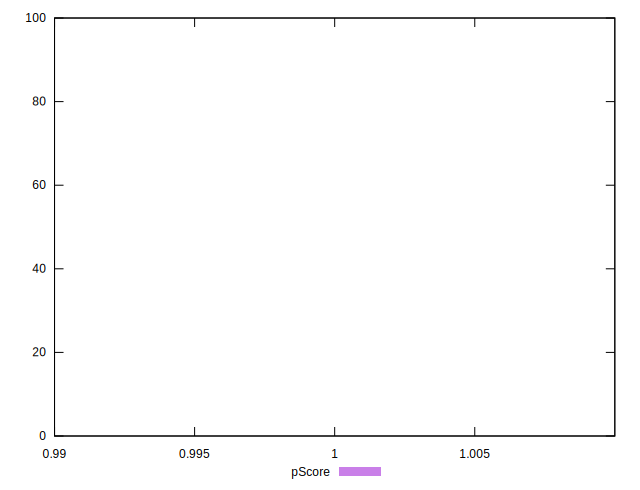
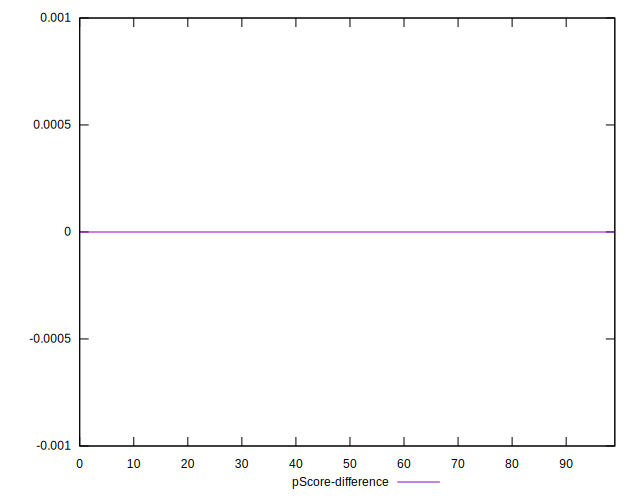
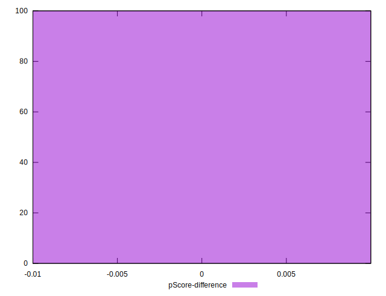

# //dom-size/samples/pages+cached+noadtech+nomedia+nocss

[→ Parent](../..)


## Raw


```yaml
p90min: 172
p90max: 172
p90range: 0
p90mean: 172
p90median: 172
p90stdev: 0
p90skewness: .nan
p90eccentricity: .nan
p90discretization: 94
outlandishness: 1
confidence: 0
p90confidence: 0

```


## Score


```yaml
p90min: 1
p90max: 1
p90range: 0
p90mean: 1
p90median: 1
p90stdev: 0
p90skewness: .nan
p90eccentricity: .nan
p90discretization: 94
outlandishness: 1
confidence: 0
p90confidence: 0

```


## Raw Estimate


## Score Estimate


## P Score


```yaml
p90min: 0.9999997135746177
p90max: 0.9999997135746177
p90range: 0
p90mean: 0.9999997135746193
p90median: 0.9999997135746177
p90stdev: 1.5543122344752192e-15
p90skewness: -1
p90eccentricity: 1
p90discretization: 94
outlandishness: 1.0000000000000009
confidence: 7.398390286446272e-16
p90confidence: 6.284235118457359e-16

```


## Score Difference


```yaml
p90min: 0
p90max: 0
p90range: 0
p90mean: 0
p90median: 0
p90stdev: 0
p90skewness: .nan
p90eccentricity: .nan
p90discretization: 94
outlandishness: .nan
confidence: 0
p90confidence: 0

```


## P Score Difference


```yaml
p90min: -2.864253823009477e-7
p90max: -2.864253823009477e-7
p90range: 0
p90mean: -2.864253823009477e-7
p90median: -2.864253823009477e-7
p90stdev: 0
p90skewness: .nan
p90eccentricity: .nan
p90discretization: 94
outlandishness: 1
confidence: 0
p90confidence: 0

```

