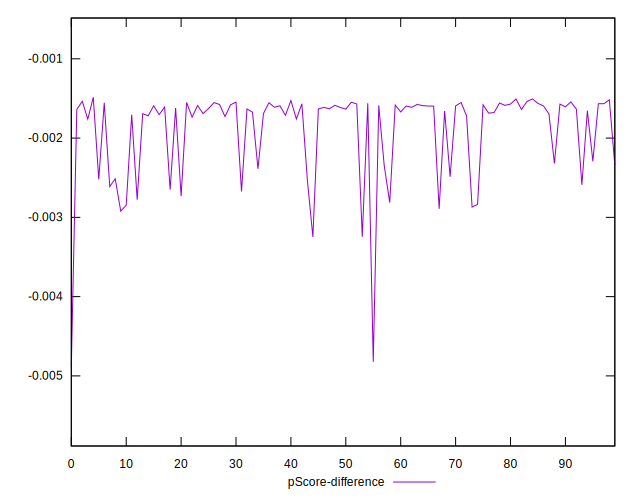

# //first-cpu-idle/samples/pages+cached+noadtech+nomedia+nocss

[→ Parent](../..)


## Raw


```yaml
p90min: 1627.4473
p90max: 1822.5099999999998
p90range: 195.06269999999972
p90mean: 1671.069889361703
p90median: 1644.6595
p90stdev: 54.142439165985515
p90skewness: 1.3457741850911877
p90eccentricity: 1.0000000000000004
p90discretization: 1
outlandishness: 1.0066469151551583
confidence: 26.258448633342645
p90confidence: 21.89031328835313

```


## Score


```yaml
p90min: 1
p90max: 1
p90range: 0
p90mean: 1
p90median: 1
p90stdev: 0
p90skewness: .nan
p90eccentricity: .nan
p90discretization: 94
outlandishness: 1
confidence: 0
p90confidence: 0

```


## Raw Estimate


## Score Estimate


## P Score


```yaml
p90min: 0.9967556634400742
p90max: 0.9984832530098751
p90range: 0.0017275895698009025
p90mean: 0.9981436809805134
p90median: 0.9983684644130402
p90stdev: 0.00045418097286357154
p90skewness: -1.4385997343493229
p90eccentricity: 0.9999999999999994
p90discretization: 1
outlandishness: 0.99987349179721
confidence: 0.00024566848316224296
p90confidence: 0.00018362977248056206

```


## Score Difference


```yaml
p90min: 0
p90max: 0
p90range: 0
p90mean: 0
p90median: 0
p90stdev: 0
p90skewness: .nan
p90eccentricity: .nan
p90discretization: 94
outlandishness: .nan
confidence: 0
p90confidence: 0

```


## P Score Difference


```yaml
p90min: -0.0032443365599258422
p90max: -0.0015167469901249397
p90range: 0.0017275895698009025
p90mean: -0.001856319019487043
p90median: -0.0016315355869597759
p90stdev: 0.00045418097286357154
p90skewness: -1.4385997343469605
p90eccentricity: 0.9999999999999992
p90discretization: 1
outlandishness: 1.0691825496733869
confidence: 0.0002456684831622429
p90confidence: 0.00018362977248056206

```

