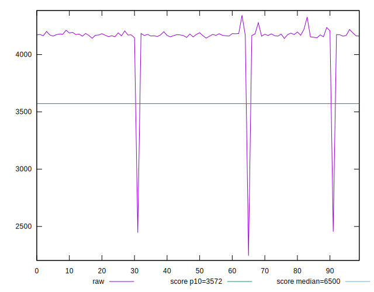
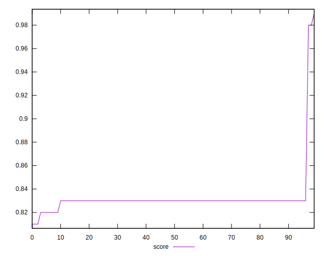
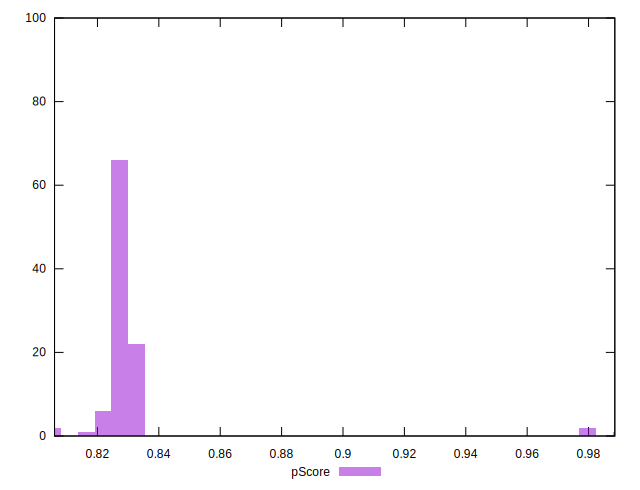

# //first-cpu-idle/samples/pages+cached+noadtech

[→ Parent](../..)


## Raw


```yaml
p90min: 4140.923999999999
p90max: 4236.432000000001
p90range: 95.50800000000163
p90mean: 4173.183646808509
p90median: 4171.3642
p90stdev: 16.913658483854096
p90skewness: 1.048571456691786
p90eccentricity: 1.0000000000000007
p90discretization: 1
outlandishness: 0.9764415635259434
confidence: 120.82729817090214
p90confidence: 6.838356172478856

```


## Score


```yaml
p90min: 0.82
p90max: 0.83
p90range: 0.010000000000000009
p90mean: 0.8292553191489347
p90median: 0.83
p90stdev: 0.002625311208351721
p90skewness: -3.2417635938909024
p90eccentricity: 0.9999999999999989
p90discretization: 47
outlandishness: 1.0097787610008067
confidence: 0.010475159489851943
p90confidence: 0.0010614387847222883

```


## Raw Estimate


## Score Estimate


## P Score


```yaml
p90min: 0.8202628837845917
p90max: 0.8327724658558139
p90range: 0.012509582071222214
p90mean: 0.828575052186951
p90median: 0.828817011589933
p90stdev: 0.002211896473085581
p90skewness: -1.06576236323203
p90eccentricity: 0.9999999999999997
p90discretization: 1
outlandishness: 1.0098999006506233
confidence: 0.010544094507603614
p90confidence: 0.000894291197498645

```


## Score Difference


```yaml
p90min: 0
p90max: 1.1102230246251565e-16
p90range: 1.1102230246251565e-16
p90mean: 1.0747903749030771e-16
p90median: 1.1102230246251565e-16
p90stdev: 1.951478180216298e-17
p90skewness: -5.326002287485482
p90eccentricity: 1.000000000000003
p90discretization: 47
outlandishness: 0.9428196594614175
confidence: 1.0335413782903683e-17
p90confidence: 7.890015558655786e-18

```


## P Score Difference


```yaml
p90min: -0.003982524236921692
p90max: 0.004022169863218239
p90range: 0.00800469410013993
p90mean: -0.0006736024547681936
p90median: -0.0007430466476717745
p90stdev: 0.0016840812868602487
p90skewness: 0.44734503546089255
p90eccentricity: 0.9999999999999999
p90discretization: 1
outlandishness: 0.8848761967072607
confidence: 0.0007775977641662951
p90confidence: 0.0006808903983694898

```

