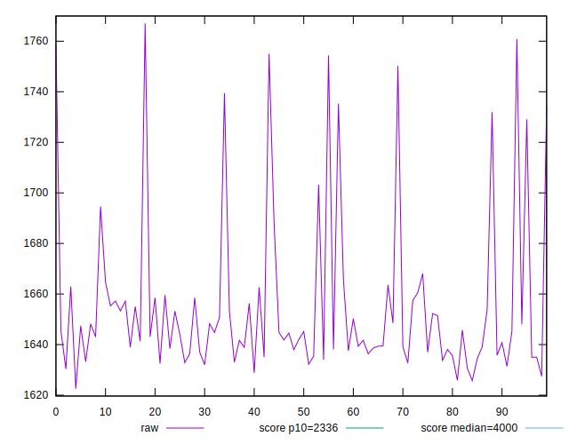
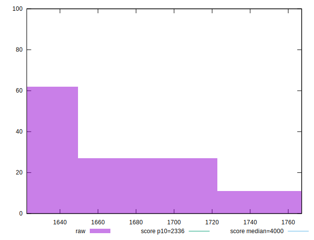
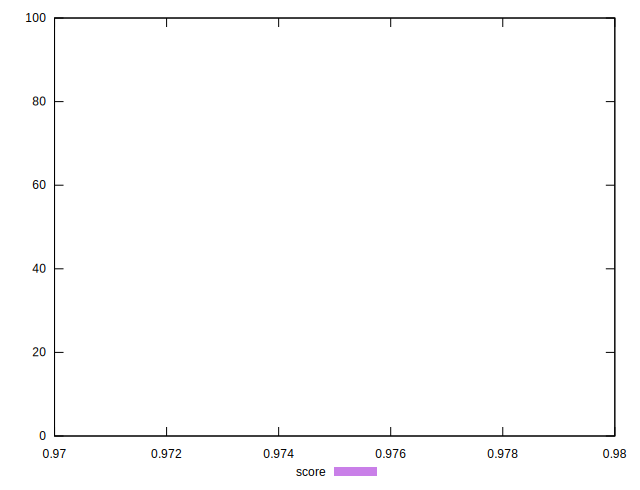
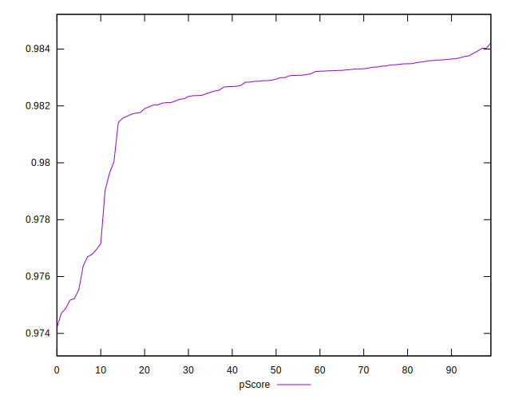
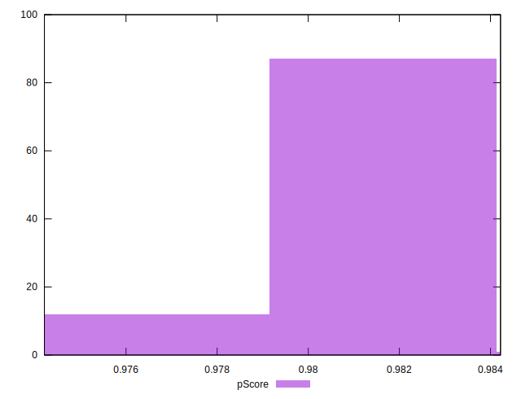
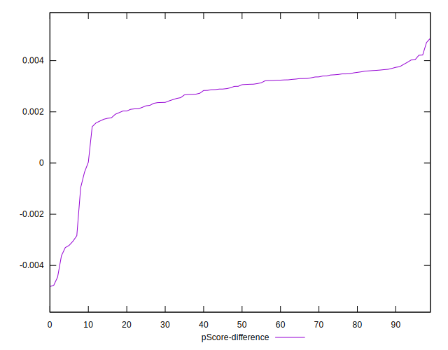

# //first-meaningful-paint/samples/pages+cached+noadtech+nomedia+nocss

[→ Parent](../..)


## Raw


```yaml
p90min: 1627.4473
p90max: 1754.9934999999998
p90range: 127.54619999999977
p90mean: 1653.9876824468092
p90median: 1644.2542249999997
p90stdev: 29.79130545303258
p90skewness: 2.1939110005845923
p90eccentricity: 1.0000000000000009
p90discretization: 1
outlandishness: 1.0028670904404469
confidence: 13.614758344160096
p90confidence: 12.04491374384935

```


## Score


```yaml
p90min: 0.98
p90max: 0.98
p90range: 0
p90mean: 0.9800000000000002
p90median: 0.98
p90stdev: 2.220446049250313e-16
p90skewness: -1
p90eccentricity: 1
p90discretization: 94
outlandishness: 0.9993878488129951
confidence: 0.0006686896191274371
p90confidence: 8.977478740653372e-17

```


## Raw Estimate


## Score Estimate


## P Score


```yaml
p90min: 0.9751739172059535
p90max: 0.9839326098944163
p90range: 0.008758692688462855
p90mean: 0.9822499276584714
p90median: 0.9829230265628255
p90stdev: 0.0020250848085261097
p90skewness: -2.3092287529333695
p90eccentricity: 0.9999999999999996
p90discretization: 1
outlandishness: 0.999645117543606
confidence: 0.0009347105269533898
p90confidence: 0.0008187614296101182

```


## Score Difference


```yaml
p90min: 0
p90max: 0
p90range: 0
p90mean: 0
p90median: 0
p90stdev: 0
p90skewness: .nan
p90eccentricity: .nan
p90discretization: 94
outlandishness: .nan
confidence: 0
p90confidence: 0

```


## P Score Difference


```yaml
p90min: -0.0036204202408127717
p90max: 0.004209079654852399
p90range: 0.00782949989566517
p90mean: 0.0025299243394106817
p90median: 0.003028963228477788
p90stdev: 0.0016109768062239362
p90skewness: -2.51633325371916
p90eccentricity: 1.0000000000000002
p90discretization: 1
outlandishness: 0.88173703718757
confidence: 0.0007945852891180394
p90confidence: 0.0006513335477997321

```

