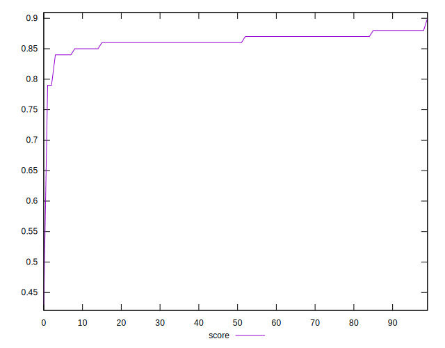

# //first-meaningful-paint/samples/pages+cached

[→ Parent](../..)


## Raw


```yaml
p90min: 2441.7825
p90max: 2647.3995000000004
p90range: 205.61700000000064
p90mean: 2521.121659574468
p90median: 2518.37625
p90stdev: 47.18269732635567
p90skewness: 0.6777909797752582
p90eccentricity: 0.9999999999999994
p90discretization: 1
outlandishness: 1.0169689764199341
confidence: 75.37053823360738
p90confidence: 19.07642215927985

```


## Score


```yaml
p90min: 0.84
p90max: 0.88
p90range: 0.040000000000000036
p90mean: 0.8642553191489356
p90median: 0.86
p90stdev: 0.0098379812950612
p90skewness: -0.46239078556218166
p90eccentricity: 0.9999999999999976
p90discretization: 18.8
outlandishness: 0.9881054980216786
confidence: 0.017869841976445488
p90confidence: 0.003977591257269093

```


## Raw Estimate


## Score Estimate


## P Score


```yaml
p90min: 0.8372908461182209
p90max: 0.8802075894289103
p90range: 0.0429167433106894
p90mean: 0.8641528899705277
p90median: 0.8648632062280025
p90stdev: 0.009809218956110569
p90skewness: -0.7582737815297602
p90eccentricity: 0.9999999999999997
p90discretization: 1
outlandishness: 0.9880009527838733
confidence: 0.01803909361624971
p90confidence: 0.003965962364662226

```


## Score Difference


```yaml
p90min: 0
p90max: 0
p90range: 0
p90mean: 0
p90median: 0
p90stdev: 0
p90skewness: .nan
p90eccentricity: .nan
p90discretization: 94
outlandishness: .nan
confidence: 0
p90confidence: 0

```


## P Score Difference


```yaml
p90min: -0.004683076258720331
p90max: 0.004797657402368927
p90range: 0.009480733661089258
p90mean: -0.00015842851289513542
p90median: -0.00044099142102910216
p90stdev: 0.0028296675153390845
p90skewness: 0.11915866479926594
p90eccentricity: 0.9999999999999994
p90discretization: 1
outlandishness: 0.864001757377271
confidence: 0.0011724425661112715
p90confidence: 0.001144062021711852

```

