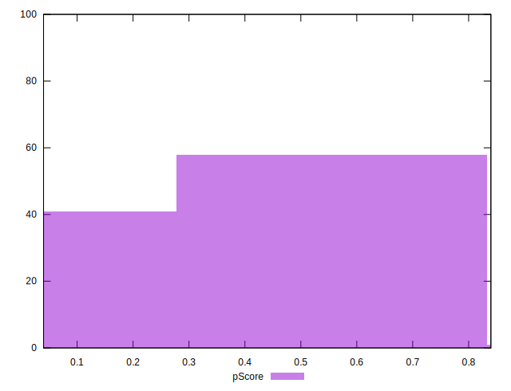

# //first-meaningful-paint/samples/pages

[→ Parent](../..)


## Raw


```yaml
p90min: 2808.6949999999997
p90max: 7598.957999999999
p90range: 4790.262999999999
p90mean: 4558.093356382977
p90median: 4466.62575
p90stdev: 1201.553680615317
p90skewness: 0.23906116769508695
p90eccentricity: 1.0000000000000007
p90discretization: 1
outlandishness: 1.0199742949310193
confidence: 524.8354251061619
p90confidence: 485.7998070756908

```


## Score


```yaml
p90min: 0.06
p90max: 0.8
p90range: 0.74
p90mean: 0.4262765957446807
p90median: 0.395
p90stdev: 0.22565264231591822
p90skewness: 0.02108665995158549
p90eccentricity: 1.0000000000000002
p90discretization: 2.8484848484848486
outlandishness: 1.0029270201903353
confidence: 0.09333659646852221
p90confidence: 0.09123355191842564

```


## Raw Estimate


## Score Estimate


## P Score


```yaml
p90min: 0.06312903658369978
p90max: 0.8002363977261187
p90range: 0.7371073611424188
p90mean: 0.42622733403795243
p90median: 0.39632016742566767
p90stdev: 0.22584468830291313
p90skewness: 0.02154153950411257
p90eccentricity: 1.0000000000000002
p90discretization: 1
outlandishness: 1.0027335103313002
confidence: 0.09336691537113913
p90confidence: 0.09131119797364308

```


## Score Difference


```yaml
p90min: 0
p90max: 5.551115123125783e-17
p90range: 5.551115123125783e-17
p90mean: 1.1810883240693154e-18
p90median: 0
p90stdev: 8.010530753054493e-18
p90skewness: 6.634888026970372
p90eccentricity: 0.9999999999999989
p90discretization: 47
outlandishness: 14.137600000000003
confidence: 7.953559784811416e-18
p90confidence: 3.2387352784895233e-18

```


## P Score Difference


```yaml
p90min: -0.00429222163703441
p90max: 0.0045988017379345325
p90range: 0.008891023374968943
p90mean: -0.00010136286763122087
p90median: -0.00038333098052889536
p90stdev: 0.0024896015025122208
p90skewness: 0.1418641648083414
p90eccentricity: 1.0000000000000002
p90discretization: 1
outlandishness: 0.7974149598745107
confidence: 0.0010468938469097553
p90confidence: 0.001006570034387833

```

