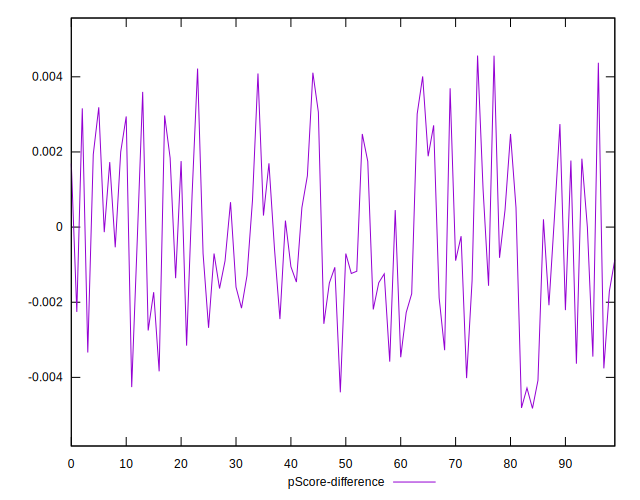

# //interactive/samples/pages+cached+noadtech+nomedia

[→ Parent](../..)


## Raw


```yaml
p90min: 2497.3025
p90max: 4994.4349999999995
p90range: 2497.1324999999997
p90mean: 4816.419498936171
p90median: 4838.2633
p90stdev: 242.7319137281218
p90skewness: -9.266751520757705
p90eccentricity: 1.0000000000000007
p90discretization: 1
outlandishness: 0.9738437209673989
confidence: 185.56692602457522
p90confidence: 98.13886700413441

```


## Score


```yaml
p90min: 0.77
p90max: 0.98
p90range: 0.20999999999999996
p90mean: 0.7909574468085109
p90median: 0.79
p90stdev: 0.019950425204031036
p90skewness: 9.023654086244425
p90eccentricity: 1.0000000000000042
p90discretization: 18.8
outlandishness: 1.0120278816571684
confidence: 0.014949836479758321
p90confidence: 0.008066150411384898

```


## Raw Estimate


## Score Estimate


## P Score


```yaml
p90min: 0.7705162787541711
p90max: 0.9818208124188683
p90range: 0.21130453366469726
p90mean: 0.7905660315935994
p90median: 0.7888774272047769
p90stdev: 0.02020410333472922
p90skewness: 8.998707260987759
p90eccentricity: 1.0000000000000007
p90discretization: 1
outlandishness: 1.0123653952041962
confidence: 0.015247997342412747
p90confidence: 0.008168714940078606

```


## Score Difference


```yaml
p90min: 0
p90max: 0
p90range: 0
p90mean: 0
p90median: 0
p90stdev: 0
p90skewness: .nan
p90eccentricity: .nan
p90discretization: 94
outlandishness: .nan
confidence: 0
p90confidence: 0

```


## P Score Difference


```yaml
p90min: -0.004282256522443961
p90max: 0.0042199374576776805
p90range: 0.008502193980121642
p90mean: -0.0002721387700215829
p90median: -0.0007032333190474804
p90stdev: 0.0022898590935357577
p90skewness: 0.1895351952976077
p90eccentricity: 0.9999999999999997
p90discretization: 1
outlandishness: 0.9209070550347952
confidence: 0.0009757386561972004
p90confidence: 0.0009258122411147867

```

