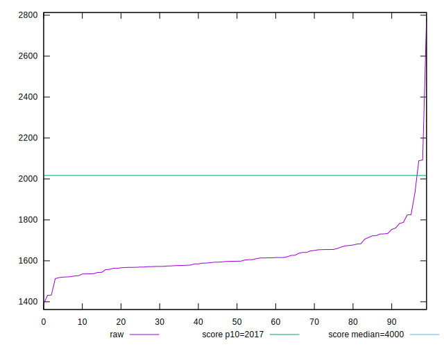
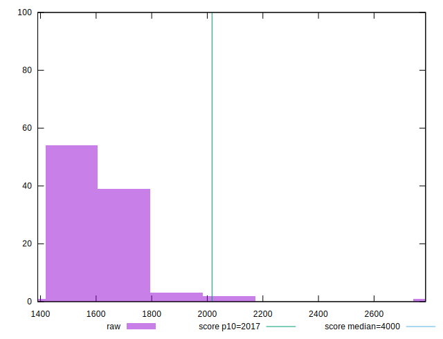
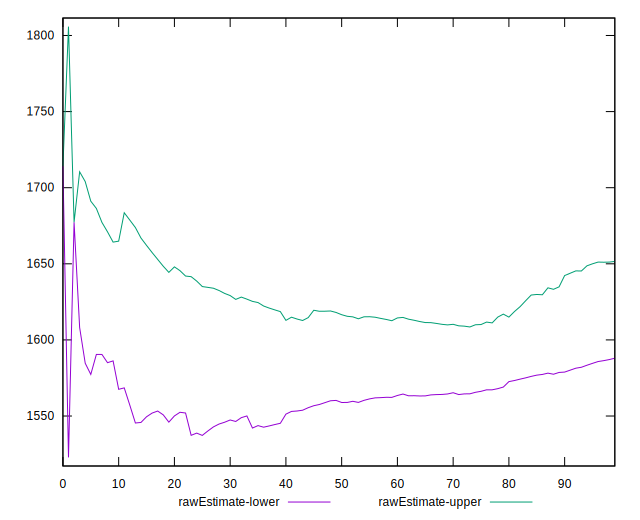
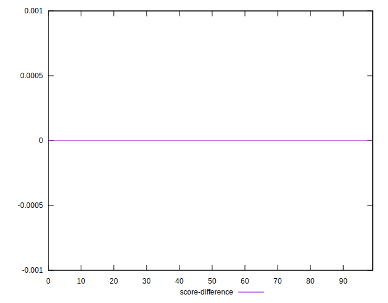

# //mainthread-work-breakdown/samples/pages+cached+noadtech+nomedia

[→ Parent](../..)


## Raw


```yaml
p90min: 1512.8920000000005
p90max: 1932.3960000000009
p90range: 419.50400000000036
p90mean: 1619.7686382978727
p90median: 1597.9800000000005
p90stdev: 76.81255946130712
p90skewness: 1.369130510165432
p90eccentricity: 0.9999999999999999
p90discretization: 1
outlandishness: 1.0186405712338689
confidence: 61.452044164599414
p90confidence: 31.05606280377228

```


## Score


```yaml
p90min: 0.91
p90max: 0.97
p90range: 0.05999999999999994
p90mean: 0.9543617021276599
p90median: 0.96
p90stdev: 0.009736803468470156
p90skewness: -1.7910328509085554
p90eccentricity: 0.999999999999998
p90discretization: 15.666666666666666
outlandishness: 0.9942208362767051
confidence: 0.009549189122753257
p90confidence: 0.00393668408064333

```


## Raw Estimate


## Score Estimate


## P Score


```yaml
p90min: 0.9133626263273161
p90max: 0.9656086048528042
p90range: 0.05224597852548807
p90mean: 0.9542560231367143
p90median: 0.9570493823132062
p90stdev: 0.009056912450304778
p90skewness: -1.719225337436164
p90eccentricity: 1.0000000000000002
p90discretization: 1
outlandishness: 0.9941874006463496
confidence: 0.00946504761321196
p90confidence: 0.00366179754766039

```


## Score Difference


```yaml
p90min: 0
p90max: 1.1102230246251565e-16
p90range: 1.1102230246251565e-16
p90mean: 3.0708296425802203e-17
p90median: 0
p90stdev: 4.9661920064764514e-17
p90skewness: 0.9988681377244392
p90eccentricity: 1.000000000000001
p90discretization: 47
outlandishness: 1.0992715976331358
confidence: 1.9747698583634167e-17
p90confidence: 2.00787959586759e-17

```


## P Score Difference


```yaml
p90min: -0.004897572733617683
p90max: 0.004709323647776875
p90range: 0.009606896381394558
p90mean: -0.000127128997749415
p90median: -0.00019218113681246374
p90stdev: 0.0025849192129435896
p90skewness: 0.05511954375711843
p90eccentricity: 1.0000000000000002
p90discretization: 1
outlandishness: 0.9114916674390997
confidence: 0.0010885697370341693
p90confidence: 0.0010451079092123204

```

