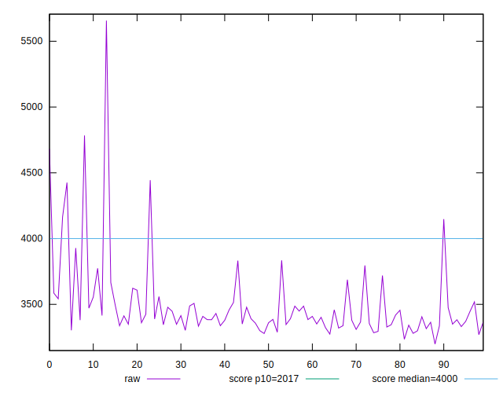
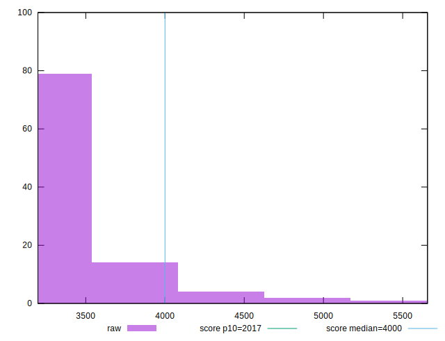
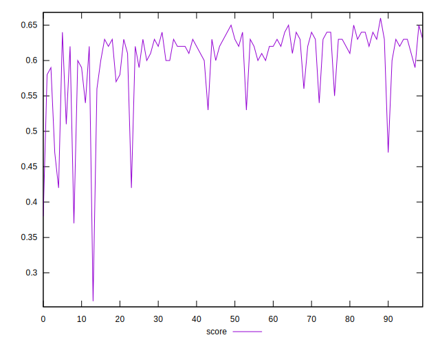

# //mainthread-work-breakdown/samples/pages+cached

[→ Parent](../..)


## Raw


```yaml
p90min: 3273.9879999999966
p90max: 4443.791999999995
p90range: 1169.8039999999983
p90mean: 3467.1797021276593
p90median: 3389.845999999996
p90stdev: 221.13776130612646
p90skewness: 2.6111962430305287
p90eccentricity: 0.9999999999999997
p90discretization: 1
outlandishness: 1.0233334240604977
confidence: 139.1677006599021
p90confidence: 89.40814173583327

```


## Score


```yaml
p90min: 0.42
p90max: 0.65
p90range: 0.23000000000000004
p90mean: 0.6058510638297876
p90median: 0.62
p90stdev: 0.04406015169008583
p90skewness: -2.4378766572920645
p90eccentricity: 0.9999999999999996
p90discretization: 5.875
outlandishness: 0.9781644157583199
confidence: 0.025134534121044706
p90confidence: 0.01781394667261819

```


## Raw Estimate


## Score Estimate


## P Score


```yaml
p90min: 0.4219399550974715
p90max: 0.6461263095324481
p90range: 0.2241863544349766
p90mean: 0.6063778911330072
p90median: 0.6216404292459503
p90stdev: 0.04342757125925531
p90skewness: -2.4383195279547016
p90eccentricity: 1.0000000000000002
p90discretization: 1
outlandishness: 0.9782477640264657
confidence: 0.025007661277585174
p90confidence: 0.01755818826896539

```


## Score Difference


```yaml
p90min: 0
p90max: 0
p90range: 0
p90mean: 0
p90median: 0
p90stdev: 0
p90skewness: .nan
p90eccentricity: .nan
p90discretization: 94
outlandishness: .inf
confidence: 5.258534703630931e-18
p90confidence: 0

```


## P Score Difference


```yaml
p90min: -0.004281965679063693
p90max: 0.004817086476172183
p90range: 0.009099052155235876
p90mean: 0.0005682542254024447
p90median: 0.0007941387957438595
p90stdev: 0.0026183053093005795
p90skewness: -0.176789621140141
p90eccentricity: 1.0000000000000002
p90discretization: 1
outlandishness: 0.9252186148896812
confidence: 0.0010940264976772526
p90confidence: 0.001058606231784917

```

