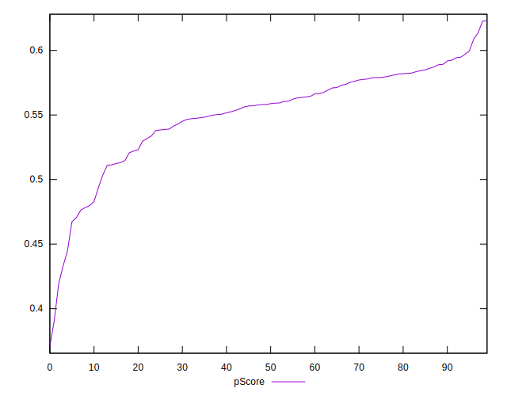

# //mainthread-work-breakdown/samples/pages

[→ Parent](../..)


## Raw


```yaml
p90min: 3450.583999999999
p90max: 4377.379999999995
p90range: 926.7959999999957
p90mean: 3734.099744680848
p90median: 3697.783999999997
p90stdev: 182.84331013617015
p90skewness: 1.3261506207086515
p90eccentricity: 1.0000000000000004
p90discretization: 1
outlandishness: 1.0089177105115974
confidence: 95.04585506580699
p90confidence: 73.92532370567467

```


## Score


```yaml
p90min: 0.43
p90max: 0.61
p90range: 0.18
p90mean: 0.5517021276595743
p90median: 0.56
p90stdev: 0.03577822640705888
p90skewness: -1.2220134604467505
p90eccentricity: 0.9999999999999991
p90discretization: 5.529411764705882
outlandishness: 0.9898676788303494
confidence: 0.017911068434079514
p90confidence: 0.014465483953375043

```


## Raw Estimate


## Score Estimate


## P Score


```yaml
p90min: 0.4329970436910886
p90max: 0.6089378033875217
p90range: 0.17594075969643308
p90mean: 0.5519276493394257
p90median: 0.5584519966306377
p90stdev: 0.03526505539961167
p90skewness: -1.2100362435886012
p90eccentricity: 0.9999999999999997
p90discretization: 1
outlandishness: 0.9901925327597773
confidence: 0.01781661794026667
p90confidence: 0.014258003937761402

```


## Score Difference


```yaml
p90min: 0
p90max: 1.1102230246251565e-16
p90range: 1.1102230246251565e-16
p90mean: 7.086529944415892e-18
p90median: 0
p90stdev: 2.5903289205632336e-17
p90skewness: 3.556209487177141
p90eccentricity: 0.9999999999999996
p90discretization: 31.333333333333332
outlandishness: 1.9881000000000004
confidence: 1.2068449747603987e-17
p90confidence: 1.047295106472299e-17

```


## P Score Difference


```yaml
p90min: -0.00392177386381154
p90max: 0.004712864671790662
p90range: 0.008634638535602202
p90mean: 0.0003358378634543838
p90median: 0.00042625961097914056
p90stdev: 0.0024511676363674086
p90skewness: -0.002112785571837961
p90eccentricity: 1
p90discretization: 1
outlandishness: 0.8768218707465809
confidence: 0.0010407864245470379
p90confidence: 0.0009910308495311387

```

