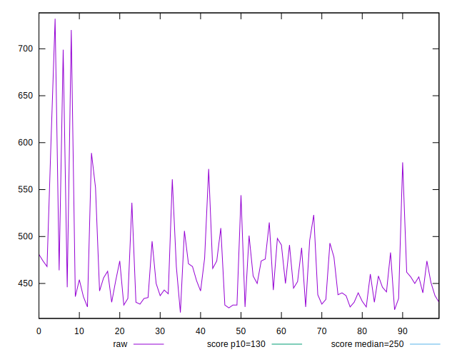
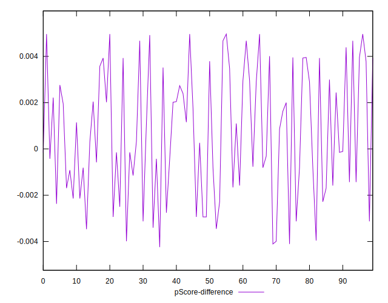

# //max-potential-fid/samples/pages+cached

[→ Parent](../..)


## Raw


```yaml
p90min: 425
p90max: 603
p90range: 178
p90mean: 464.3829787234043
p90median: 452.5
p90stdev: 39.566831795852046
p90skewness: 1.5870453805467408
p90eccentricity: 1
p90discretization: 1.5932203389830508
outlandishness: 1.0273038215892245
confidence: 22.879950330688068
p90confidence: 15.997253858169573

```


## Score


```yaml
p90min: 0.04
p90max: 0.15
p90range: 0.10999999999999999
p90mean: 0.11574468085106383
p90median: 0.12
p90stdev: 0.027346840873292984
p90skewness: -0.8204936365990635
p90eccentricity: 1.0000000000000002
p90discretization: 7.833333333333333
outlandishness: 0.9700801524653989
confidence: 0.01250696618603668
p90confidence: 0.011056593005126528

```


## Raw Estimate


## Score Estimate


## P Score


```yaml
p90min: 0.042218665466525473
p90max: 0.14918989053590703
p90range: 0.10697122506938156
p90mean: 0.11649033802555492
p90median: 0.1224582778557412
p90stdev: 0.026917378150069483
p90skewness: -0.9315458377815304
p90eccentricity: 0.9999999999999996
p90discretization: 1.5932203389830508
outlandishness: 0.9690274292446531
confidence: 0.012392871528712844
p90confidence: 0.0108829570607205

```


## Score Difference


```yaml
p90min: 0
p90max: 0
p90range: 0
p90mean: 0
p90median: 0
p90stdev: 0
p90skewness: .nan
p90eccentricity: .nan
p90discretization: 94
outlandishness: .nan
confidence: 0
p90confidence: 0

```


## P Score Difference


```yaml
p90min: -0.003989691079640506
p90max: 0.004964372903314168
p90range: 0.008954063982954674
p90mean: 0.0006891442203789609
p90median: 0.0003122354859593085
p90stdev: 0.0027051428953881835
p90skewness: -0.021671617678700263
p90eccentricity: 0.9999999999999997
p90discretization: 1.492063492063492
outlandishness: 0.9512774459553998
confidence: 0.0011177082157626422
p90confidence: 0.0010937155100875506

```

