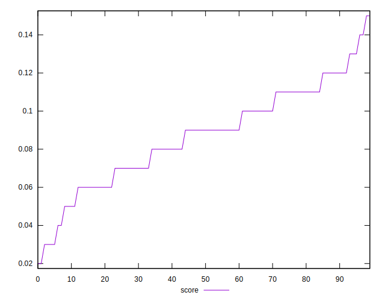
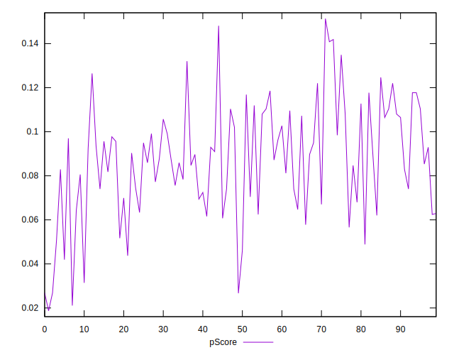
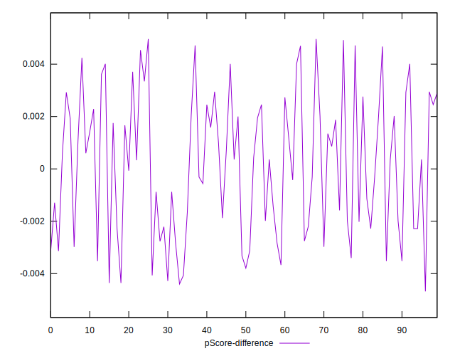
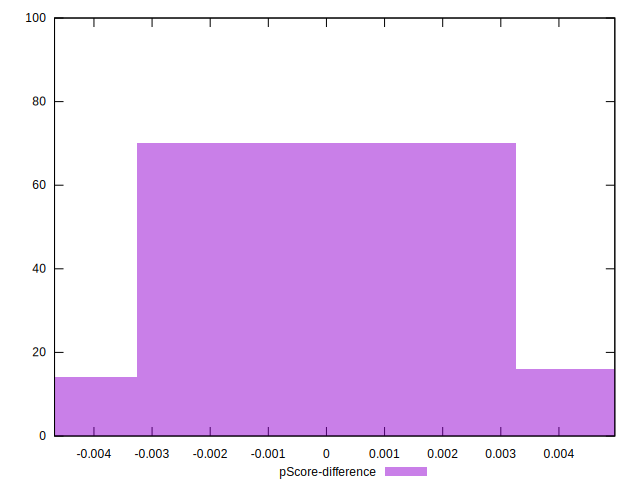

# //max-potential-fid/samples/pages

[→ Parent](../..)


## Raw


```yaml
p90min: 433
p90max: 669
p90range: 236
p90mean: 507.2340425531915
p90median: 497.5
p90stdev: 46.61919646886291
p90skewness: 1.2657206539911119
p90eccentricity: 0.9999999999999997
p90discretization: 1.2207792207792207
outlandishness: 1.013276156537325
confidence: 22.677458860328482
p90confidence: 18.848593297137974

```


## Score


```yaml
p90min: 0.03
p90max: 0.14
p90range: 0.11000000000000001
p90mean: 0.08680851063829789
p90median: 0.09
p90stdev: 0.024763252027415368
p90skewness: -0.23752520509047081
p90eccentricity: 0.9999999999999994
p90discretization: 7.833333333333333
outlandishness: 0.9975015624999992
confidence: 0.011129489422160828
p90confidence: 0.010012022976222357

```


## Raw Estimate


## Score Estimate


## P Score


```yaml
p90min: 0.02686187897531489
p90max: 0.14086052997954235
p90range: 0.11399865100422746
p90mean: 0.0869913724477568
p90median: 0.08873929835329902
p90stdev: 0.024411458489562148
p90skewness: -0.25527715359948294
p90eccentricity: 0.9999999999999996
p90discretization: 1.2207792207792207
outlandishness: 0.9967552054139368
confidence: 0.011055909668521572
p90confidence: 0.009869789436783613

```


## Score Difference


```yaml
p90min: 0
p90max: 0
p90range: 0
p90mean: 0
p90median: 0
p90stdev: 0
p90skewness: .nan
p90eccentricity: .nan
p90discretization: 94
outlandishness: .nan
confidence: 0
p90confidence: 0

```


## P Score Difference


```yaml
p90min: -0.004357423923150333
p90max: 0.004716032485991076
p90range: 0.009073456409141409
p90mean: 0.0001446923158360991
p90median: 0.00036228818439780486
p90stdev: 0.0026452862851210177
p90skewness: 0.02314260669385209
p90eccentricity: 0.9999999999999997
p90discretization: 1.205128205128205
outlandishness: 1.076476931218057
confidence: 0.0011025540965072132
p90confidence: 0.0010695149020006085

```

