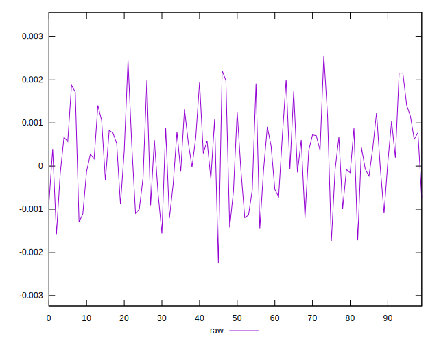
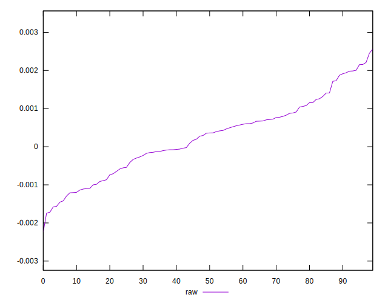
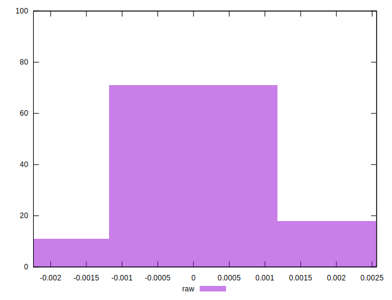

# //meta/pScore-difference/samples/pages

[→ Parent](../..)


## Raw


```yaml
p90min: -0.0015786150998662255
p90max: 0.0021567782348748416
p90range: 0.0037353933347410674
p90mean: 0.00024837300979856525
p90median: 0.00035769442036449206
p90stdev: 0.0009581114828569537
p90skewness: 0.039994420779681725
p90eccentricity: 0.9999999999999992
p90discretization: 1
outlandishness: 1.0027004832697695
confidence: 0.00041925375382116995
p90confidence: 0.00038737376534900584

```

