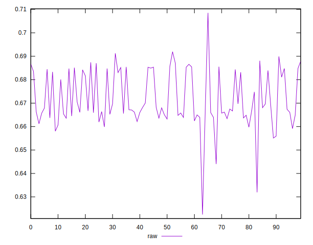
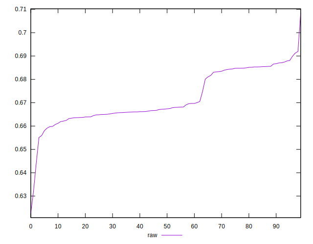
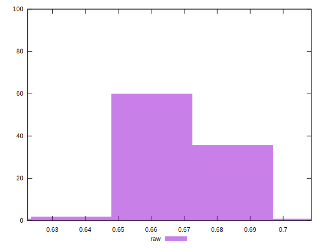

# //meta/pScore/samples/pages+cached+noadtech

[→ Parent](../..)


## Raw


```yaml
p90min: 0.6551001382423638
p90max: 0.6899155210457166
p90range: 0.034815382803352835
p90mean: 0.6721558983400685
p90median: 0.6673154995571815
p90stdev: 0.009936735442664232
p90skewness: 0.4170733929139362
p90eccentricity: 1.0000000000000007
p90discretization: 1
outlandishness: 0.9987274758514502
confidence: 0.00499219256002332
p90confidence: 0.004017518516972471

```

