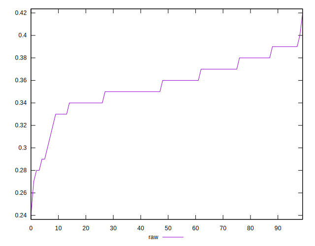

# //meta/score/samples/pages+cached

[→ Parent](../..)


## Raw


```yaml
p90min: 0.28
p90max: 0.39
p90range: 0.10999999999999999
p90mean: 0.35638297872340435
p90median: 0.36
p90stdev: 0.022777885123550758
p90skewness: -0.8788898142704469
p90eccentricity: 0.9999999999999999
p90discretization: 7.833333333333333
outlandishness: 0.9922538650033417
confidence: 0.011259135894148637
p90confidence: 0.009209319880695262

```

