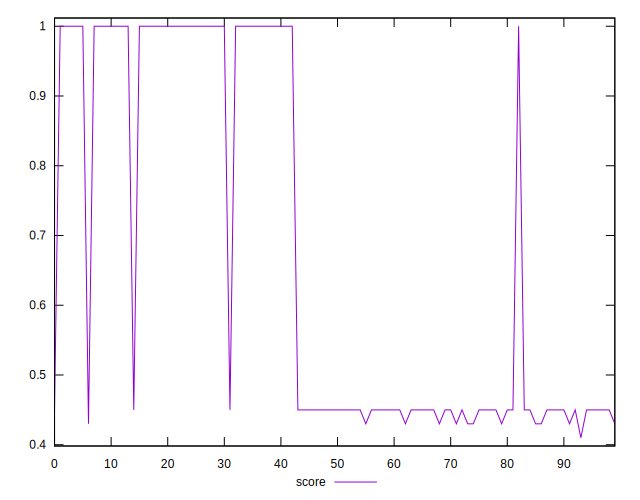
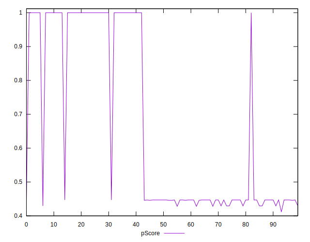
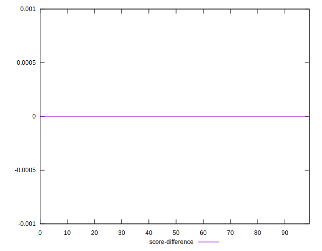
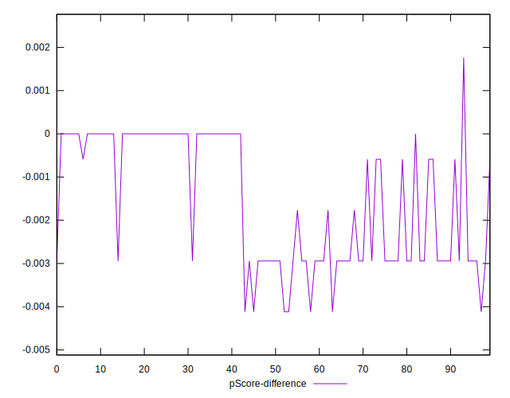

# //offscreen-images/samples/pages

[→ Parent](../..)


## Raw


```yaml
p90min: 0
p90max: 1360
p90range: 1360
p90mean: 744.468085106383
p90median: 1200
p90stdev: 601.442622121881
p90skewness: -0.4179650259996549
p90eccentricity: 1.0000000000000016
p90discretization: 18.8
outlandishness: 0.9933805249219533
confidence: 238.41928699602326
p90confidence: 243.16908558282748

```


## Score


```yaml
p90min: 0.43
p90max: 1
p90range: 0.5700000000000001
p90mean: 0.6643617021276609
p90median: 0.45
p90stdev: 0.27048246299638745
p90skewness: 0.43400834419737055
p90eccentricity: 1.0000000000000009
p90discretization: 31.333333333333332
outlandishness: 1.0085626873931486
confidence: 0.10655295847171194
p90confidence: 0.10935868322896106

```


## Raw Estimate


## Score Estimate


## P Score


```yaml
p90min: 0.42823529411764705
p90max: 1
p90range: 0.571764705882353
p90mean: 0.6627284105131408
p90median: 0.4470588235294118
p90stdev: 0.2717836256690227
p90skewness: 0.43435604910772513
p90eccentricity: 1.000000000000001
p90discretization: 18.8
outlandishness: 1.0088273721506729
confidence: 0.10704200951095028
p90confidence: 0.1098847559176291

```


## Score Difference


```yaml
p90min: 0
p90max: 0
p90range: 0
p90mean: 0
p90median: 0
p90stdev: 0
p90skewness: .nan
p90eccentricity: .nan
p90discretization: 94
outlandishness: .inf
confidence: 2.165089820536966e-18
p90confidence: 0

```


## P Score Difference


```yaml
p90min: -0.004117647058823559
p90max: 0
p90range: 0.004117647058823559
p90mean: -0.0015394242803504316
p90median: -0.0011764705882352788
p90stdev: 0.0014714800374258452
p90skewness: -0.10812598827542388
p90eccentricity: 0.9999999999999962
p90discretization: 18.8
outlandishness: 1.0176380725758496
confidence: 0.0006061509060399695
p90confidence: 0.0005949336511799732

```

