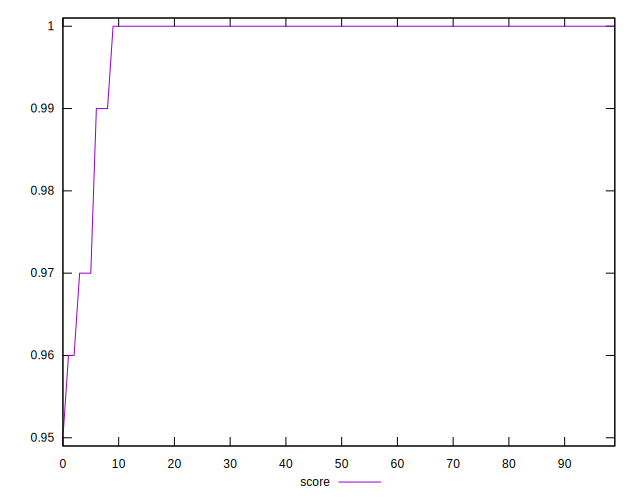
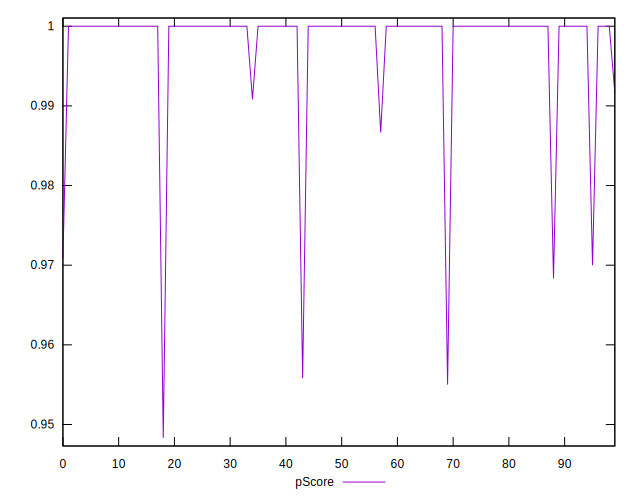
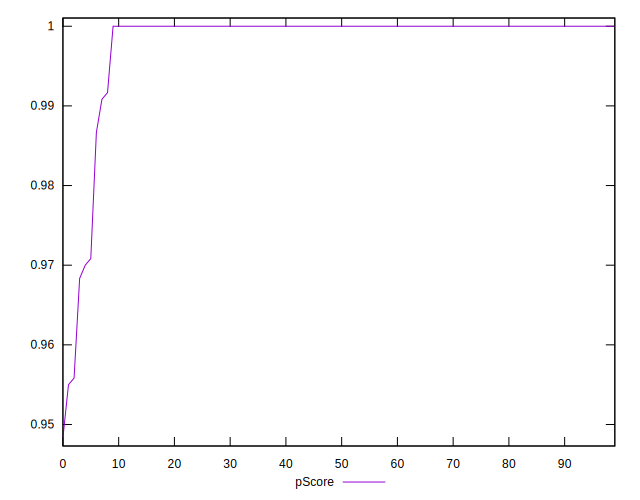
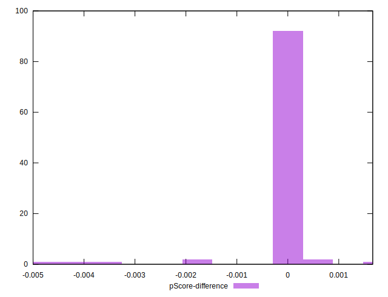

# //render-blocking-resources/samples/pages+cached+noadtech+nomedia+nocss

[→ Parent](../..)


## Raw


```yaml
p90min: 0
p90max: 38
p90range: 38
p90mean: 1.553191489361702
p90median: 0
p90stdev: 6.696485297998541
p90skewness: 4.6351160376785945
p90eccentricity: 0.9999999999999983
p90discretization: 13.428571428571429
outlandishness: 4.1131173766185025
confidence: 4.472627506149455
p90confidence: 2.70745395593724

```


## Score


```yaml
p90min: 0.97
p90max: 1
p90range: 0.030000000000000027
p90mean: 0.9987234042553189
p90median: 1
p90stdev: 0.005503198789947899
p90skewness: -4.653337897768236
p90eccentricity: 1.0000000000000027
p90discretization: 31.333333333333332
outlandishness: 0.9975515644580863
confidence: 0.0035224866203921947
p90confidence: 0.002224996646913674

```


## Raw Estimate


## Score Estimate


## P Score


```yaml
p90min: 0.9683333333333334
p90max: 1
p90range: 0.03166666666666662
p90mean: 0.9987056737588651
p90median: 1
p90stdev: 0.005580404414998778
p90skewness: -4.635116037678583
p90eccentricity: 0.9999999999999996
p90discretization: 13.428571428571429
outlandishness: 0.9973369786513339
confidence: 0.0037271895884578754
p90confidence: 0.0022562116299476975

```


## Score Difference


```yaml
p90min: 0
p90max: 0
p90range: 0
p90mean: 0
p90median: 0
p90stdev: 0
p90skewness: .nan
p90eccentricity: .nan
p90discretization: 94
outlandishness: .inf
confidence: 4.330179641073934e-18
p90confidence: 0

```


## P Score Difference


```yaml
p90min: -0.0016666666666665941
p90max: 0
p90range: 0.0016666666666665941
p90mean: -0.00003546099290779987
p90median: 0
p90stdev: 0.00024050815542996372
p90skewness: -6.634888026970369
p90eccentricity: 0.9999999999999979
p90discretization: 47
outlandishness: 12.425625000000556
confidence: 0.0003077379252693045
p90confidence: 0.0000972397799557098

```

