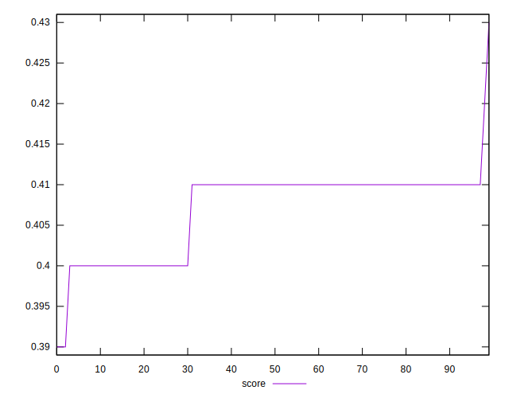
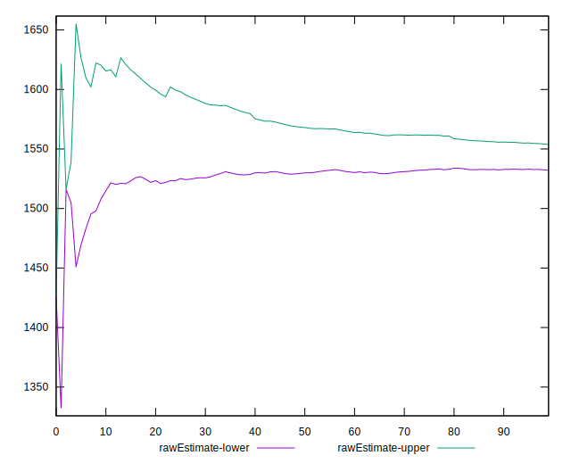
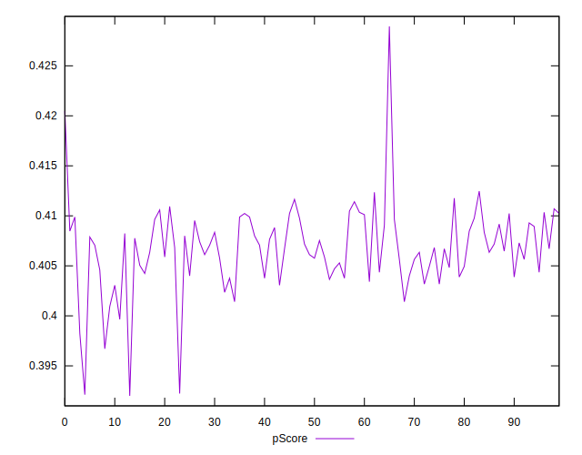
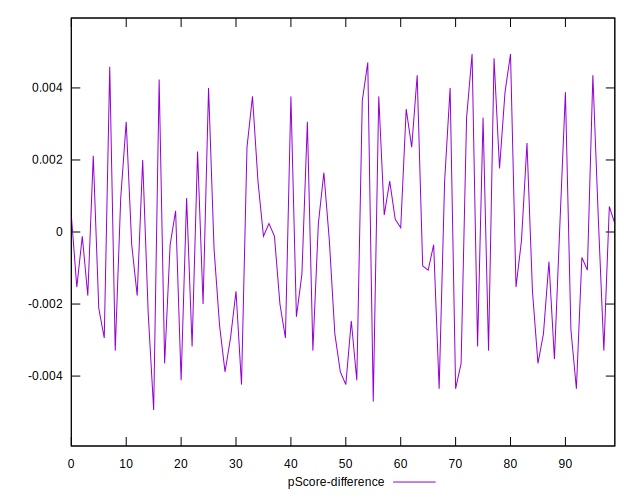
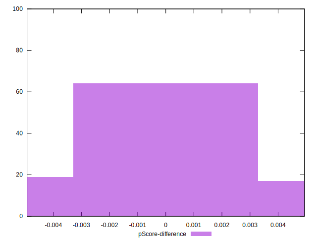

# //render-blocking-resources/samples/pages+cached

[→ Parent](../..)


## Raw


```yaml
p90min: 1495
p90max: 1628
p90range: 133
p90mean: 1543.0106382978724
p90median: 1542
p90stdev: 26.10025461718597
p90skewness: 0.5890384357227223
p90eccentricity: 0.9999999999999997
p90discretization: 1.540983606557377
outlandishness: 1.0002195331549126
confidence: 15.77607920383481
p90confidence: 10.55258609100358

```


## Score


```yaml
p90min: 0.4
p90max: 0.41
p90range: 0.009999999999999953
p90mean: 0.40702127659574405
p90median: 0.41
p90stdev: 0.004573230906426503
p90skewness: -0.8839599998782534
p90eccentricity: 1.0000000000000027
p90discretization: 47
outlandishness: 0.9994041661463406
confidence: 0.002331945348110581
p90confidence: 0.0018490016117439375

```


## Raw Estimate


## Score Estimate


## P Score


```yaml
p90min: 0.3967058823529412
p90max: 0.4123529411764706
p90range: 0.015647058823529403
p90mean: 0.4067046307884856
p90median: 0.4068235294117647
p90stdev: 0.0030706181902571713
p90skewness: -0.5890384357229129
p90eccentricity: 0.9999999999999992
p90discretization: 1.540983606557377
outlandishness: 0.9999020202055606
confidence: 0.0018560093180982123
p90confidence: 0.0012414807165886557

```


## Score Difference


```yaml
p90min: 0
p90max: 5.551115123125783e-17
p90range: 5.551115123125783e-17
p90mean: 3.7794826370218094e-17
p90median: 5.551115123125783e-17
p90stdev: 2.5876348699949434e-17
p90skewness: -0.7759402897989873
p90eccentricity: 1.0000000000000007
p90discretization: 47
outlandishness: 0.9683790039062501
confidence: 1.0231815306134056e-17
p90confidence: 1.046205875697643e-17

```


## P Score Difference


```yaml
p90min: -0.0043529411764705594
p90max: 0.004705882352941171
p90range: 0.00905882352941173
p90mean: -0.00023654568210262138
p90median: -0.00029411764705880583
p90stdev: 0.00266947784366992
p90skewness: 0.2221668283249478
p90eccentricity: 0.9999999999999996
p90discretization: 1.540983606557377
outlandishness: 0.8283889140841512
confidence: 0.0011143111934446234
p90confidence: 0.0010792957837585492

```

