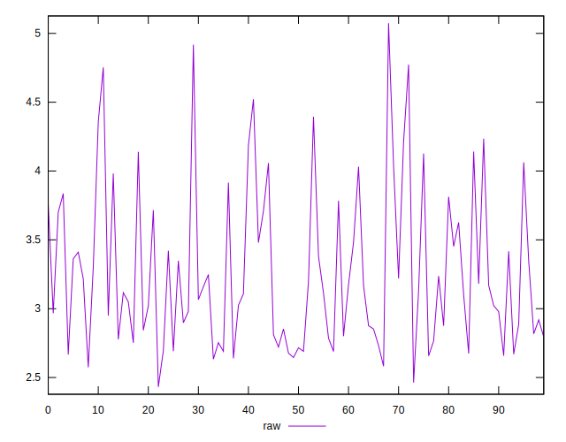
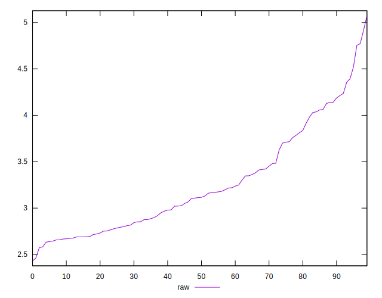
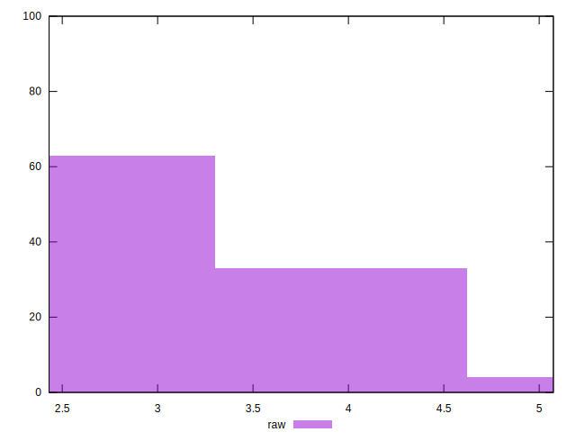
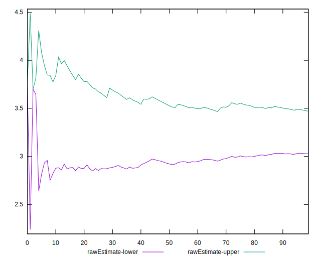

# //server-response-time/samples/pages+cached+noadtech

[→ Parent](../..)


## Raw


```yaml
p90min: 2.582
p90max: 4.753
p90range: 2.1710000000000003
p90mean: 3.247734042553191
p90median: 3.1144999999999996
p90stdev: 0.5368120669508867
p90skewness: 0.8279853503741497
p90eccentricity: 0.9999999999999997
p90discretization: 1.010752688172043
outlandishness: 1.0169854405191572
confidence: 0.23908517654007452
p90confidence: 0.21703832526824451

```


## Score


```yaml
p90min: 1
p90max: 1
p90range: 0
p90mean: 1
p90median: 1
p90stdev: 0
p90skewness: .nan
p90eccentricity: .nan
p90discretization: 94
outlandishness: 1
confidence: 0
p90confidence: 0

```


## Raw Estimate


## Score Estimate


## P Score


```yaml
p90min: 1
p90max: 1
p90range: 0
p90mean: 1
p90median: 1
p90stdev: 0
p90skewness: .nan
p90eccentricity: .nan
p90discretization: 94
outlandishness: 1
confidence: 0
p90confidence: 0

```


## Score Difference


```yaml
p90min: 0
p90max: 0
p90range: 0
p90mean: 0
p90median: 0
p90stdev: 0
p90skewness: .nan
p90eccentricity: .nan
p90discretization: 94
outlandishness: .nan
confidence: 0
p90confidence: 0

```


## P Score Difference


```yaml
p90min: 0
p90max: 0
p90range: 0
p90mean: 0
p90median: 0
p90stdev: 0
p90skewness: .nan
p90eccentricity: .nan
p90discretization: 94
outlandishness: .nan
confidence: 0
p90confidence: 0

```

