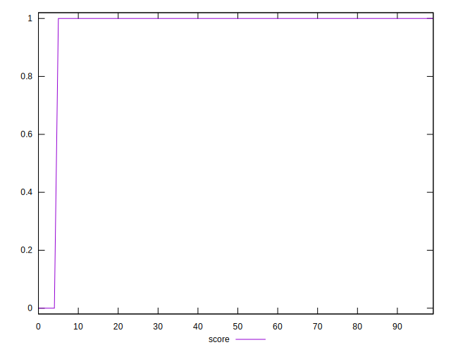

# //server-response-time/samples/pages

[→ Parent](../..)


## Raw


```yaml
p90min: 98.337
p90max: 780.961
p90range: 682.624
p90mean: 145.02365957446807
p90median: 114.90299999999999
p90stdev: 107.45621130790936
p90skewness: 4.0633966518814315
p90eccentricity: 1.0000000000000002
p90discretization: 1
outlandishness: 3.074411930018958
confidence: 289.62129359684803
p90confidence: 43.44558846154441

```


## Score


```yaml
p90min: 0
p90max: 1
p90range: 1
p90mean: 0.9787234042553191
p90median: 1
p90stdev: 0.14430489325798443
p90skewness: -6.6348880269703825
p90eccentricity: 0.9999999999999988
p90discretization: 47
outlandishness: 0.9421656427221172
confidence: 0.0854328494158941
p90confidence: 0.05834386797342838

```


## Raw Estimate


## Score Estimate


## P Score


```yaml
p90min: 0
p90max: 1
p90range: 1
p90mean: 0.9787234042553191
p90median: 1
p90stdev: 0.14430489325798443
p90skewness: -6.6348880269703825
p90eccentricity: 0.9999999999999988
p90discretization: 47
outlandishness: 0.9421656427221172
confidence: 0.0854328494158941
p90confidence: 0.05834386797342838

```


## Score Difference


```yaml
p90min: 0
p90max: 0
p90range: 0
p90mean: 0
p90median: 0
p90stdev: 0
p90skewness: .nan
p90eccentricity: .nan
p90discretization: 94
outlandishness: .nan
confidence: 0
p90confidence: 0

```


## P Score Difference


```yaml
p90min: 0
p90max: 0
p90range: 0
p90mean: 0
p90median: 0
p90stdev: 0
p90skewness: .nan
p90eccentricity: .nan
p90discretization: 94
outlandishness: .nan
confidence: 0
p90confidence: 0

```

