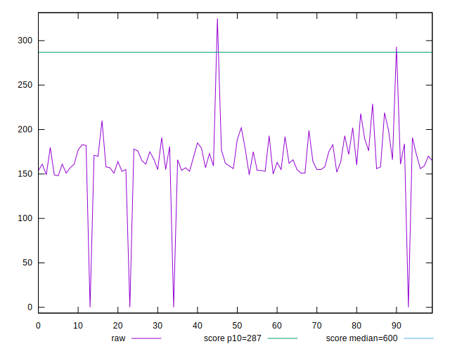
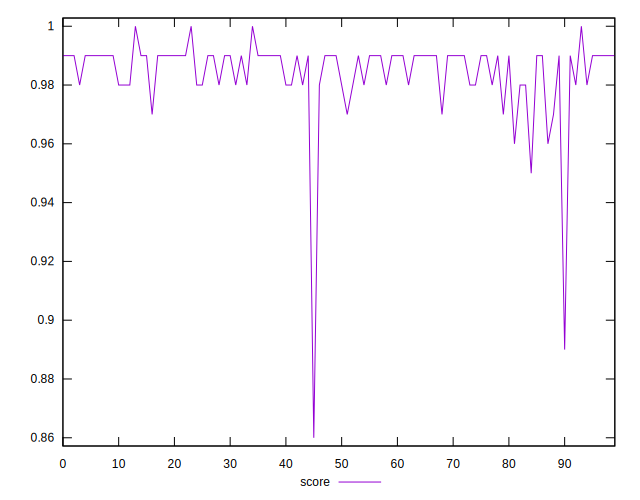
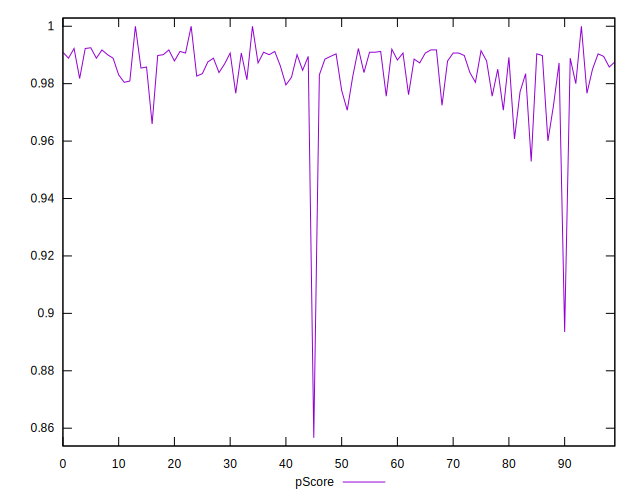
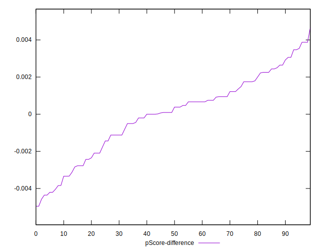

# //total-blocking-time/samples/pages+cached+noadtech+nomedia

[→ Parent](../..)


## Raw


```yaml
p90min: 0
p90max: 219
p90range: 219
p90mean: 166.7659574468085
p90median: 163.49999999999966
p90stdev: 23.774394205278433
p90skewness: -3.2215650717915914
p90eccentricity: 0.9999999999999991
p90discretization: 1.323943661971831
outlandishness: 0.9816643134096352
confidence: 16.684979428904075
p90confidence: 9.612218167690287

```


## Score


```yaml
p90min: 0.96
p90max: 1
p90range: 0.040000000000000036
p90mean: 0.985744680851063
p90median: 0.99
p90stdev: 0.00706946711737709
p90skewness: -1.5291129722446144
p90eccentricity: 1.000000000000001
p90discretization: 18.8
outlandishness: 0.9956533414670016
confidence: 0.006913312813951643
p90confidence: 0.002858254123104178

```


## Raw Estimate


## Score Estimate


## P Score


```yaml
p90min: 0.9600681142336948
p90max: 1
p90range: 0.03993188576630524
p90mean: 0.9856492322263358
p90median: 0.9880691053362578
p90stdev: 0.007023208558528688
p90skewness: -1.4948592087160515
p90eccentricity: 1.0000000000000002
p90discretization: 1.5161290322580645
outlandishness: 0.9957279712215585
confidence: 0.00690185879038336
p90confidence: 0.0028395513390948564

```


## Score Difference


```yaml
p90min: 0
p90max: 0
p90range: 0
p90mean: 0
p90median: 0
p90stdev: 0
p90skewness: .nan
p90eccentricity: .nan
p90discretization: 94
outlandishness: .inf
confidence: 4.330179641073932e-18
p90confidence: 0

```


## P Score Difference


```yaml
p90min: -0.004355862049517212
p90max: 0.00387291554960556
p90range: 0.008228777599122772
p90mean: -0.00004000286071164023
p90median: 0.00023835100564140177
p90stdev: 0.002084676397837198
p90skewness: -0.3668646474646869
p90eccentricity: 0.9999999999999994
p90discretization: 1.5666666666666667
outlandishness: 2.1299868430755913
confidence: 0.0009024993315839159
p90confidence: 0.0008428548871540502

```

