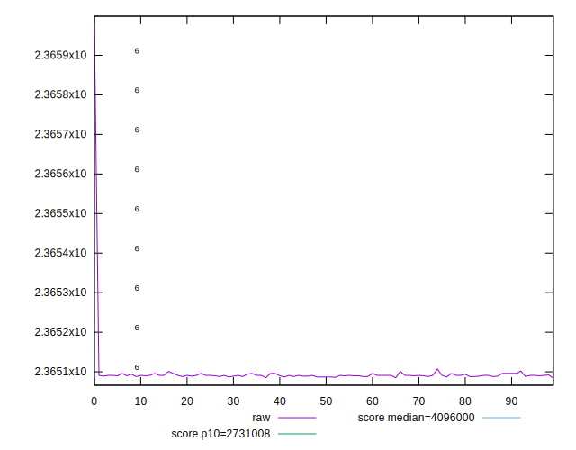
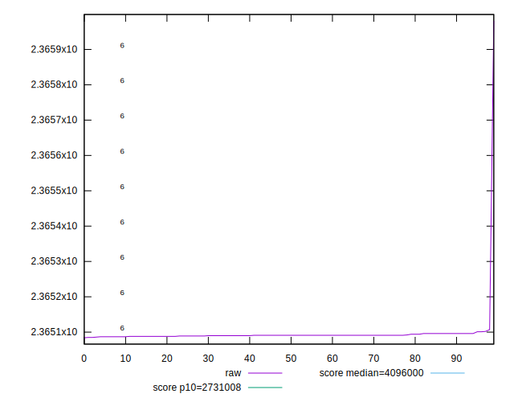
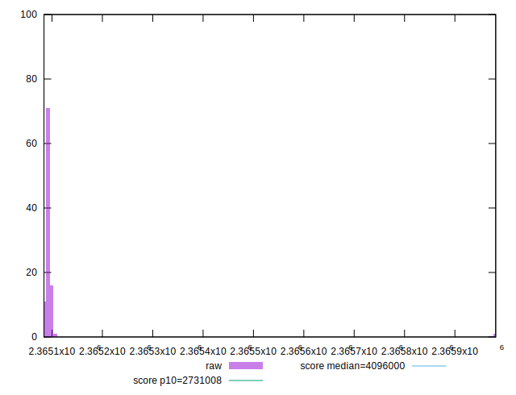
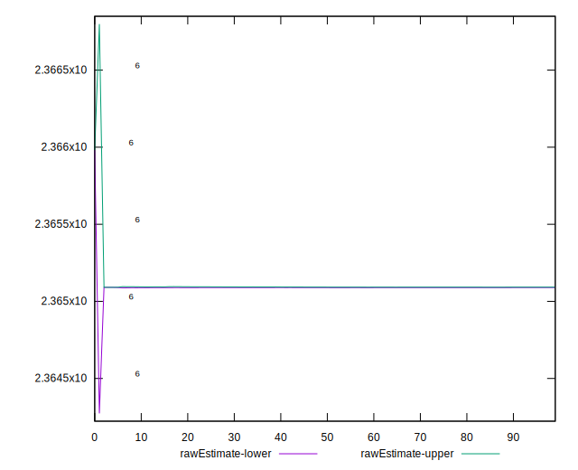
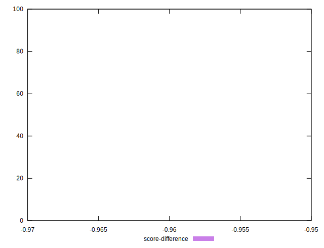

# //total-byte-weight/samples/pages+cached

[→ Parent](../..)


## Raw


```yaml
p90min: 2365086
p90max: 2365101
p90range: 15
p90mean: 2365091.010638298
p90median: 2365091
p90stdev: 2.9839809224871554
p90skewness: 1.0875763333938993
p90eccentricity: 1.0000000000000018
p90discretization: 9.4
outlandishness: 1.0000075932627603
confidence: 34.738458059010085
p90confidence: 1.2064524289247327

```


## Score


```yaml
p90min: 0.96
p90max: 0.96
p90range: 0
p90mean: 0.9599999999999987
p90median: 0.96
p90stdev: 1.2212453270876722e-15
p90skewness: 1
p90eccentricity: 1
p90discretization: 94
outlandishness: 0.9999999999999993
confidence: 6.092792000602813e-16
p90confidence: 4.937613307359355e-16

```


## Raw Estimate


## Score Estimate


## P Score


```yaml
p90min: 0
p90max: 0
p90range: 0
p90mean: 0
p90median: 0
p90stdev: 0
p90skewness: .nan
p90eccentricity: .nan
p90discretization: 94
outlandishness: .nan
confidence: 0
p90confidence: 0

```


## Score Difference


```yaml
p90min: -0.96
p90max: -0.96
p90range: 0
p90mean: -0.9599999999999987
p90median: -0.96
p90stdev: 1.2212453270876722e-15
p90skewness: -1
p90eccentricity: 1
p90discretization: 94
outlandishness: 0.9999999999999993
confidence: 6.092792000602813e-16
p90confidence: 4.937613307359355e-16

```


## P Score Difference


```yaml
p90min: -0.96
p90max: -0.96
p90range: 0
p90mean: -0.9599999999999987
p90median: -0.96
p90stdev: 1.2212453270876722e-15
p90skewness: -1
p90eccentricity: 1
p90discretization: 94
outlandishness: 0.9999999999999993
confidence: 6.092792000602813e-16
p90confidence: 4.937613307359355e-16

```

