# //unminified-javascript/samples/pages+cached+noadtech+nomedia+nocss

[→ Parent](../..)


## Raw


```yaml
p90min: 0
p90max: 300
p90range: 300
p90mean: 59.04255319148936
p90median: 0
p90stdev: 76.47929978503252
p90skewness: 0.6751666067760114
p90eccentricity: 0.9999999999999989
p90discretization: 31.333333333333332
outlandishness: 1.193408619430241
confidence: 33.52569814853816
p90confidence: 30.921322684331763

```

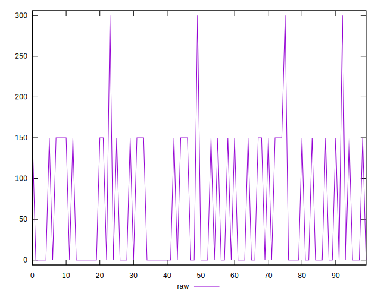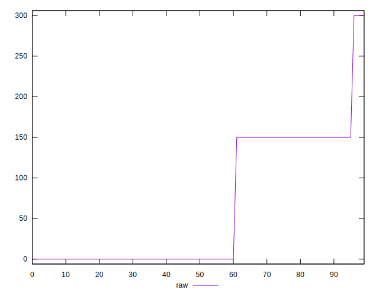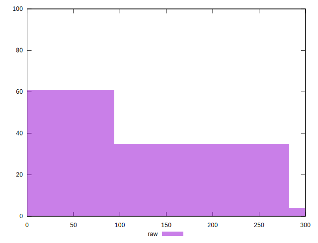
## Score


```yaml
p90min: 0.75
p90max: 1
p90range: 0.25
p90mean: 0.9526595744680849
p90median: 1
p90stdev: 0.061526253381284875
p90skewness: -0.7123617183421871
p90eccentricity: 1.0000000000000016
p90discretization: 31.333333333333332
outlandishness: 0.990241678521025
confidence: 0.027259710091544865
p90confidence: 0.024875660992034785

```

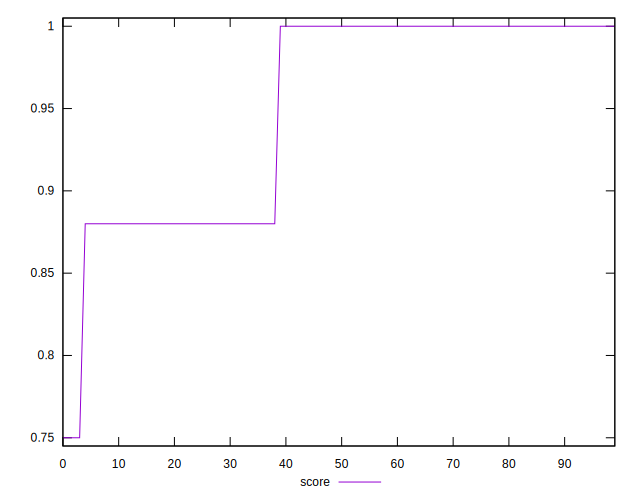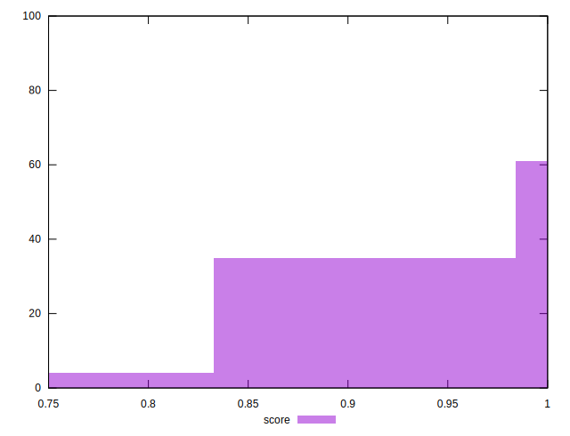
## Raw Estimate

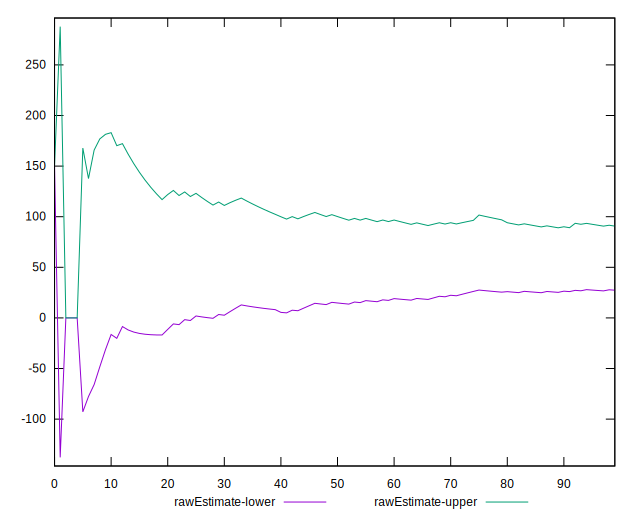
## Score Estimate

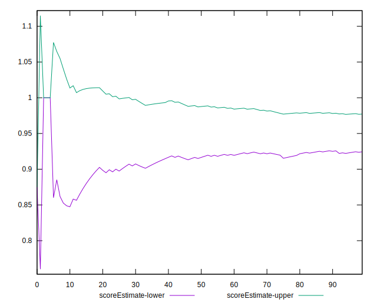
## P Score


```yaml
p90min: 0.75
p90max: 1
p90range: 0.25
p90mean: 0.9507978723404256
p90median: 1
p90stdev: 0.06373274982086037
p90skewness: -0.6751666067760141
p90eccentricity: 1
p90discretization: 31.333333333333332
outlandishness: 0.9904564455963616
confidence: 0.02793808179044844
p90confidence: 0.025767768903609774

```

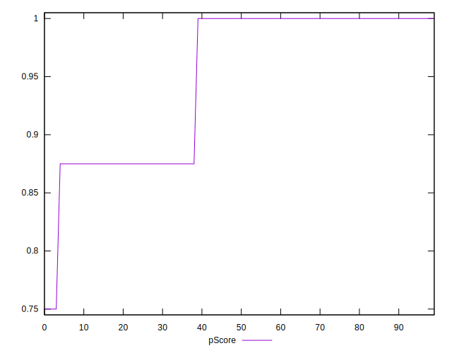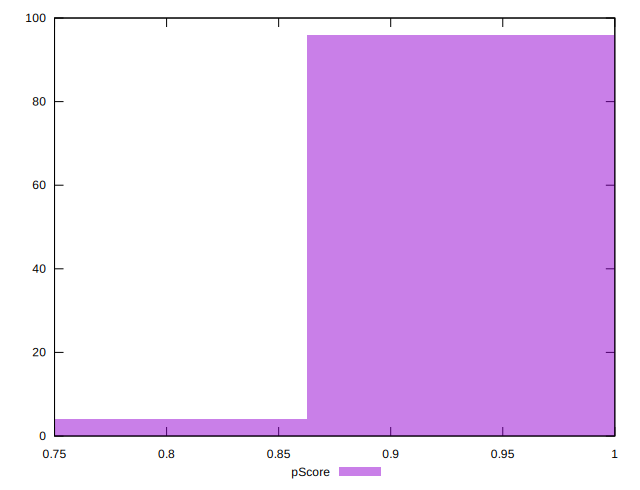
## Score Difference


```yaml
p90min: 0
p90max: 0
p90range: 0
p90mean: 0
p90median: 0
p90stdev: 0
p90skewness: .nan
p90eccentricity: .nan
p90discretization: 94
outlandishness: .nan
confidence: 0
p90confidence: 0

```


## P Score Difference


```yaml
p90min: -0.0050000000000000044
p90max: 0
p90range: 0.0050000000000000044
p90mean: -0.0017021276595744696
p90median: 0
p90stdev: 0.002369261430991501
p90skewness: -0.6735198826004055
p90eccentricity: 0.9999999999999997
p90discretization: 47
outlandishness: 1.0570410156249999
confidence: 0.0009348432391090591
p90confidence: 0.0009579153762802546

```

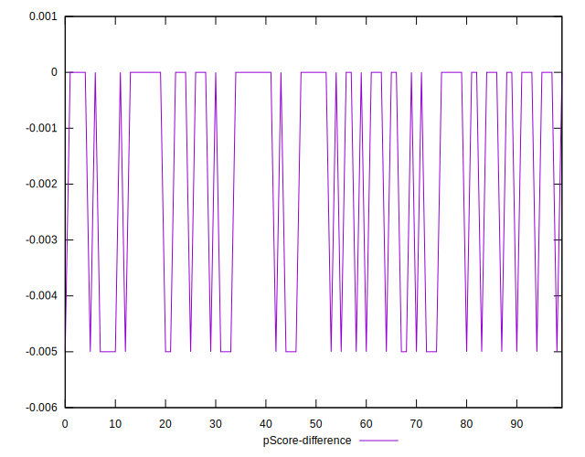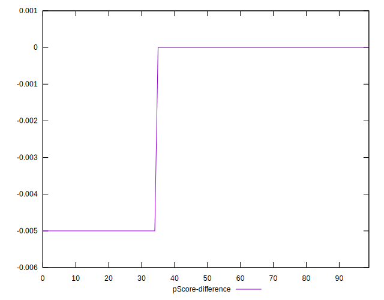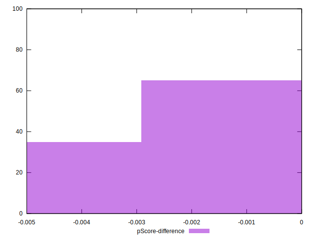