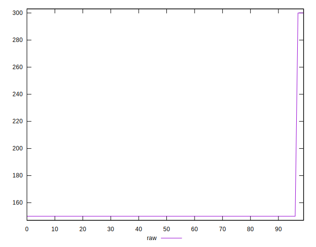
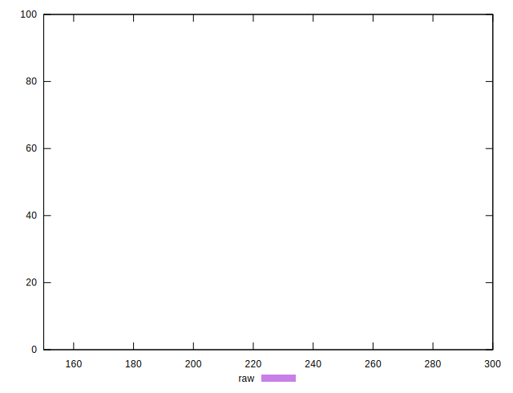
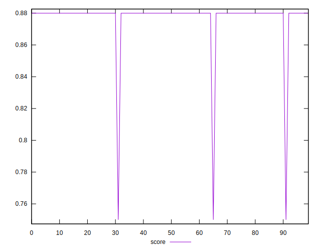
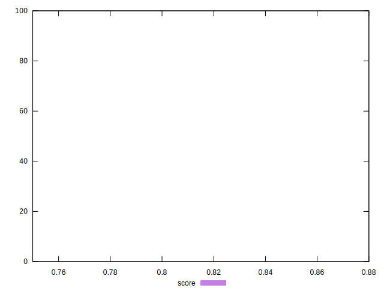
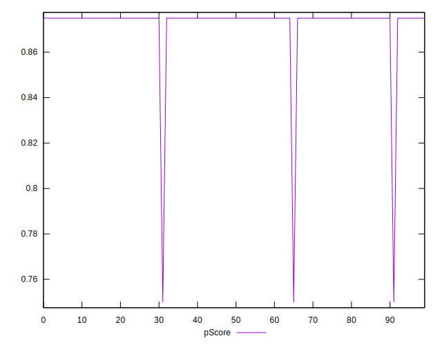
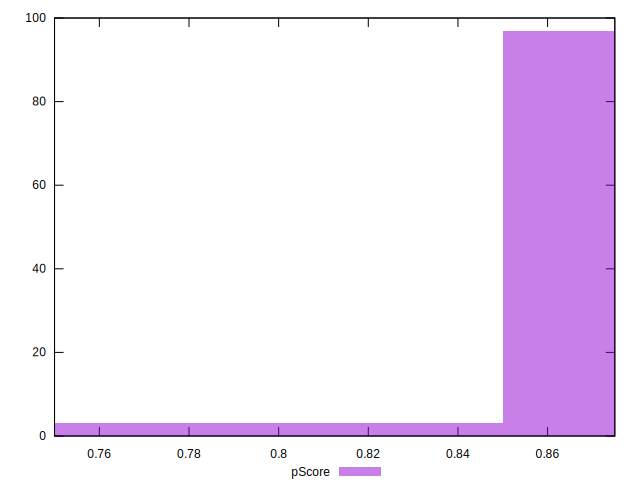
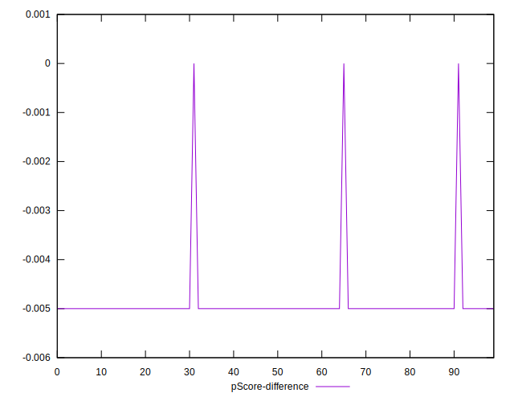
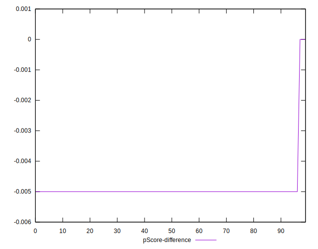

# //unused-css-rules/samples/pages+cached+noadtech

[→ Parent](../..)


## Raw


```yaml
p90min: 150
p90max: 150
p90range: 0
p90mean: 150
p90median: 150
p90stdev: 0
p90skewness: .nan
p90eccentricity: .nan
p90discretization: 94
outlandishness: 1.0609
confidence: 10.030344286911554
p90confidence: 0

```


## Score


```yaml
p90min: 0.88
p90max: 0.88
p90range: 0
p90mean: 0.8799999999999998
p90median: 0.88
p90stdev: 2.220446049250313e-16
p90skewness: 1
p90eccentricity: 1
p90discretization: 94
outlandishness: 0.99115600464876
confidence: 0.008692965048656673
p90confidence: 8.977478740653372e-17

```


## Raw Estimate


## Score Estimate


## P Score


```yaml
p90min: 0.875
p90max: 0.875
p90range: 0
p90mean: 0.875
p90median: 0.875
p90stdev: 0
p90skewness: .nan
p90eccentricity: .nan
p90discretization: 94
outlandishness: 0.9914469387755102
confidence: 0.00835862023909297
p90confidence: 0

```


## Score Difference


```yaml
p90min: 0
p90max: 0
p90range: 0
p90mean: 0
p90median: 0
p90stdev: 0
p90skewness: .nan
p90eccentricity: .nan
p90discretization: 94
outlandishness: .nan
confidence: 0
p90confidence: 0

```


## P Score Difference


```yaml
p90min: -0.0050000000000000044
p90max: -0.0050000000000000044
p90range: 0
p90mean: -0.0050000000000000044
p90median: -0.0050000000000000044
p90stdev: 0
p90skewness: .nan
p90eccentricity: .nan
p90discretization: 94
outlandishness: 0.9409000000000002
confidence: 0.00033434480956371894
p90confidence: 0

```

