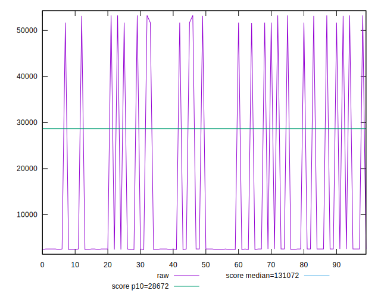
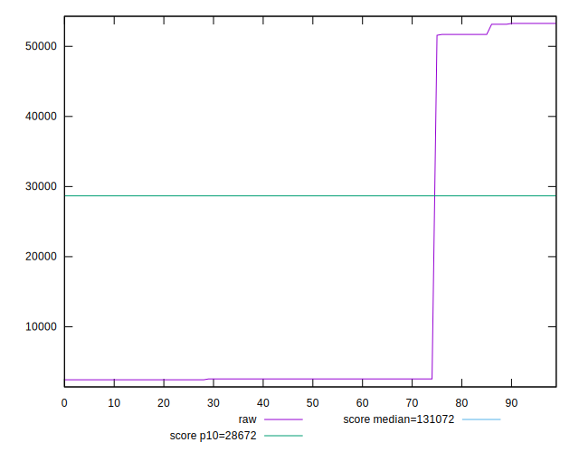
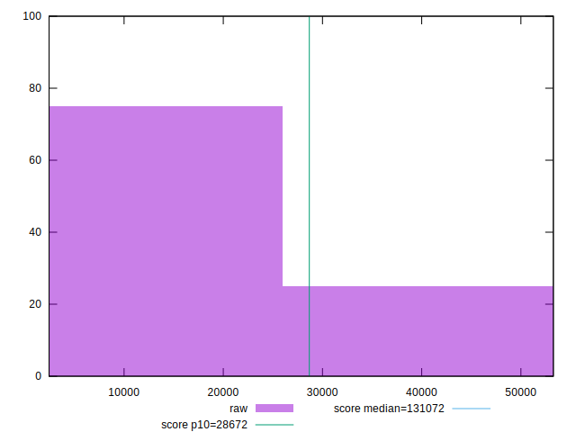
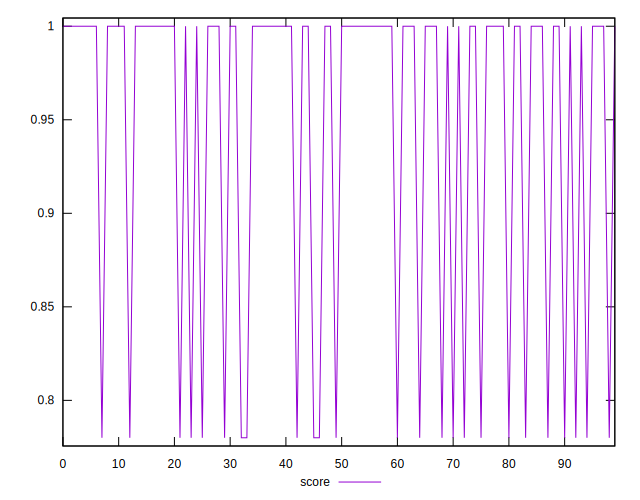
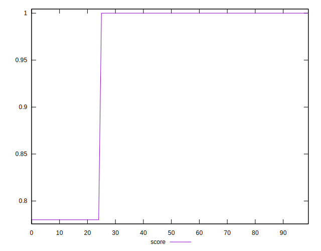
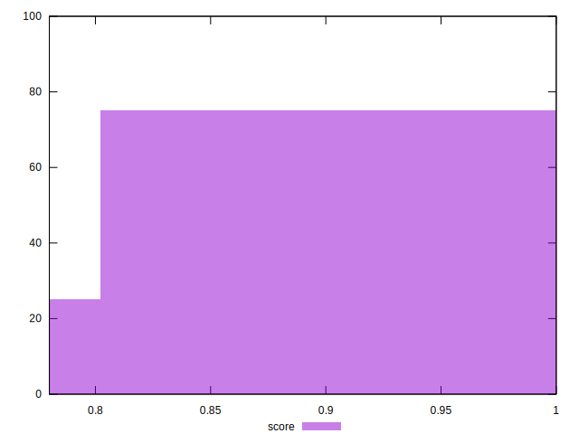
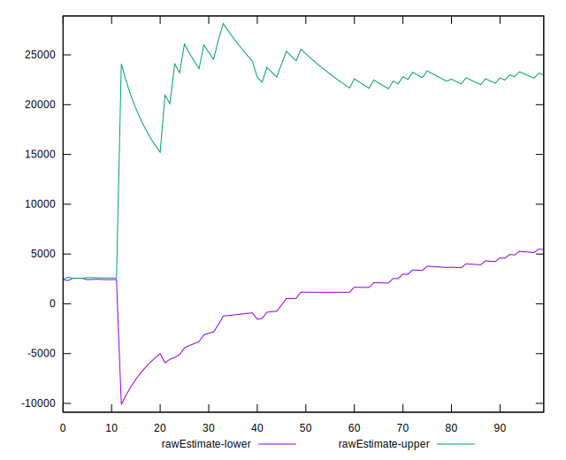
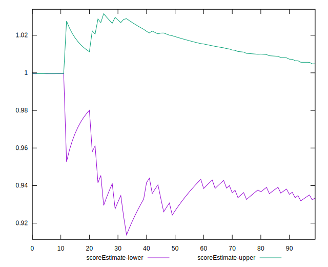
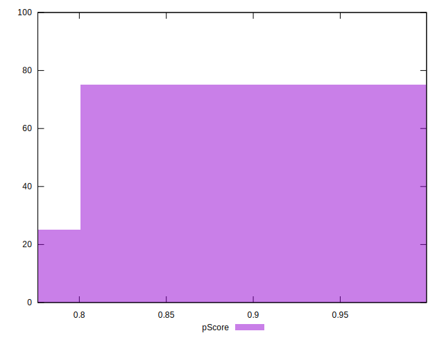
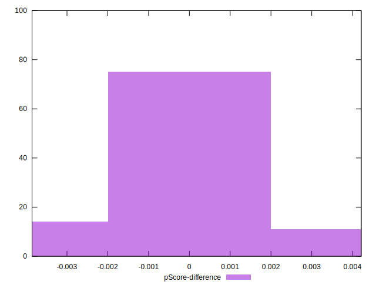

# //uses-long-cache-ttl/samples/pages+cached+noadtech+nomedia+nocss

[→ Parent](../..)


## Raw


```yaml
p90min: 2440
p90max: 53269
p90range: 50829
p90mean: 14205.287234042553
p90median: 2562
p90stdev: 21146.553865226906
p90skewness: 1.2573795637940859
p90eccentricity: 1.0000000000000002
p90discretization: 15.666666666666666
outlandishness: 1.1186261964540107
confidence: 8494.650522231292
p90confidence: 8549.756830491438

```


## Score


```yaml
p90min: 0.78
p90max: 1
p90range: 0.21999999999999997
p90mean: 0.9485106382978726
p90median: 1
p90stdev: 0.09314776006955593
p90skewness: -1.2562972690740244
p90eccentricity: 0.9999999999999999
p90discretization: 47
outlandishness: 0.9926112763540919
confidence: 0.037342329224513644
p90confidence: 0.03766054284661659

```


## Raw Estimate


## Score Estimate


## P Score


```yaml
p90min: 0.7761429257345126
p90max: 0.9996090852968826
p90range: 0.22346615956237004
p90mean: 0.9481847250521013
p90median: 0.9995466956021494
p90stdev: 0.09297502929704558
p90skewness: -1.2575896947596867
p90eccentricity: 0.9999999999999979
p90discretization: 15.666666666666666
outlandishness: 0.992382035995694
confidence: 0.037352381217992094
p90confidence: 0.03759070611995566

```


## Score Difference


```yaml
p90min: 0
p90max: 0
p90range: 0
p90mean: 0
p90median: 0
p90stdev: 0
p90skewness: .nan
p90eccentricity: .nan
p90discretization: 94
outlandishness: .nan
confidence: 0
p90confidence: 0

```


## P Score Difference


```yaml
p90min: -0.0038570742654874257
p90max: 0.0036284452541361922
p90range: 0.007485519519623618
p90mean: -0.0004604016296216365
p90median: -0.00045330439785062904
p90stdev: 0.0016191622316129878
p90skewness: 0.4585432879662815
p90eccentricity: 0.9999999999999989
p90discretization: 18.8
outlandishness: 0.8877723750269927
confidence: 0.0007188031310497445
p90confidence: 0.0006546429946758779

```

