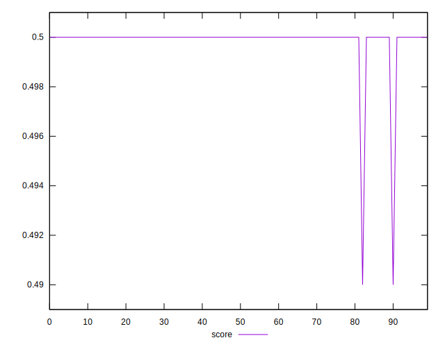
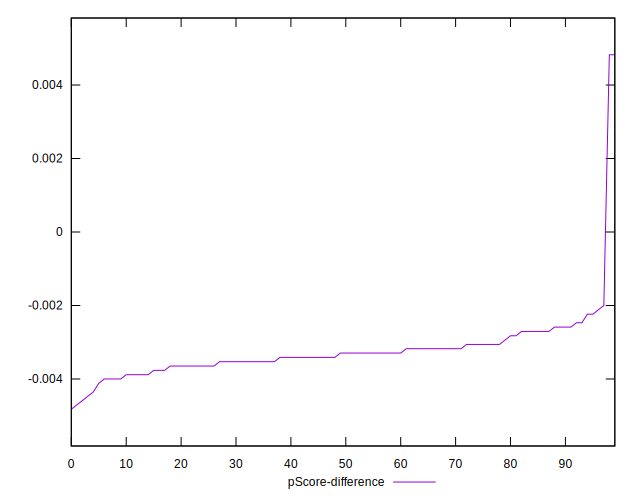

# //uses-rel-preload/samples/pages+cached+noadtech

[→ Parent](../..)


## Raw


```yaml
p90min: 769
p90max: 790
p90range: 21
p90mean: 778.6063829787234
p90median: 779
p90stdev: 3.949732242759942
p90skewness: 0.20966314678729217
p90eccentricity: 1.0000000000000022
p90discretization: 4.7
outlandishness: 1.0002918684291862
confidence: 1.9331882976409103
p90confidence: 1.5969150546405935

```


## Score


```yaml
p90min: 0.5
p90max: 0.5
p90range: 0
p90mean: 0.5
p90median: 0.5
p90stdev: 0
p90skewness: .nan
p90eccentricity: .nan
p90discretization: 94
outlandishness: 0.9992001600000001
confidence: 0.0005487899156712145
p90confidence: 0

```


## Raw Estimate


## Score Estimate


## P Score


```yaml
p90min: 0.49529411764705883
p90max: 0.49776470588235294
p90range: 0.0024705882352941133
p90mean: 0.4966345431789738
p90median: 0.49658823529411766
p90stdev: 0.00046467438150116745
p90skewness: -0.2096631467876426
p90eccentricity: 1
p90discretization: 4.7
outlandishness: 0.9999461715714727
confidence: 0.00022743391736951803
p90confidence: 0.0001878723593694807

```


## Score Difference


```yaml
p90min: 0
p90max: 0
p90range: 0
p90mean: 0
p90median: 0
p90stdev: 0
p90skewness: .nan
p90eccentricity: .nan
p90discretization: 94
outlandishness: .nan
confidence: 0
p90confidence: 0

```


## P Score Difference


```yaml
p90min: -0.004470588235294115
p90max: -0.0021176470588235574
p90range: 0.0023529411764705577
p90mean: -0.003312891113892364
p90median: -0.0032941176470588363
p90stdev: 0.000456388774873278
p90skewness: 0.2847441127060325
p90eccentricity: 0.9999999999999997
p90discretization: 4.947368421052632
outlandishness: 0.9207007861292104
confidence: 0.0004923486202912178
p90confidence: 0.00018452240824680388

```

