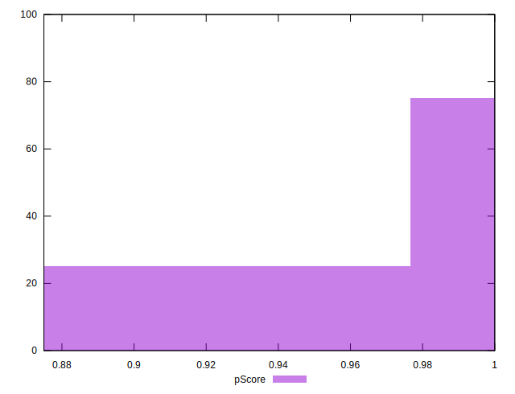
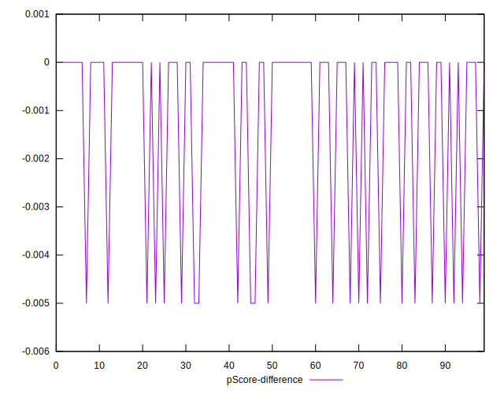

# //uses-webp-images/samples/pages+cached+noadtech+nomedia+nocss

[→ Parent](../..)


## Raw


```yaml
p90min: 0
p90max: 150
p90range: 150
p90mean: 35.1063829787234
p90median: 0
p90stdev: 63.50983641106078
p90skewness: 1.2562972690740195
p90eccentricity: 1.0000000000000027
p90discretization: 47
outlandishness: 1.1410123966942147
confidence: 25.460679016713872
p90confidence: 25.67764284996582

```


## Score


```yaml
p90min: 0.88
p90max: 1
p90range: 0.12
p90mean: 0.971914893617021
p90median: 1
p90stdev: 0.05080786912884868
p90skewness: -1.2562972690740033
p90eccentricity: 0.9999999999999996
p90discretization: 47
outlandishness: 0.9960634264555684
confidence: 0.020368543213371084
p90confidence: 0.02054211427997268

```


## Raw Estimate


## Score Estimate


## P Score


```yaml
p90min: 0.875
p90max: 1
p90range: 0.125
p90mean: 0.9707446808510638
p90median: 1
p90stdev: 0.052924863675884046
p90skewness: -1.2562972690740155
p90eccentricity: 1.0000000000000002
p90discretization: 47
outlandishness: 0.9958946331394258
confidence: 0.021217232513928225
p90confidence: 0.021398035708304872

```


## Score Difference


```yaml
p90min: 0
p90max: 0
p90range: 0
p90mean: 0
p90median: 0
p90stdev: 0
p90skewness: .nan
p90eccentricity: .nan
p90discretization: 94
outlandishness: .nan
confidence: 0
p90confidence: 0

```


## P Score Difference


```yaml
p90min: -0.0050000000000000044
p90max: 0
p90range: 0.0050000000000000044
p90mean: -0.0011702127659574478
p90median: 0
p90stdev: 0.002116994547035362
p90skewness: -1.256297269074019
p90eccentricity: 1.0000000000000024
p90discretization: 47
outlandishness: 1.1410123966942152
confidence: 0.0008486893005571292
p90confidence: 0.0008559214283321951

```

