# //uses-webp-images/samples/pages

[→ Parent](../..)


## Raw


```yaml
p90min: 1350
p90max: 1650
p90range: 300
p90mean: 1545.531914893617
p90median: 1510
p90stdev: 99.41977436421314
p90skewness: -0.4318719167920751
p90eccentricity: 0.9999999999999997
p90discretization: 15.666666666666666
outlandishness: 0.9993117924569779
confidence: 43.88744071708939
p90confidence: 40.196379058911404

```

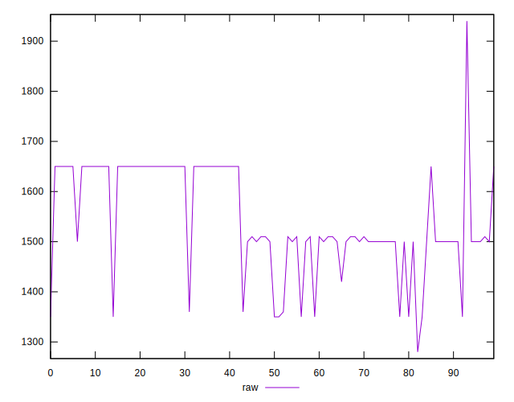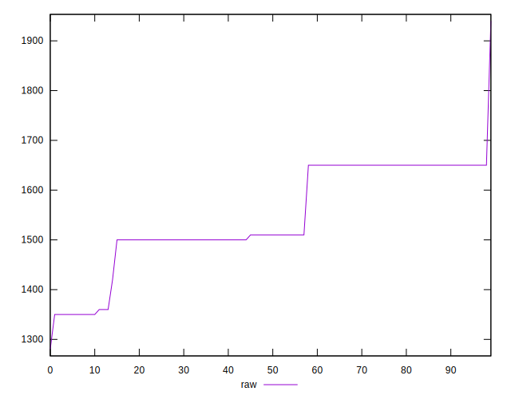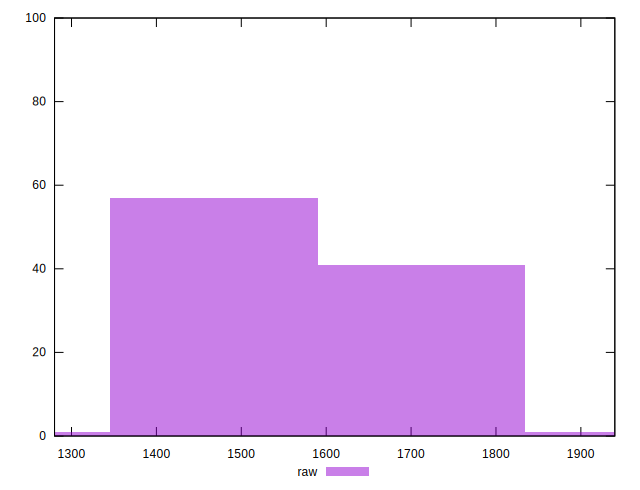
## Score


```yaml
p90min: 0.39
p90max: 0.43
p90range: 0.03999999999999998
p90mean: 0.4041489361702124
p90median: 0.41
p90stdev: 0.013401299910598132
p90skewness: 0.4073588547122427
p90eccentricity: 1.0000000000000018
p90discretization: 23.5
outlandishness: 1.0007477048621363
confidence: 0.005794470353396839
p90confidence: 0.005418275534554634

```

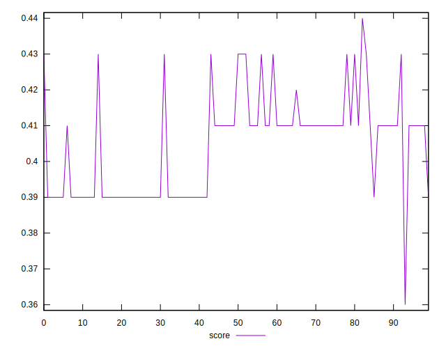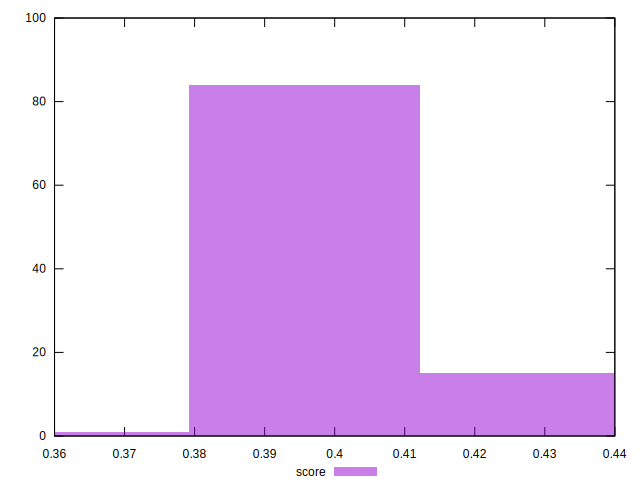
## Raw Estimate

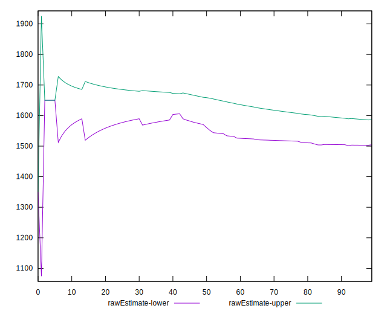
## Score Estimate

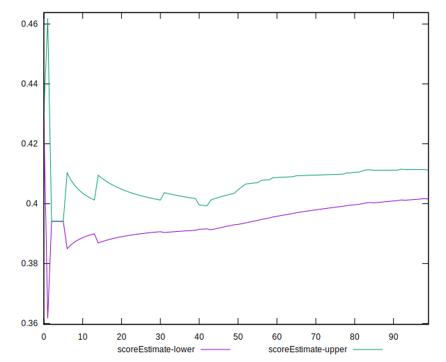
## P Score


```yaml
p90min: 0.3941176470588235
p90max: 0.4294117647058824
p90range: 0.035294117647058865
p90mean: 0.40640801001251575
p90median: 0.41058823529411764
p90stdev: 0.011696444042848609
p90skewness: 0.4318719167921727
p90eccentricity: 1.0000000000000002
p90discretization: 15.666666666666666
outlandishness: 1.0003079813345053
confidence: 0.00516322831965758
p90confidence: 0.004728985771636637

```

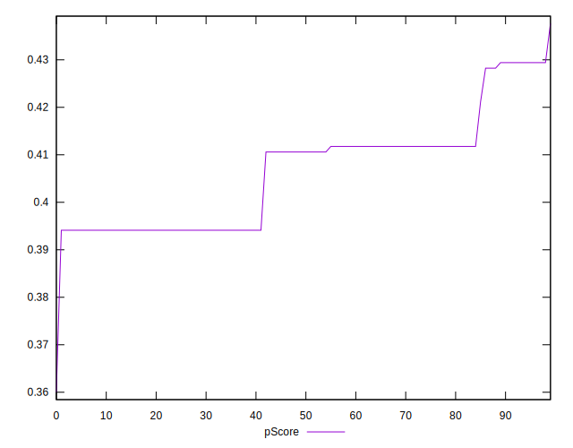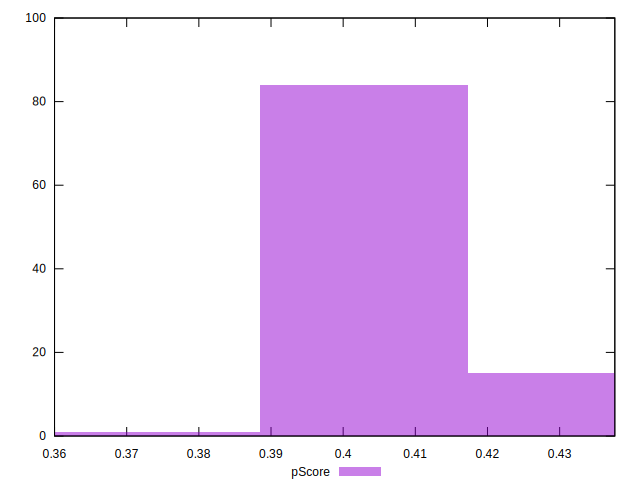
## Score Difference


```yaml
p90min: 0
p90max: 5.551115123125783e-17
p90range: 5.551115123125783e-17
p90mean: 2.362176648138631e-17
p90median: 0
p90stdev: 2.744601245712295e-17
p90skewness: 0.3012320380383538
p90eccentricity: 0.9999999999999983
p90discretization: 47
outlandishness: 1.02111025
confidence: 1.0772834214765464e-17
p90confidence: 1.1096689038345214e-17

```

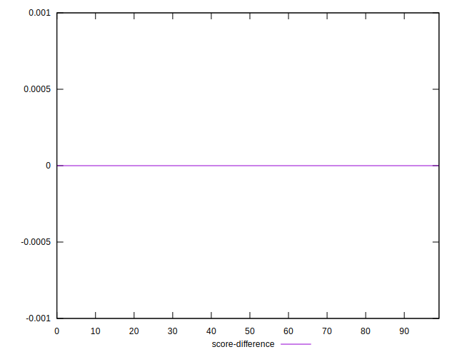
## P Score Difference


```yaml
p90min: -0.001764705882352946
p90max: 0.004117647058823504
p90range: 0.00588235294117645
p90mean: 0.002240300375469334
p90median: 0.001764705882352946
p90stdev: 0.0017209352596455427
p90skewness: -0.23670301798276666
p90eccentricity: 0.9999999999999991
p90discretization: 13.428571428571429
outlandishness: 0.9387336506351229
confidence: 0.0007245586199658354
p90confidence: 0.0006957908170173692

```

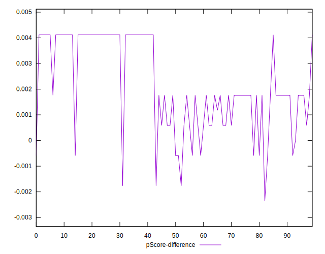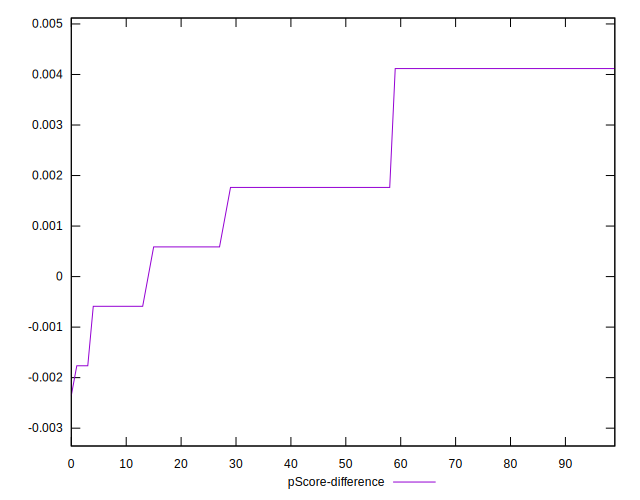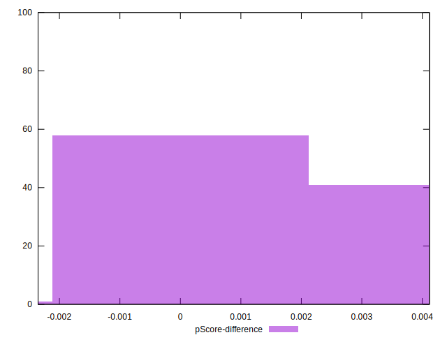