# //bootup-time/samples/pages+cached+noadtech+nomedia+nocss

[→ Parent](../..)


## Raw


```yaml
p90min: 245.508
p90max: 1405.1
p90range: 1159.5919999999999
p90mean: 652.6818297872343
p90median: 633.0840000000001
p90stdev: 291.9577926106763
p90skewness: 0.7357698044653375
p90eccentricity: 1.0000000000000004
p90discretization: 1
outlandishness: 1.10260424516862
confidence: 156.2284883940659
p90confidence: 118.04136728363082

```

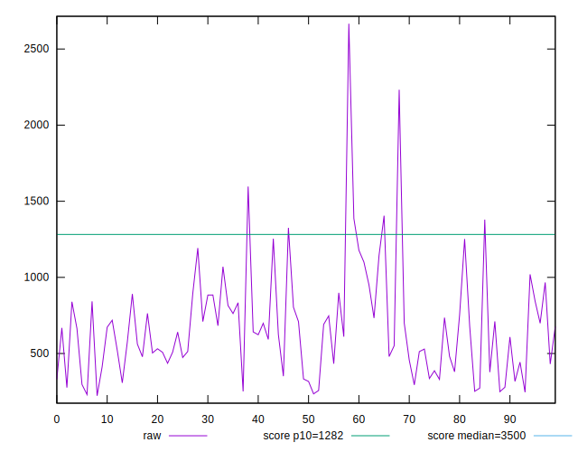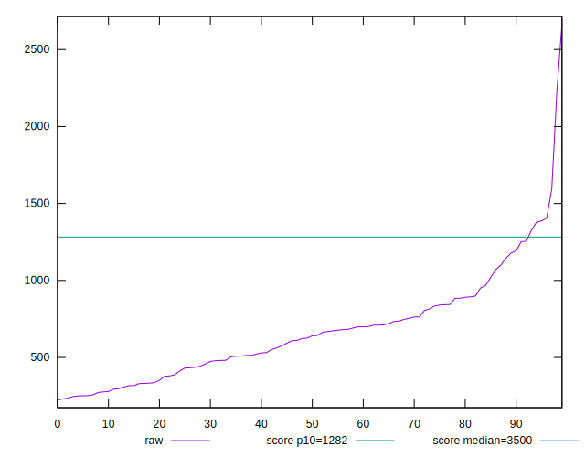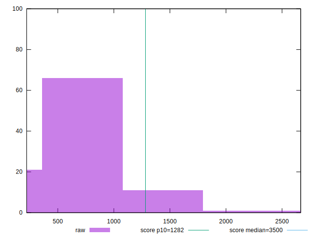
## Score


```yaml
p90min: 0.88
p90max: 1
p90range: 0.12
p90mean: 0.9760638297872339
p90median: 0.985
p90stdev: 0.029686951252939926
p90skewness: -1.8008675944346544
p90eccentricity: 1.0000000000000004
p90discretization: 7.230769230769231
outlandishness: 0.9865956315957499
confidence: 0.020641128791885035
p90confidence: 0.012002722328608884

```

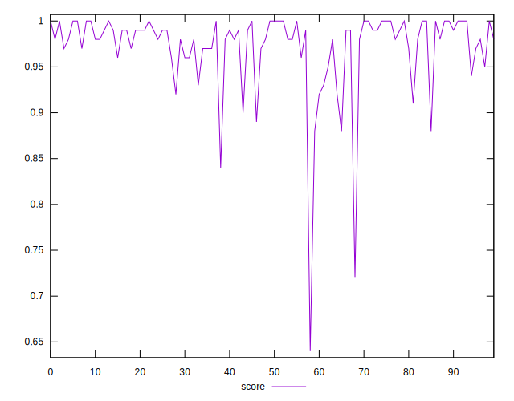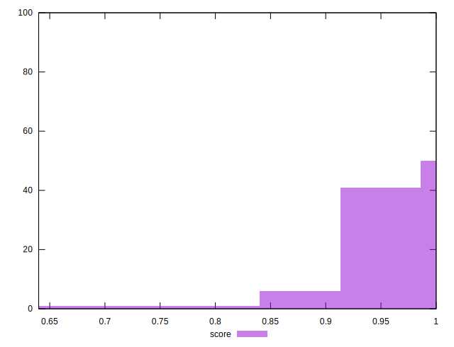
## Raw Estimate

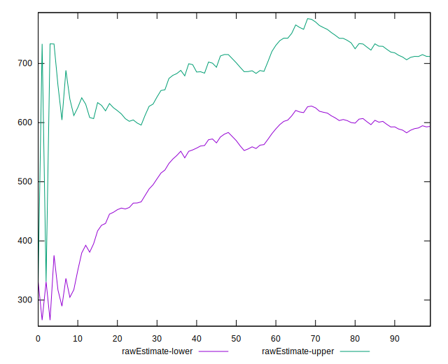
## Score Estimate

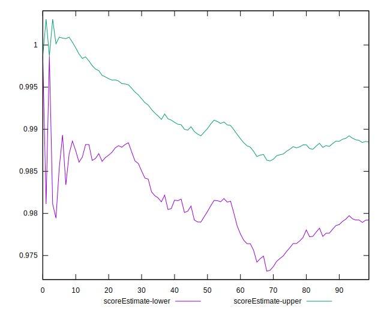
## P Score


```yaml
p90min: 0.8779009113468175
p90max: 0.9996512534033227
p90range: 0.12175034205650526
p90mean: 0.9759448174967635
p90median: 0.9854341608902488
p90stdev: 0.0293785873737483
p90skewness: -1.823764019515554
p90eccentricity: 1
p90discretization: 1
outlandishness: 0.9864804427002969
confidence: 0.020714213231341455
p90confidence: 0.011878047821396115

```

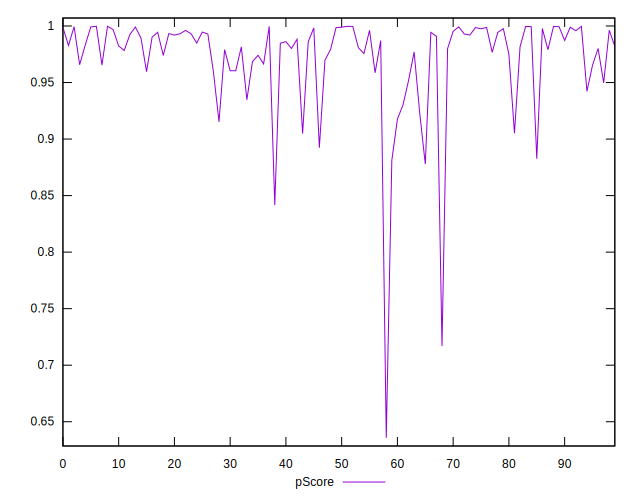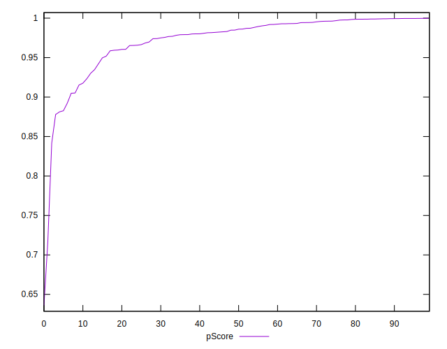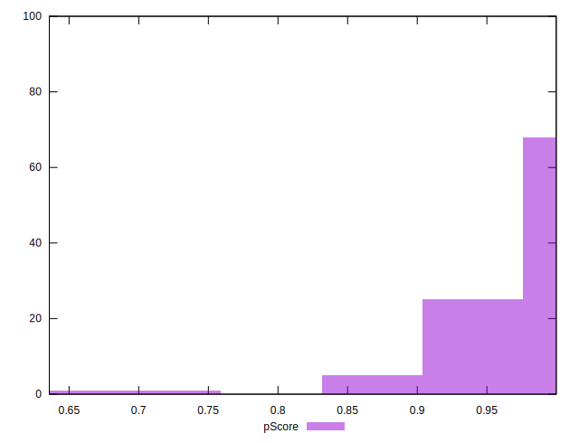
## Score Difference


```yaml
p90min: 0
p90max: 0
p90range: 0
p90mean: 0
p90median: 0
p90stdev: 0
p90skewness: .nan
p90eccentricity: .nan
p90discretization: 94
outlandishness: .inf
confidence: 7.423946114831074e-18
p90confidence: 0

```

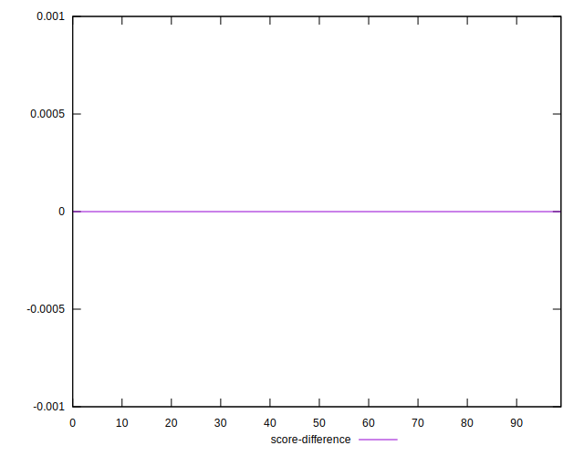
## P Score Difference


```yaml
p90min: -0.004680604101105601
p90max: 0.004772854596836074
p90range: 0.009453458697941675
p90mean: -0.00019031615341430733
p90median: -0.0004055174577373699
p90stdev: 0.0025224022327081513
p90skewness: 0.17740618623445137
p90eccentricity: 0.9999999999999996
p90discretization: 1
outlandishness: 0.8436208031874513
confidence: 0.0010651050020987574
p90confidence: 0.0010198316877439815

```

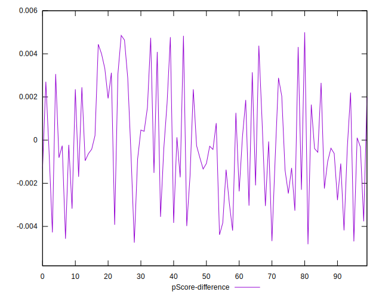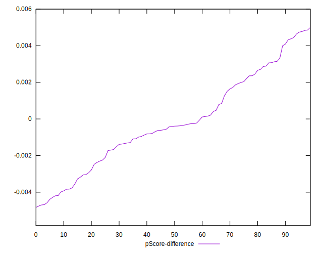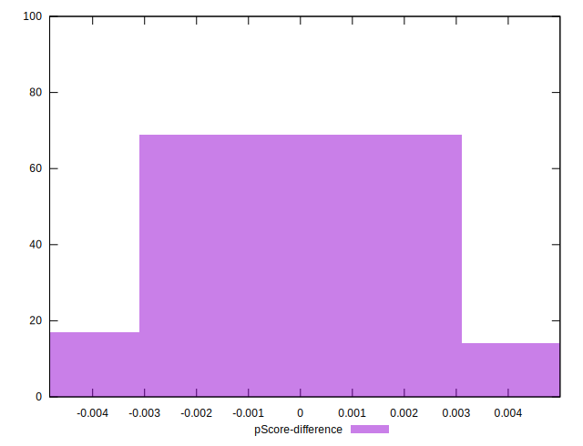