# //bootup-time/samples/pages+cached+noadtech

[→ Parent](../..)


## Raw


```yaml
p90min: 236.68399999999997
p90max: 1298.728
p90range: 1062.044
p90mean: 590.4828510638299
p90median: 541.902
p90stdev: 261.4743926827398
p90skewness: 0.7632309129415614
p90eccentricity: 1.0000000000000002
p90discretization: 1
outlandishness: 1.0426317936574392
confidence: 115.08252066770874
p90confidence: 105.71663303087647

```

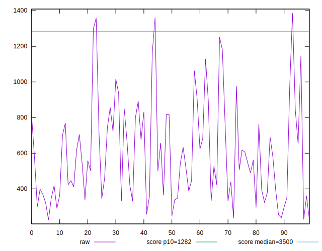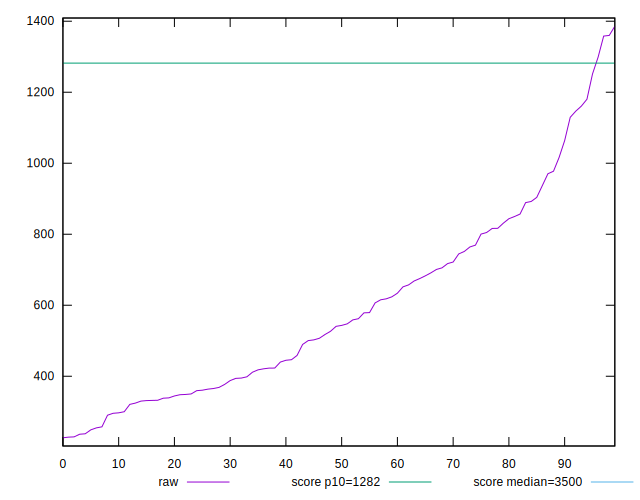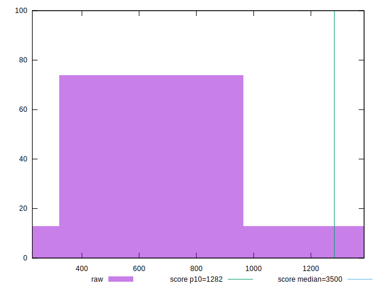
## Score


```yaml
p90min: 0.9
p90max: 1
p90range: 0.09999999999999998
p90mean: 0.9826595744680848
p90median: 0.99
p90stdev: 0.02316341263556185
p90skewness: -1.670171167593822
p90eccentricity: 0.9999999999999983
p90discretization: 8.545454545454545
outlandishness: 0.9952033407917701
confidence: 0.010982166349042477
p90confidence: 0.009365192393075608

```

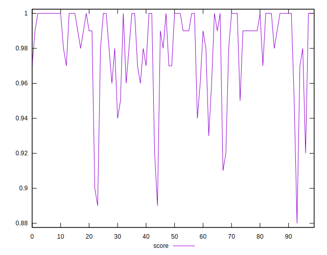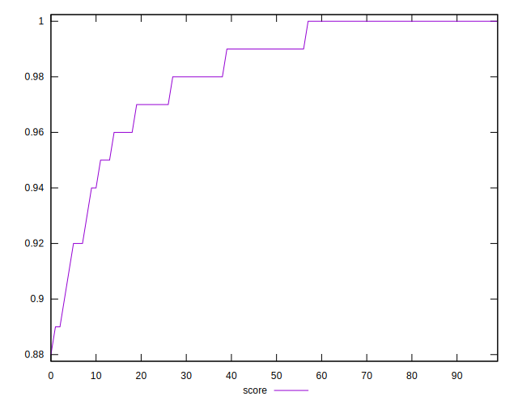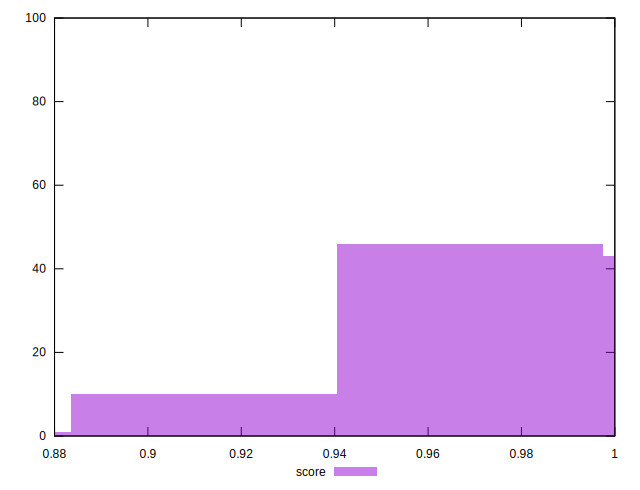
## Raw Estimate

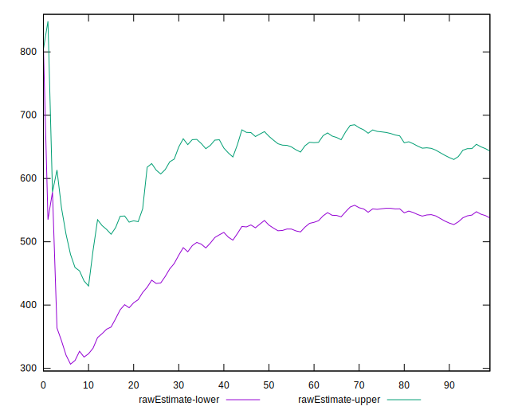
## Score Estimate

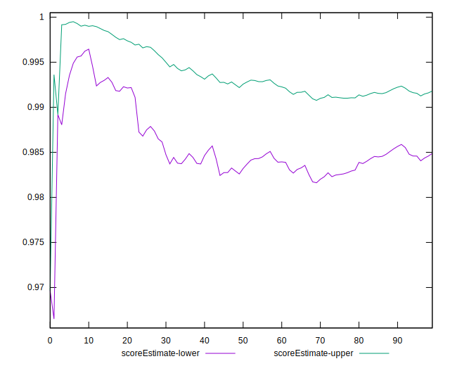
## P Score


```yaml
p90min: 0.8970659511976717
p90max: 0.9997061900855492
p90range: 0.10264023888787743
p90mean: 0.9817588942614465
p90median: 0.9913508904558415
p90stdev: 0.02302349929609748
p90skewness: -1.7984737845628915
p90eccentricity: 0.9999999999999999
p90discretization: 1
outlandishness: 0.9951721360252214
confidence: 0.010984840059933356
p90confidence: 0.009308624072895106

```

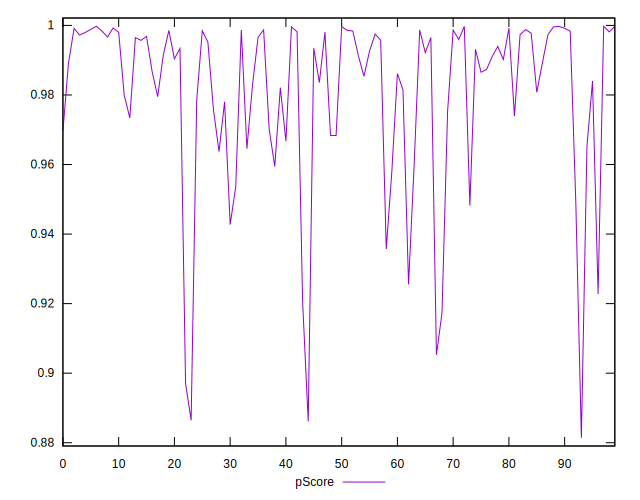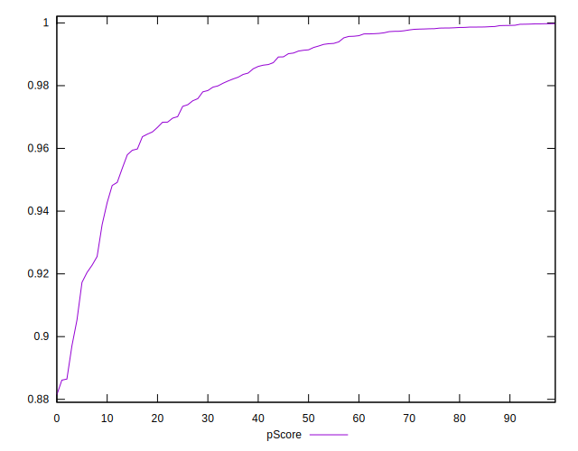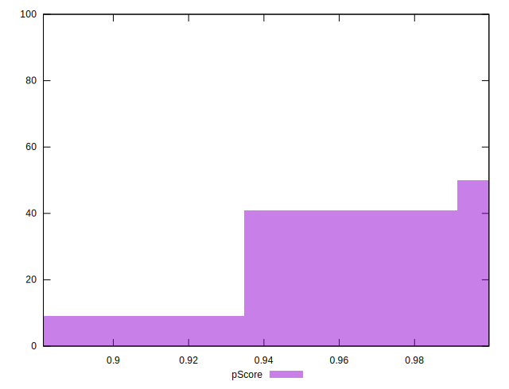
## Score Difference


```yaml
p90min: 0
p90max: 1.1102230246251565e-16
p90range: 1.1102230246251565e-16
p90mean: 2.362176648138631e-18
p90median: 0
p90stdev: 1.6021061506108986e-17
p90skewness: 6.634888026970369
p90eccentricity: 0.9999999999999992
p90discretization: 47
outlandishness: 5.522500000000001
confidence: 9.484951648085961e-18
p90confidence: 6.477470556979047e-18

```

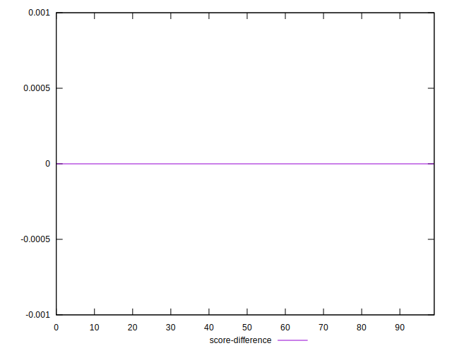
## P Score Difference


```yaml
p90min: -0.00472939222744595
p90max: 0.00391492122915893
p90range: 0.00864431345660488
p90mean: -0.00095317918501817
p90median: -0.0013046150782326515
p90stdev: 0.002245231001526647
p90skewness: 0.4772599430580536
p90eccentricity: 0.9999999999999999
p90discretization: 1
outlandishness: 0.9192251137078425
confidence: 0.0009573479287843088
p90confidence: 0.0009077686706626704

```

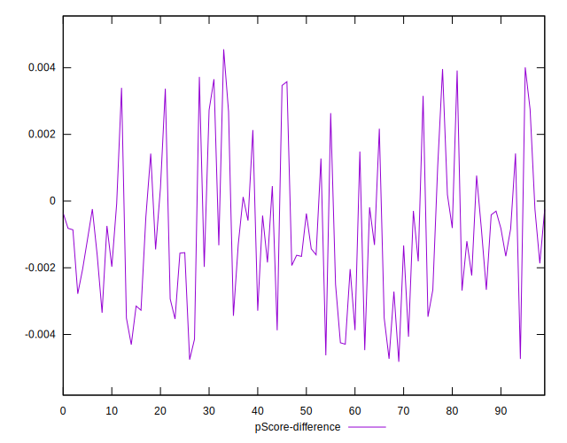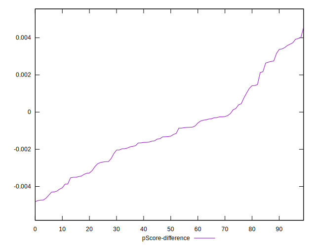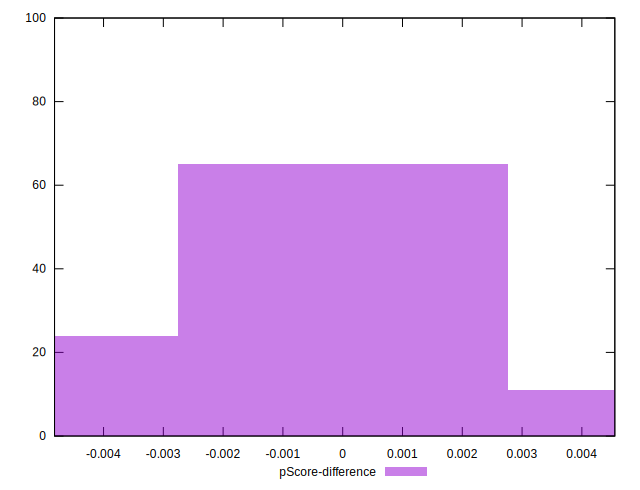