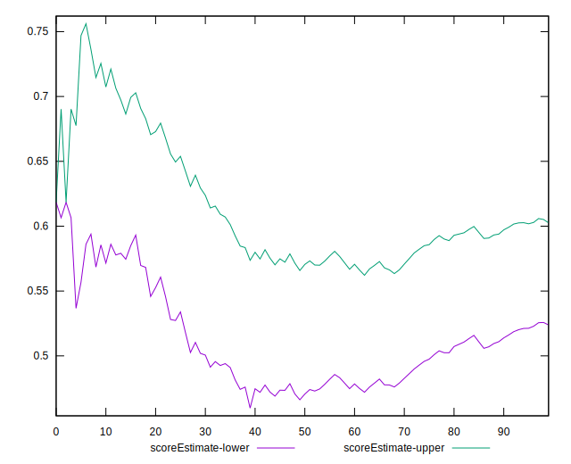

# //bootup-time/samples/pages+cached

[→ Parent](../..)


## Raw


```yaml
p90min: 1482.7720000000002
p90max: 5582.423999999997
p90range: 4099.651999999997
p90mean: 3091.6349361702128
p90median: 2774.748
p90stdev: 1198.1978404562128
p90skewness: 0.46509186181865886
p90eccentricity: 1
p90discretization: 1
outlandishness: 1.0281256653238176
confidence: 523.4991587810214
p90confidence: 484.44300835069765

```


## Score


```yaml
p90min: 0.28
p90max: 0.86
p90range: 0.58
p90mean: 0.5902127659574468
p90median: 0.615
p90stdev: 0.18120740863279655
p90skewness: -0.19749222291050741
p90eccentricity: 0.9999999999999999
p90discretization: 2.088888888888889
outlandishness: 0.9952184188434264
confidence: 0.0764039715761189
p90confidence: 0.07326391286106992

```


## Raw Estimate


## Score Estimate


## P Score


```yaml
p90min: 0.2756814547963564
p90max: 0.8634391570066577
p90range: 0.5877577022103013
p90mean: 0.5900400486873428
p90median: 0.6164994269027011
p90stdev: 0.18139715689838665
p90skewness: -0.19857850004768263
p90eccentricity: 1.0000000000000002
p90discretization: 1
outlandishness: 0.9950694246419143
confidence: 0.07643211876261366
p90confidence: 0.07334062992523756

```


## Score Difference


```yaml
p90min: 0
p90max: 1.1102230246251565e-16
p90range: 1.1102230246251565e-16
p90mean: 7.086529944415892e-18
p90median: 0
p90stdev: 2.3234742230566256e-17
p90skewness: 3.4089538293213466
p90eccentricity: 0.9999999999999968
p90discretization: 31.333333333333332
outlandishness: 1.9881000000000004
confidence: 1.1256448154005117e-17
p90confidence: 9.394031640169571e-18

```


## P Score Difference


```yaml
p90min: -0.004737540953482222
p90max: 0.0045445822891925225
p90range: 0.009282123242674745
p90mean: -0.00023056524366654583
p90median: -0.0004619405972043078
p90stdev: 0.0027131750114222706
p90skewness: 0.15496952889932147
p90eccentricity: 1.0000000000000004
p90discretization: 1
outlandishness: 0.8806337191232066
confidence: 0.0011310280516944628
p90confidence: 0.0010969629725045196

```

