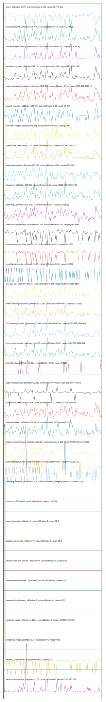

# //correlation/pages+cached+noadtech

[→ Parent](../..)

[0. score, p90stdev=0.079, score:p90stdev=0.079, range=[0.27:0.64]](../../meta/score/samples/pages+cached+noadtech)  
[1. third-party-summary, p90stdev=NaN, score:p90stdev=0.5, range=[NaN:NaN]](../../third-party-summary/samples/pages+cached+noadtech/)  
[2. max-potential-fid, p90stdev=125.446, score:p90stdev=0.278, range=[111:852]](../../max-potential-fid/samples/pages+cached+noadtech/)  
[3. estimated-input-latency, p90stdev=43.074, score:p90stdev=0.244, range=[12.8:294.4]](../../estimated-input-latency/samples/pages+cached+noadtech/)  
[4. total-blocking-time, p90stdev=194.773, score:p90stdev=0.196, range=[46.5:1302.192]](../../total-blocking-time/samples/pages+cached+noadtech/)  
[5. mainthread-work-breakdown, p90stdev=1008.999, score:p90stdev=0.192, range=[1238.292:6052.14]](../../mainthread-work-breakdown/samples/pages+cached+noadtech/)  
[6. unused-css-rules, p90stdev=108.185, score:p90stdev=0.09, range=[0:450]](../../unused-css-rules/samples/pages+cached+noadtech/)  
[7. offscreen-images, p90stdev=98.389, score:p90stdev=0.081, range=[0:460]](../../offscreen-images/samples/pages+cached+noadtech/)  
[8. speed-index, p90stdev=725.58, score:p90stdev=0.079, range=[2087.595:7913.277]](../../speed-index/samples/pages+cached+noadtech/)  
[9. uses-webp-images, p90stdev=105.716, score:p90stdev=0.072, range=[150:610]](../../uses-webp-images/samples/pages+cached+noadtech/)  
[10. interactive, p90stdev=692.996, score:p90stdev=0.07, range=[6492.572:10858.442]](../../interactive/samples/pages+cached+noadtech/)  
[11. uses-http2, p90stdev=246.901, score:p90stdev=0.063, range=[240:1820]](../../uses-http2/samples/pages+cached+noadtech/)  
[12. uses-text-compression, p90stdev=531.748, score:p90stdev=0.062, range=[840:3040]](../../uses-text-compression/samples/pages+cached+noadtech/)  
[13. unused-javascript, p90stdev=501.22, score:p90stdev=0.061, range=[340:2330]](../../unused-javascript/samples/pages+cached+noadtech/)  
[14. unminified-javascript, p90stdev=73.754, score:p90stdev=0.059, range=[0:170]](../../unminified-javascript/samples/pages+cached+noadtech/)  
[15. first-cpu-idle, p90stdev=492.217, score:p90stdev=0.058, range=[6182.076:9283.839]](../../first-cpu-idle/samples/pages+cached+noadtech/)  
[16. render-blocking-resources, p90stdev=123.082, score:p90stdev=0.054, range=[417:1299]](../../render-blocking-resources/samples/pages+cached+noadtech/)  
[17. first-meaningful-paint, p90stdev=217.249, score:p90stdev=0.044, range=[2087.595:3699.085]](../../first-meaningful-paint/samples/pages+cached+noadtech/)  
[18. first-contentful-paint, p90stdev=210.413, score:p90stdev=0.042, range=[2087.595:3699.085]](../../first-contentful-paint/samples/pages+cached+noadtech/)  
[19. unminified-css, p90stdev=39.38, score:p90stdev=0.032, range=[0:150]](../../unminified-css/samples/pages+cached+noadtech/)  
[20. uses-rel-preconnect, p90stdev=33.115, score:p90stdev=0.026, range=[51.407:478.014]](../../uses-rel-preconnect/samples/pages+cached+noadtech/)  
[21. bootup-time, p90stdev=261.474, score:p90stdev=0.023, range=[226.724:1385.86]](../../bootup-time/samples/pages+cached+noadtech/)  
[22. uses-rel-preload, p90stdev=123.103, score:p90stdev=0.015, range=[0:2415]](../../uses-rel-preload/samples/pages+cached+noadtech/)  
[23. largest-contentful-paint, p90stdev=561.982, score:p90stdev=0.008, range=[7712.285:11676.866]](../../largest-contentful-paint/samples/pages+cached+noadtech/)  
[24. cumulative-layout-shift, p90stdev=0.184, score:p90stdev=0.007, range=[0.932:1.642]](../../cumulative-layout-shift/samples/pages+cached+noadtech/)  
[25. uses-long-cache-ttl, p90stdev=1.104, score:p90stdev=0, range=[784462.483:784858.017]](../../uses-long-cache-ttl/samples/pages+cached+noadtech/)  
[26. uses-passive-event-listeners, p90stdev=NaN, score:p90stdev=0, range=[NaN:NaN]](../../uses-passive-event-listeners/samples/pages+cached+noadtech/)  
[27. no-document-write, p90stdev=NaN, score:p90stdev=0, range=[NaN:NaN]](../../no-document-write/samples/pages+cached+noadtech/)  
[28. dom-size, p90stdev=0, score:p90stdev=0, range=[110:110]](../../dom-size/samples/pages+cached+noadtech/)  
[29. legacy-javascript, p90stdev=0, score:p90stdev=0, range=[0:0]](../../legacy-javascript/samples/pages+cached+noadtech/)  
[30. duplicated-javascript, p90stdev=0, score:p90stdev=0, range=[0:0]](../../duplicated-javascript/samples/pages+cached+noadtech/)  
[31. efficient-animated-content, p90stdev=0, score:p90stdev=0, range=[0:0]](../../efficient-animated-content/samples/pages+cached+noadtech/)  
[32. uses-responsive-images, p90stdev=0, score:p90stdev=0, range=[0:0]](../../uses-responsive-images/samples/pages+cached+noadtech/)  
[33. uses-optimized-images, p90stdev=0, score:p90stdev=0, range=[0:0]](../../uses-optimized-images/samples/pages+cached+noadtech/)  
[34. total-byte-weight, p90stdev=1.228, score:p90stdev=0, range=[1060867:1062185]](../../total-byte-weight/samples/pages+cached+noadtech/)  
[35. preload-lcp-image, p90stdev=0, score:p90stdev=0, range=[0:0]](../../preload-lcp-image/samples/pages+cached+noadtech/)  
[36. unsized-images, p90stdev=NaN, score:p90stdev=0, range=[NaN:NaN]](../../unsized-images/samples/pages+cached+noadtech/)  
[37. font-display, p90stdev=NaN, score:p90stdev=0, range=[NaN:NaN]](../../font-display/samples/pages+cached+noadtech/)  
[38. redirects, p90stdev=0, score:p90stdev=0, range=[0:0]](../../redirects/samples/pages+cached+noadtech/)  
[39. server-response-time, p90stdev=17.56, score:p90stdev=0, range=[2.532:295.287]](../../server-response-time/samples/pages+cached+noadtech/)  
