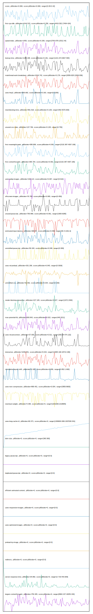

# //correlation/pages+cached

[→ Parent](../..)

[0. score, p90stdev=0.069, score:p90stdev=0.069, range=[0.09:0.42]](../../meta/score/samples/pages+cached)  
[1. first-cpu-idle, p90stdev=4144.515, score:p90stdev=0.258, range=[4419.302:17404.424]](../../first-cpu-idle/samples/pages+cached/)  
[2. speed-index, p90stdev=1450, score:p90stdev=0.206, range=[3763.878:12512.44]](../../speed-index/samples/pages+cached/)  
[3. bootup-time, p90stdev=1198.198, score:p90stdev=0.181, range=[1221.672:6827.584]](../../bootup-time/samples/pages+cached/)  
[4. mainthread-work-breakdown, p90stdev=2416.742, score:p90stdev=0.179, range=[3059.628:12949.836]](../../mainthread-work-breakdown/samples/pages+cached/)  
[5. uses-http2, p90stdev=255.692, score:p90stdev=0.163, range=[0:1200]](../../uses-http2/samples/pages+cached/)  
[6. total-blocking-time, p90stdev=991.918, score:p90stdev=0.109, range=[492:5570.693]](../../total-blocking-time/samples/pages+cached/)  
[7. unused-css-rules, p90stdev=137.766, score:p90stdev=0.105, range=[0:750]](../../unused-css-rules/samples/pages+cached/)  
[8. first-meaningful-paint, p90stdev=395.806, score:p90stdev=0.091, range=[2132.387:4307.106]](../../first-meaningful-paint/samples/pages+cached/)  
[9. first-contentful-paint, p90stdev=395.704, score:p90stdev=0.091, range=[2132.387:4307.106]](../../first-contentful-paint/samples/pages+cached/)  
[10. uses-webp-images, p90stdev=100.114, score:p90stdev=0.067, range=[0:610]](../../uses-webp-images/samples/pages+cached/)  
[11. offscreen-images, p90stdev=76.783, score:p90stdev=0.065, range=[0:450]](../../offscreen-images/samples/pages+cached/)  
[12. unused-javascript, p90stdev=790.868, score:p90stdev=0.061, range=[1900:6280]](../../unused-javascript/samples/pages+cached/)  
[13. estimated-input-latency, p90stdev=369.82, score:p90stdev=0.058, range=[90.4:2181.6]](../../estimated-input-latency/samples/pages+cached/)  
[14. unminified-javascript, p90stdev=59.184, score:p90stdev=0.048, range=[0:300]](../../unminified-javascript/samples/pages+cached/)  
[15. uses-rel-preload, p90stdev=331.299, score:p90stdev=0.045, range=[0:3026]](../../uses-rel-preload/samples/pages+cached/)  
[16. unminified-css, p90stdev=42.092, score:p90stdev=0.034, range=[0:190]](../../unminified-css/samples/pages+cached/)  
[17. render-blocking-resources, p90stdev=227.165, score:p90stdev=0.027, range=[1072:2494]](../../render-blocking-resources/samples/pages+cached/)  
[18. max-potential-fid, p90stdev=500.843, score:p90stdev=0.022, range=[440:3211]](../../max-potential-fid/samples/pages+cached/)  
[19. uses-rel-preconnect, p90stdev=37.005, score:p90stdev=0.021, range=[300.34:474.132]](../../uses-rel-preconnect/samples/pages+cached/)  
[20. interactive, p90stdev=1040.831, score:p90stdev=0.015, range=[14084.166:18713.196]](../../interactive/samples/pages+cached/)  
[21. cumulative-layout-shift, p90stdev=0.185, score:p90stdev=0.006, range=[0.952:1.693]](../../cumulative-layout-shift/samples/pages+cached/)  
[22. uses-text-compression, p90stdev=869.401, score:p90stdev=0.004, range=[3850:8600]](../../uses-text-compression/samples/pages+cached/)  
[23. total-byte-weight, p90stdev=4.395, score:p90stdev=0, range=[2201006:2218805]](../../total-byte-weight/samples/pages+cached/)  
[24. uses-long-cache-ttl, p90stdev=60.371, score:p90stdev=0, range=[1306604.069:1307030.541]](../../uses-long-cache-ttl/samples/pages+cached/)  
[25. uses-passive-event-listeners, p90stdev=NaN, score:p90stdev=0, range=[NaN:NaN]](../../uses-passive-event-listeners/samples/pages+cached/)  
[26. no-document-write, p90stdev=NaN, score:p90stdev=0, range=[NaN:NaN]](../../no-document-write/samples/pages+cached/)  
[27. dom-size, p90stdev=0, score:p90stdev=0, range=[360:360]](../../dom-size/samples/pages+cached/)  
[28. legacy-javascript, p90stdev=0, score:p90stdev=0, range=[0:0]](../../legacy-javascript/samples/pages+cached/)  
[29. duplicated-javascript, p90stdev=0, score:p90stdev=0, range=[0:0]](../../duplicated-javascript/samples/pages+cached/)  
[30. efficient-animated-content, p90stdev=0, score:p90stdev=0, range=[0:0]](../../efficient-animated-content/samples/pages+cached/)  
[31. uses-responsive-images, p90stdev=0, score:p90stdev=0, range=[0:0]](../../uses-responsive-images/samples/pages+cached/)  
[32. uses-optimized-images, p90stdev=0, score:p90stdev=0, range=[0:0]](../../uses-optimized-images/samples/pages+cached/)  
[33. preload-lcp-image, p90stdev=0, score:p90stdev=0, range=[0:0]](../../preload-lcp-image/samples/pages+cached/)  
[34. unsized-images, p90stdev=NaN, score:p90stdev=0, range=[NaN:NaN]](../../unsized-images/samples/pages+cached/)  
[35. third-party-summary, p90stdev=NaN, score:p90stdev=0, range=[NaN:NaN]](../../third-party-summary/samples/pages+cached/)  
[36. font-display, p90stdev=NaN, score:p90stdev=0, range=[NaN:NaN]](../../font-display/samples/pages+cached/)  
[37. redirects, p90stdev=0, score:p90stdev=0, range=[0:0]](../../redirects/samples/pages+cached/)  
[38. server-response-time, p90stdev=25.892, score:p90stdev=0, range=[2.719:443.829]](../../server-response-time/samples/pages+cached/)  
[39. largest-contentful-paint, p90stdev=750.405, score:p90stdev=0, range=[8963.157:18255.333]](../../largest-contentful-paint/samples/pages+cached/)  
