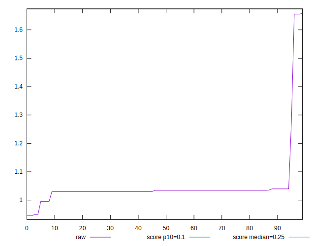

# //cumulative-layout-shift/samples/pages+cached+noadtech+nomedia

[→ Parent](../..)


## Raw


```yaml
p90min: 0.95001220703125
p90max: 1.655515889485677
p90range: 0.705503682454427
p90mean: 1.0389755470510345
p90median: 1.0344603203667533
p90stdev: 0.07041673216672824
p90skewness: 7.522417737080651
p90eccentricity: 1.000000000000001
p90discretization: 8.545454545454545
outlandishness: 1.030552758393225
confidence: 0.04978051285845292
p90confidence: 0.028470167794733058

```


## Score


```yaml
p90min: 0
p90max: 0.03
p90range: 0.03
p90mean: 0.020319148936170227
p90median: 0.02
p90stdev: 0.0034059171475706654
p90skewness: -1.089711946368119
p90eccentricity: 0.9999999999999991
p90discretization: 23.5
outlandishness: 0.968833091198158
confidence: 0.001998778920621761
p90confidence: 0.0013770453371324176

```


## Raw Estimate


## Score Estimate


## P Score


```yaml
p90min: 0.0040969197158846615
p90max: 0.030937445685189635
p90range: 0.026840525969304974
p90mean: 0.023550261676867884
p90median: 0.023500050050571486
p90stdev: 0.002698073858265445
p90skewness: -4.525296689371071
p90eccentricity: 1.0000000000000002
p90discretization: 11.75
outlandishness: 0.9704724489652822
confidence: 0.0017491308325140594
p90confidence: 0.0010908574298154493

```


## Score Difference


```yaml
p90min: 0
p90max: 0
p90range: 0
p90mean: 0
p90median: 0
p90stdev: 0
p90skewness: .nan
p90eccentricity: .nan
p90discretization: 94
outlandishness: .nan
confidence: 0
p90confidence: 0

```


## P Score Difference


```yaml
p90min: -0.0033563698241416973
p90max: 0.004054126984273931
p90range: 0.007410496808415629
p90mean: 0.0033805842362257554
p90median: 0.0035000500505714856
p90stdev: 0.000942437063105548
p90skewness: -4.683034289101145
p90eccentricity: 0.9999999999999991
p90discretization: 10.444444444444445
outlandishness: 0.8959981575855601
confidence: 0.000578672705637292
p90confidence: 0.00038103644541557033

```

