# //cumulative-layout-shift/samples/pages+cached

[→ Parent](../..)


## Raw


```yaml
p90min: 0.9801116896735297
p90max: 1.6817582261827257
p90range: 0.7016465365091961
p90mean: 1.1127329721563533
p90median: 1.0504894362555608
p90stdev: 0.18470778202302085
p90skewness: 2.656349961776224
p90eccentricity: 1.0000000000000002
p90discretization: 1.1058823529411765
outlandishness: 1.0228969314880345
confidence: 0.08090130868973
p90confidence: 0.07467914777324883

```

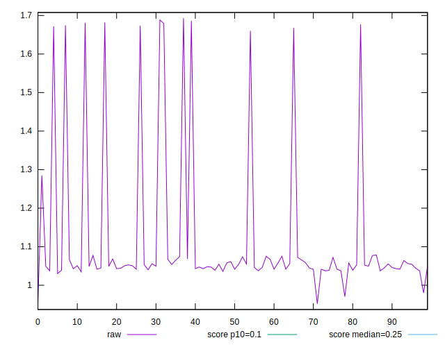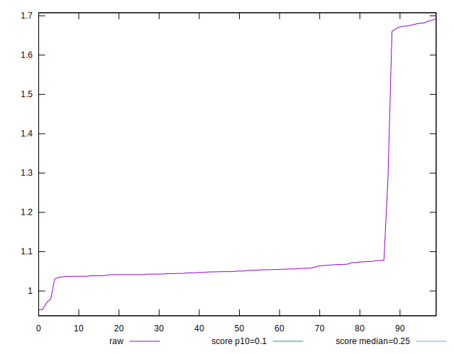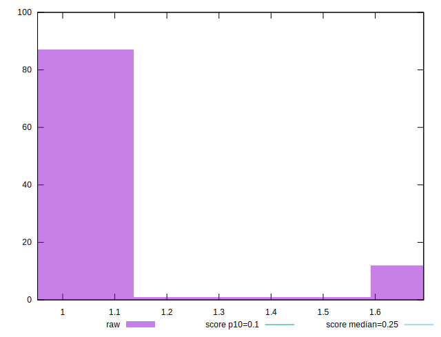
## Score


```yaml
p90min: 0
p90max: 0.03
p90range: 0.03
p90mean: 0.018085106382978736
p90median: 0.02
p90stdev: 0.0060628965313936235
p90skewness: -2.457858184185133
p90eccentricity: 1.0000000000000002
p90discretization: 23.5
outlandishness: 0.9796341730103807
confidence: 0.0027324456744647467
p90confidence: 0.0024512878723508867

```

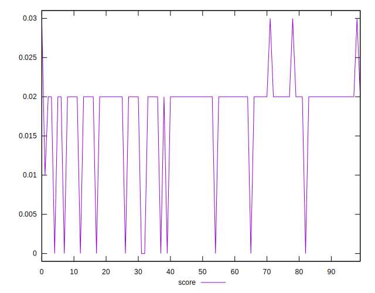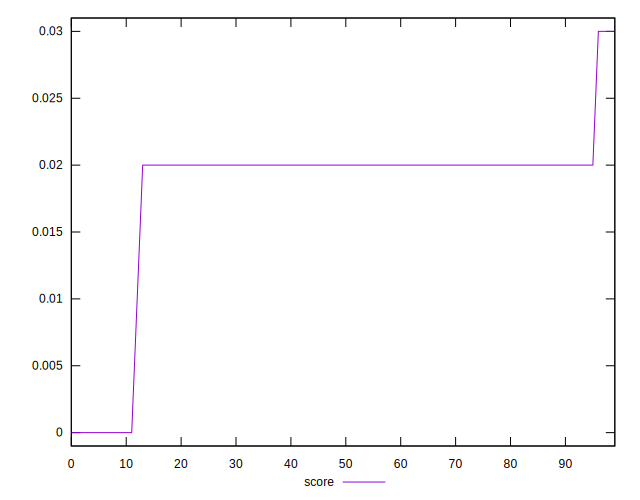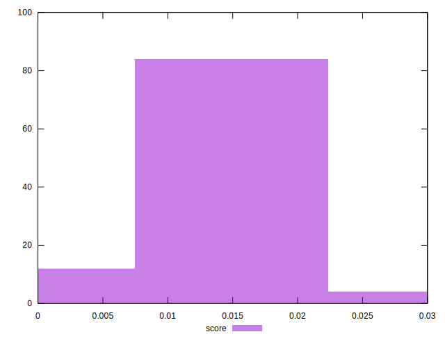
## Raw Estimate

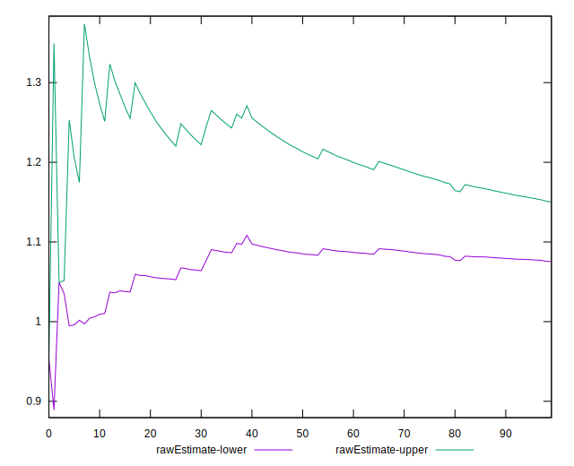
## Score Estimate

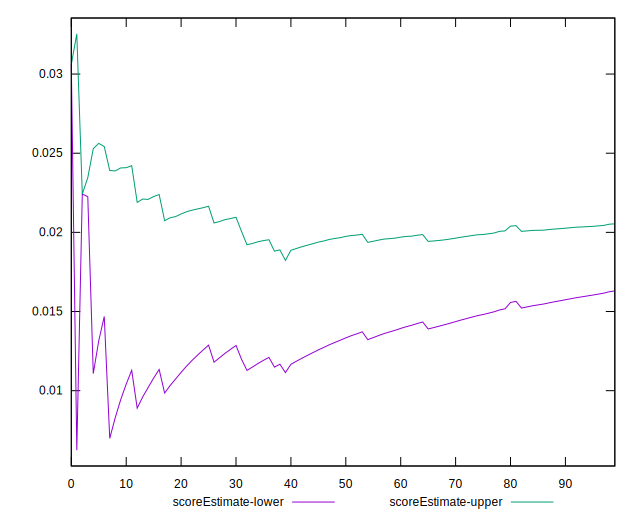
## P Score


```yaml
p90min: 0.0038383016408017334
p90max: 0.028014051790209604
p90range: 0.02417575014940787
p90mean: 0.02046810131025765
p90median: 0.022332005589323106
p90stdev: 0.005596778881015037
p90skewness: -2.4555515491586792
p90eccentricity: 0.9999999999999999
p90discretization: 1.1325301204819278
outlandishness: 0.9793660502398289
confidence: 0.002496635652515751
p90confidence: 0.0022628319853758403

```

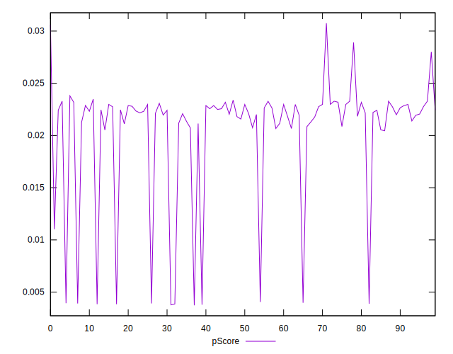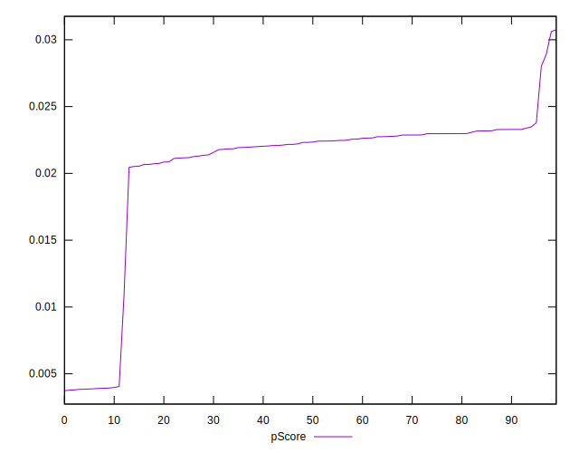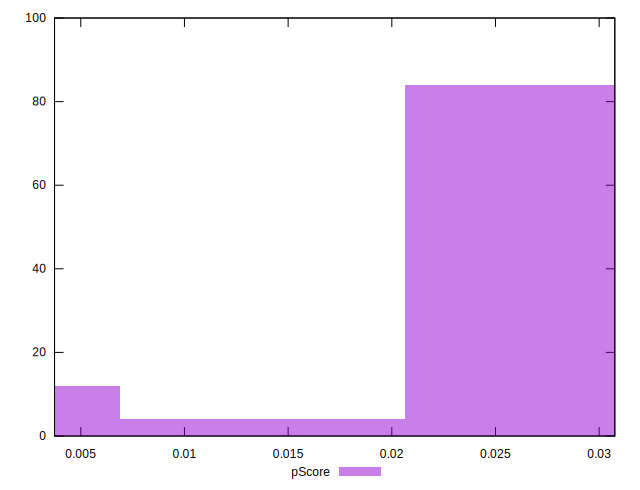
## Score Difference


```yaml
p90min: 0
p90max: 0
p90range: 0
p90mean: 0
p90median: 0
p90stdev: 0
p90skewness: .nan
p90eccentricity: .nan
p90discretization: 94
outlandishness: .nan
confidence: 0
p90confidence: 0

```


## P Score Difference


```yaml
p90min: 0.000519630003614064
p90max: 0.003915766413392974
p90range: 0.0033961364097789097
p90mean: 0.0024067941172535696
p90median: 0.0025294674439800997
p90stdev: 0.0009289861762161408
p90skewness: -0.37919439498915947
p90eccentricity: 0.9999999999999992
p90discretization: 1.1325301204819278
outlandishness: 0.958099579440859
confidence: 0.00043595587357758714
p90confidence: 0.00037559812138453355

```

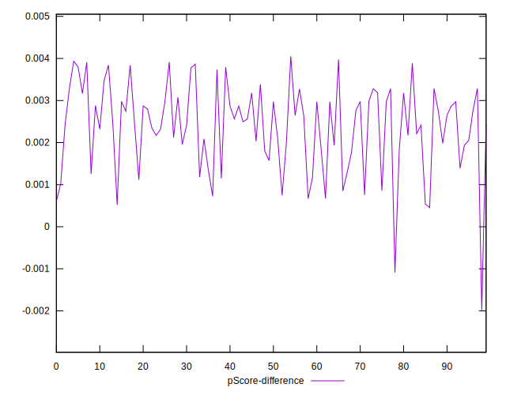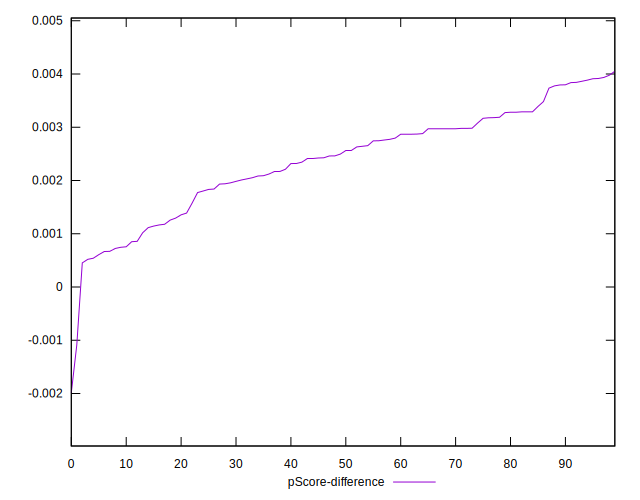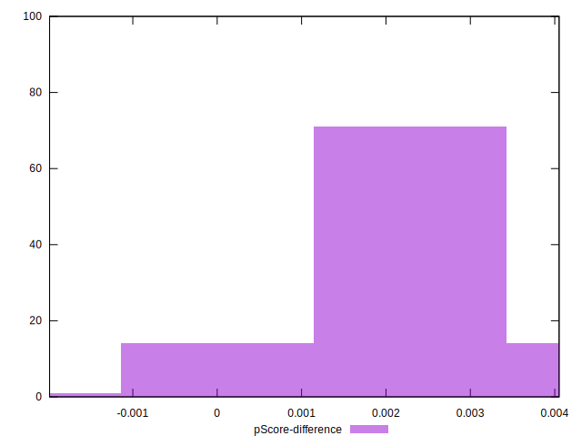