# //cumulative-layout-shift/samples/pages

[→ Parent](../..)


## Raw


```yaml
p90min: 0.9555600691901313
p90max: 1.6801078355577257
p90range: 0.7245477663675944
p90mean: 1.1761332879483557
p90median: 1.0521429803636337
p90stdev: 0.2466223446114797
p90skewness: 1.4458585002243862
p90eccentricity: 0.9999999999999997
p90discretization: 1.0804597701149425
outlandishness: 1.0184385306455555
confidence: 0.10296471710734126
p90confidence: 0.09971180594399827

```

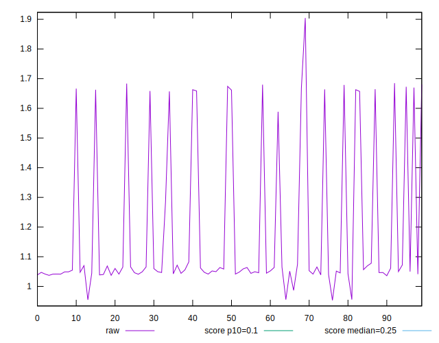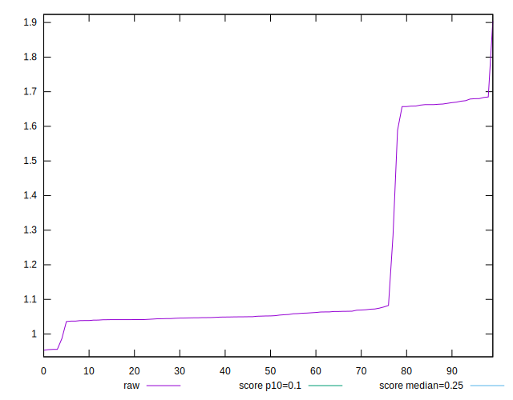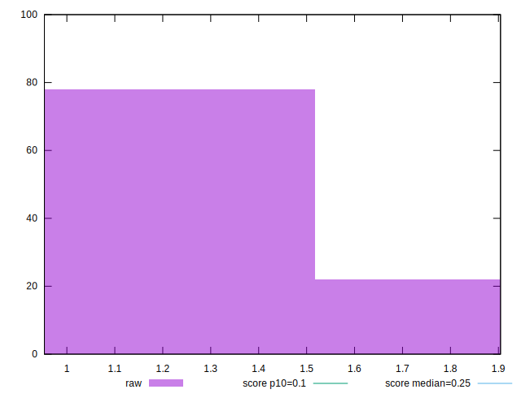
## Score


```yaml
p90min: 0
p90max: 0.03
p90range: 0.03
p90mean: 0.01606382978723405
p90median: 0.02
p90stdev: 0.008279439428344375
p90skewness: -1.2966918303357495
p90eccentricity: 0.9999999999999989
p90discretization: 23.5
outlandishness: 0.9920687689136445
confidence: 0.0034619866436145655
p90confidence: 0.0033474576640844023

```

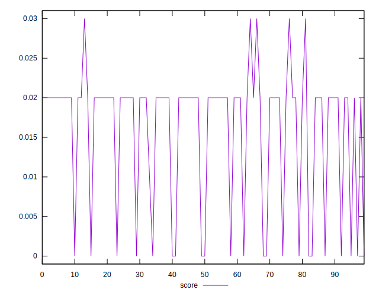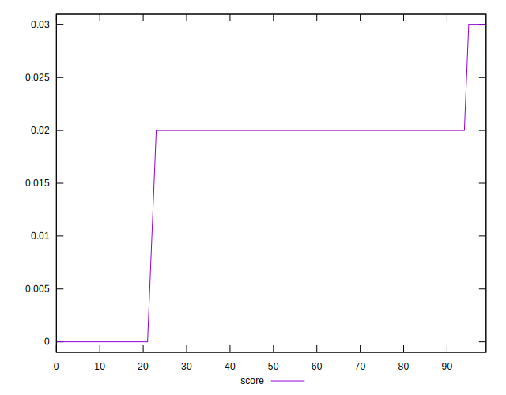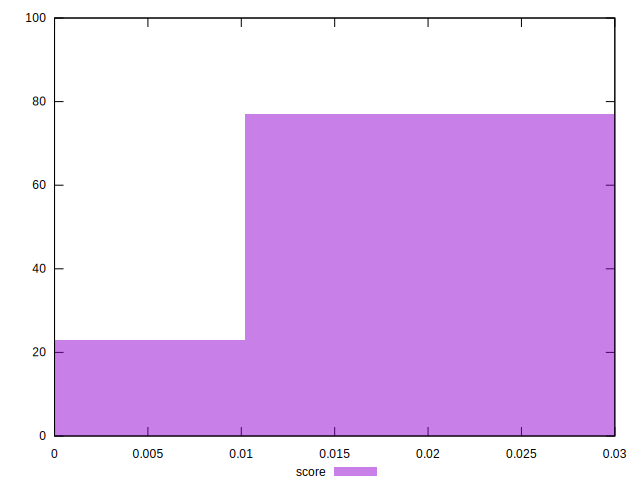
## Raw Estimate

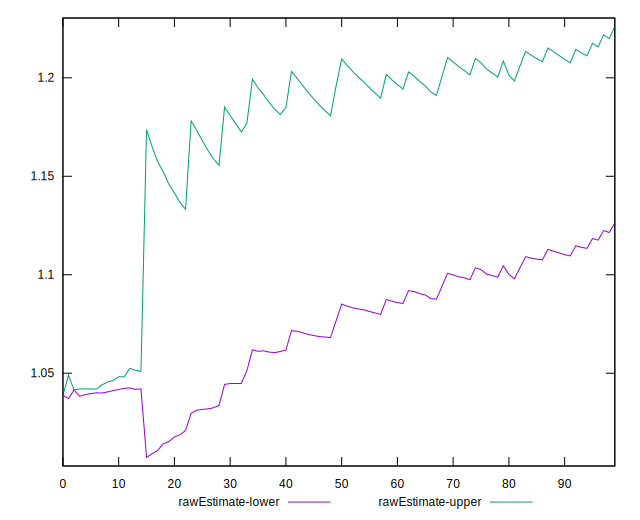
## Score Estimate

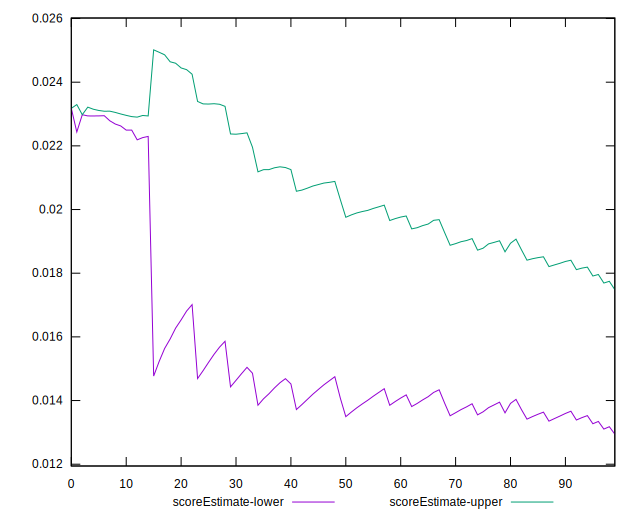
## P Score


```yaml
p90min: 0.00385400816629361
p90max: 0.030373314160317355
p90range: 0.026519305994023745
p90mean: 0.018584600144834932
p90median: 0.02221533316448593
p90stdev: 0.007513136136744703
p90skewness: -1.3225658920916108
p90eccentricity: 0.9999999999999999
p90discretization: 1.0930232558139534
outlandishness: 0.9890791537638144
confidence: 0.003143885996707369
p90confidence: 0.003037633810829717

```

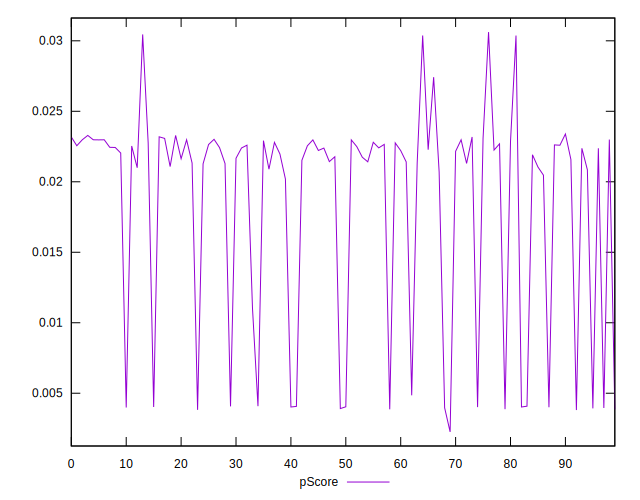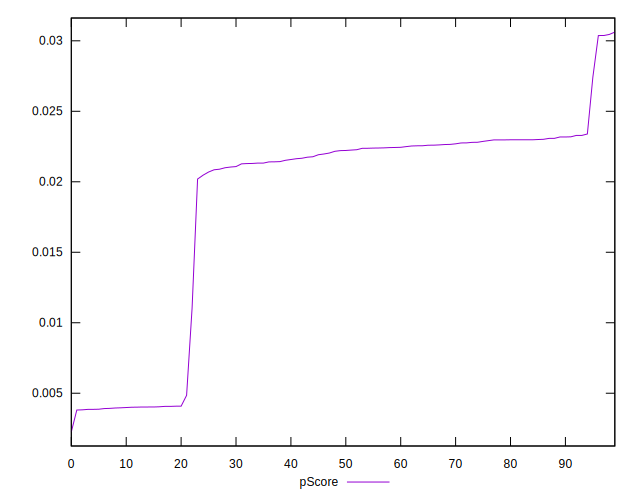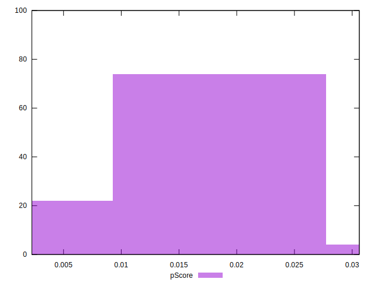
## Score Difference


```yaml
p90min: 0
p90max: 0
p90range: 0
p90mean: 0
p90median: 0
p90stdev: 0
p90skewness: .nan
p90eccentricity: .nan
p90discretization: 94
outlandishness: .nan
confidence: 0
p90confidence: 0

```


## P Score Difference


```yaml
p90min: 0.00037494931238432616
p90max: 0.004066729187220397
p90range: 0.003691779874836071
p90mean: 0.0025242759472967912
p90median: 0.002594899847663163
p90stdev: 0.0010066702102475332
p90skewness: -0.2444389902900313
p90eccentricity: 1.0000000000000002
p90discretization: 1.0930232558139534
outlandishness: 0.9674408724192435
confidence: 0.00046618303415362313
p90confidence: 0.0004070065298095202

```

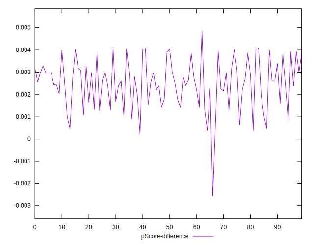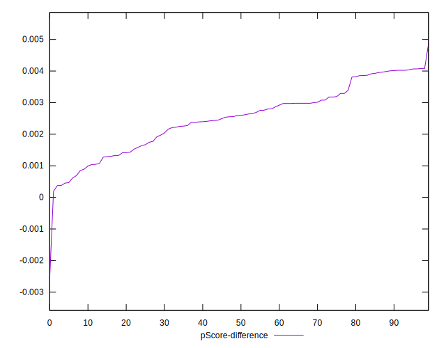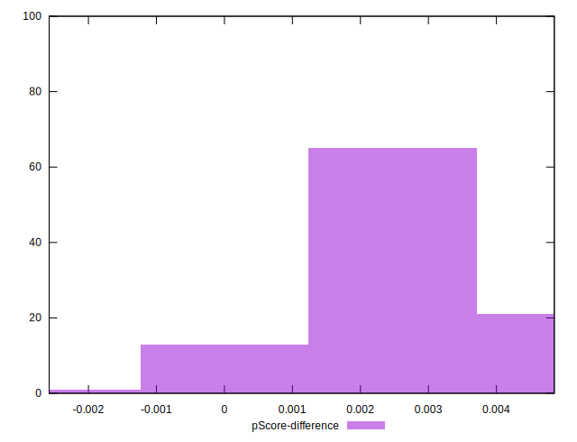