# //estimated-input-latency/samples/pages+cached+noadtech+nomedia+nocss

[→ Parent](../..)


## Raw


```yaml
p90min: 12.8
p90max: 274.8
p90range: 262
p90mean: 58.67489361702131
p90median: 39.900000000000006
p90stdev: 58.23840387157579
p90skewness: 1.5261602264088625
p90eccentricity: 1.0000000000000007
p90discretization: 1.6491228070175439
outlandishness: 1.740220307017775
confidence: 54.41247031173665
p90confidence: 23.546351546040967

```

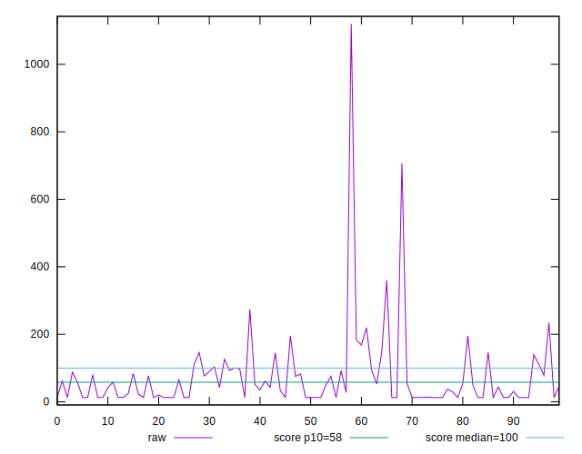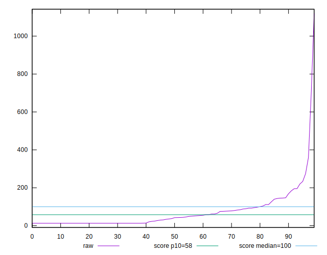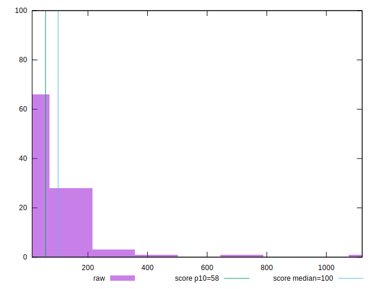
## Score


```yaml
p90min: 0.01
p90max: 1
p90range: 0.99
p90mean: 0.7915957446808511
p90median: 0.985
p90stdev: 0.31052564628894813
p90skewness: -1.349770386040904
p90eccentricity: 0.9999999999999987
p90discretization: 2.5405405405405403
outlandishness: 0.9562847565133672
confidence: 0.13026681483775568
p90confidence: 0.12554853061743615

```

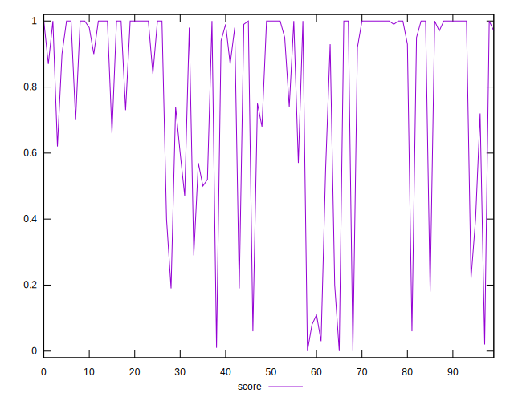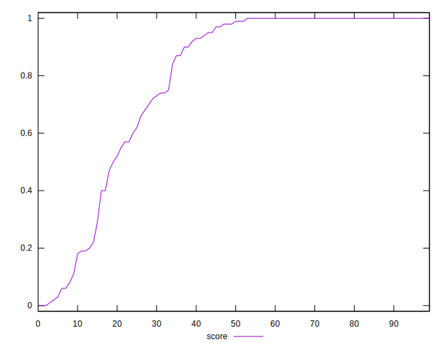
## Raw Estimate

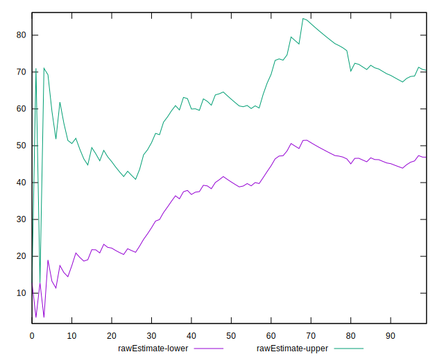
## Score Estimate

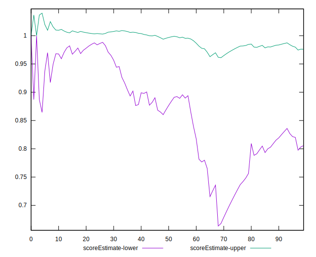
## P Score


```yaml
p90min: 0.008697980928441151
p90max: 0.9999993380488856
p90range: 0.9913013571204445
p90mean: 0.7913171339926677
p90median: 0.9839491798980297
p90stdev: 0.3108747493903798
p90skewness: -1.348943411457024
p90eccentricity: 0.9999999999999994
p90discretization: 1.6491228070175439
outlandishness: 0.956342764846117
confidence: 0.13036983977656996
p90confidence: 0.1256896763873348

```

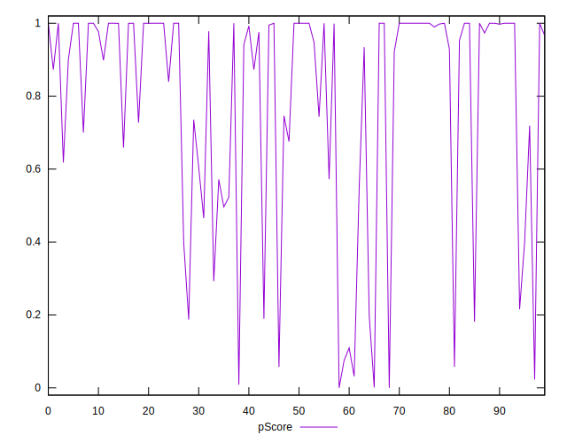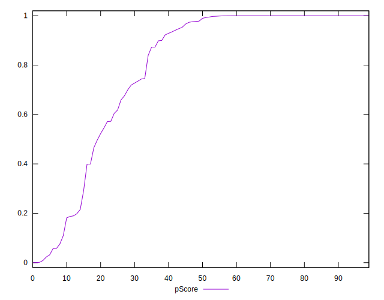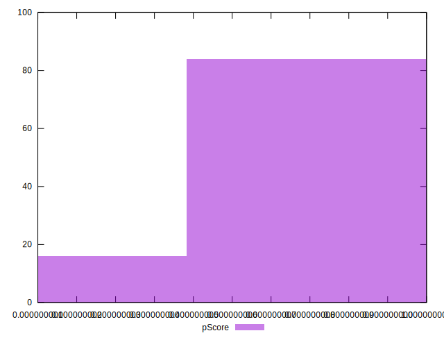
## Score Difference


```yaml
p90min: 0
p90max: 1.1102230246251565e-16
p90range: 1.1102230246251565e-16
p90mean: 4.133809134242604e-18
p90median: 0
p90stdev: 2.0225598724843797e-17
p90skewness: 4.876863729774658
p90eccentricity: 0.9999999999999979
p90discretization: 31.333333333333332
outlandishness: 3.047518367346939
confidence: 1.0505807952691233e-17
p90confidence: 8.17740573478811e-18

```

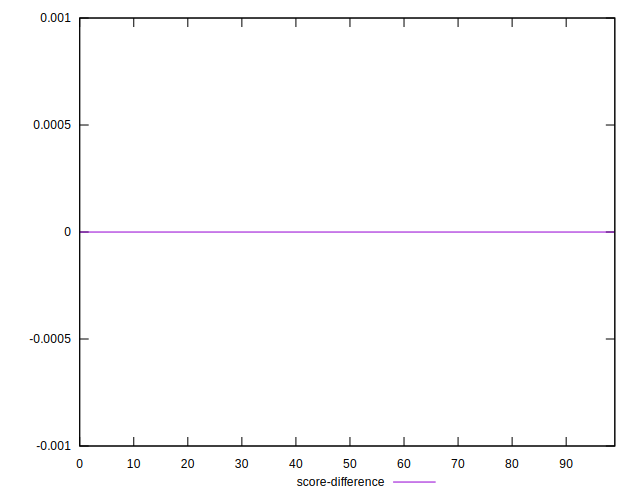
## P Score Difference


```yaml
p90min: -0.004359215886324486
p90max: 0.0037528514810278857
p90range: 0.008112067367352371
p90mean: -0.00027293938319863876
p90median: -6.619511143668433e-7
p90stdev: 0.0017393049359768966
p90skewness: -0.2217616150770323
p90eccentricity: 0.9999999999999994
p90discretization: 1.7407407407407407
outlandishness: 0.8321602585490188
confidence: 0.0007955427313568014
p90confidence: 0.0007032178553276713

```

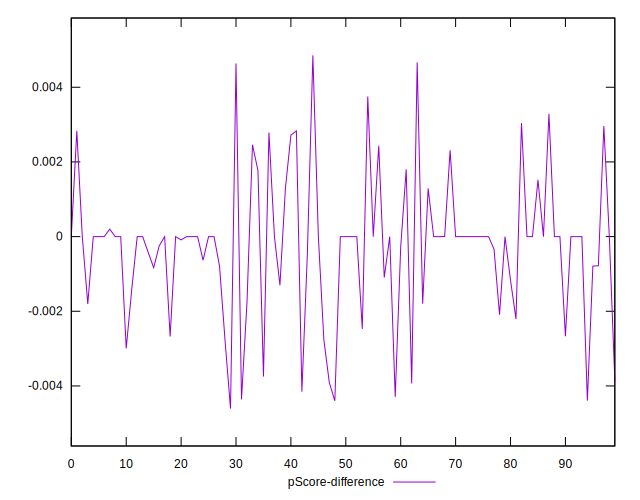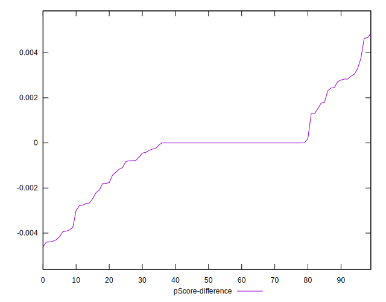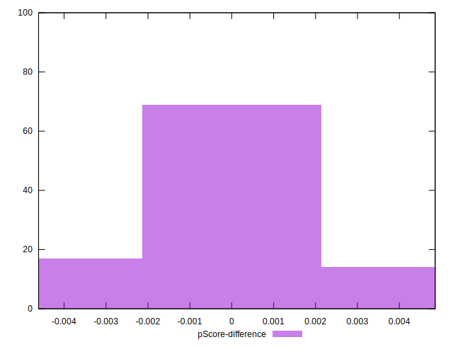