# //first-cpu-idle/samples/pages+cached+noadtech+nomedia+nocss

[→ Parent](../..)


## Raw


```yaml
p90min: 4181.7119999999995
p90max: 6126.7080000000005
p90range: 1944.996000000001
p90mean: 4708.742870212766
p90median: 4633.3505
p90stdev: 409.9366068867813
p90skewness: 0.9404743505762284
p90eccentricity: 0.9999999999999997
p90discretization: 1
outlandishness: 1.022624853224088
confidence: 223.17784089391233
p90confidence: 165.74134618511442

```

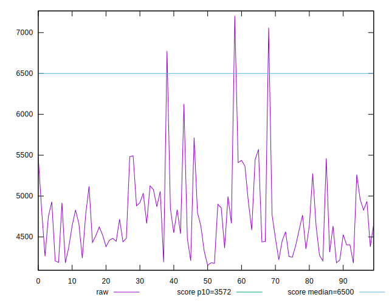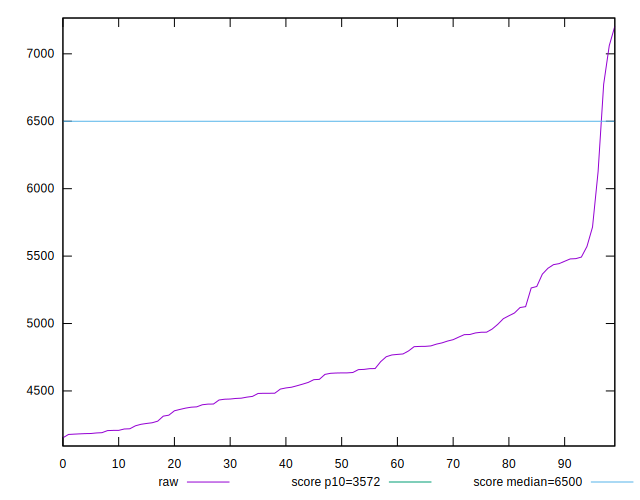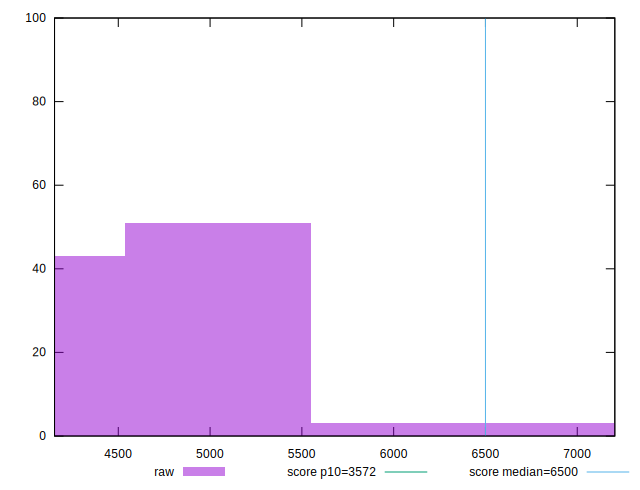
## Score


```yaml
p90min: 0.55
p90max: 0.83
p90range: 0.2799999999999999
p90mean: 0.7541489361702125
p90median: 0.77
p90stdev: 0.05891590787721025
p90skewness: -0.9805280345846672
p90eccentricity: 1.0000000000000002
p90discretization: 4.2727272727272725
outlandishness: 0.9806056089911863
confidence: 0.03155909639113411
p90confidence: 0.023820272986705755

```

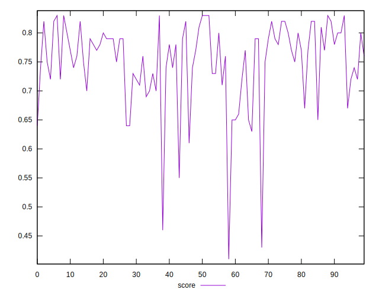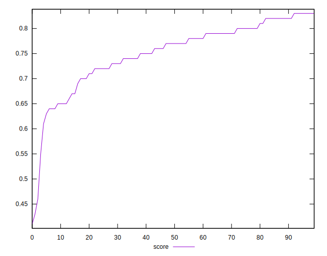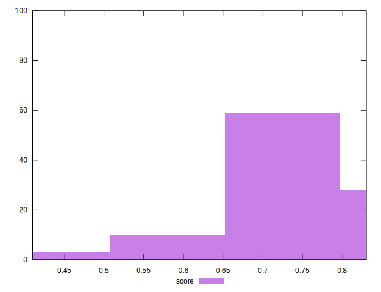
## Raw Estimate

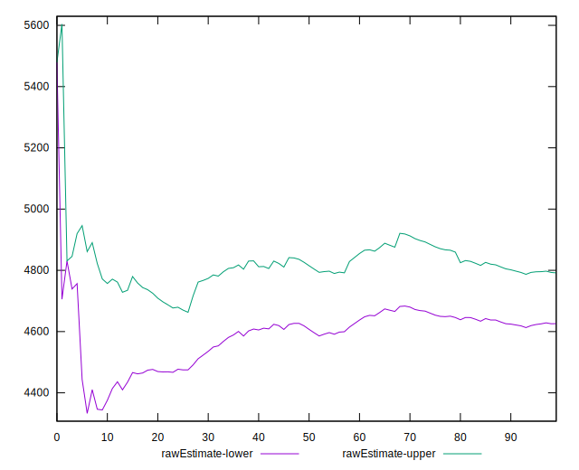
## Score Estimate

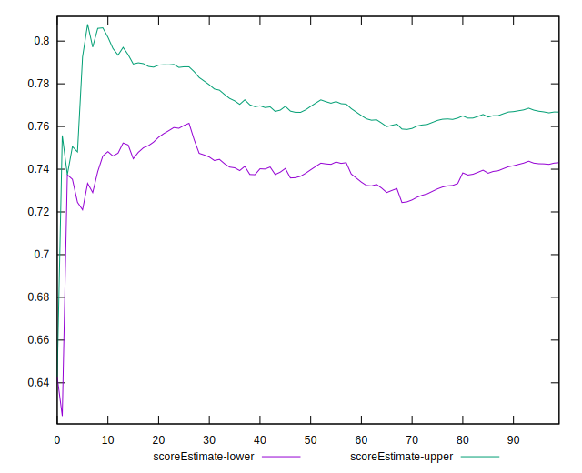
## P Score


```yaml
p90min: 0.5503744548384748
p90max: 0.8274655385144912
p90range: 0.2770910836760164
p90mean: 0.7540045612432971
p90median: 0.7656678895685738
p90stdev: 0.05859242546707227
p90skewness: -0.9868483069970676
p90eccentricity: 0.9999999999999999
p90discretization: 1
outlandishness: 0.9807368956847691
confidence: 0.031347582469784814
p90confidence: 0.023689485910795064

```

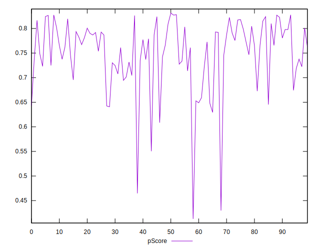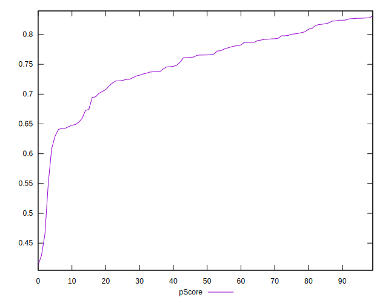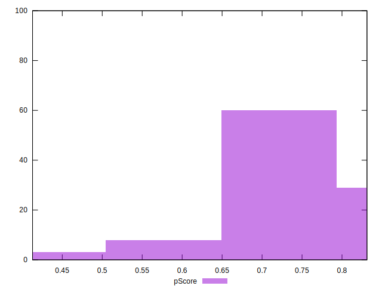
## Score Difference


```yaml
p90min: 0
p90max: 1.1102230246251565e-16
p90range: 1.1102230246251565e-16
p90mean: 2.303122231935165e-17
p90median: 0
p90stdev: 4.465154356357303e-17
p90skewness: 1.44285754804951
p90eccentricity: 0.9999999999999971
p90discretization: 31.333333333333332
outlandishness: 1.176390532544379
confidence: 1.80424151711414e-17
p90confidence: 1.8053052143044687e-17

```

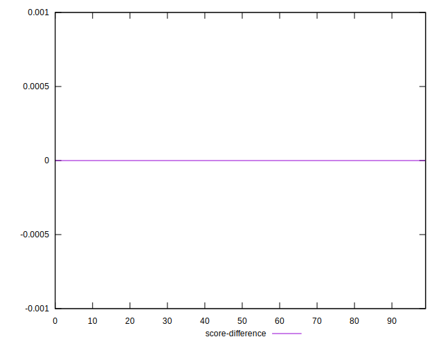
## P Score Difference


```yaml
p90min: -0.004731006499901214
p90max: 0.004652486416246049
p90range: 0.009383492916147262
p90mean: -0.00009265405690547023
p90median: 0.000016613011349753126
p90stdev: 0.0027693951736646946
p90skewness: 0.005194896618884325
p90eccentricity: 1.0000000000000002
p90discretization: 1
outlandishness: 1.0072055067617198
confidence: 0.0011503886312635488
p90confidence: 0.0011196933293847443

```

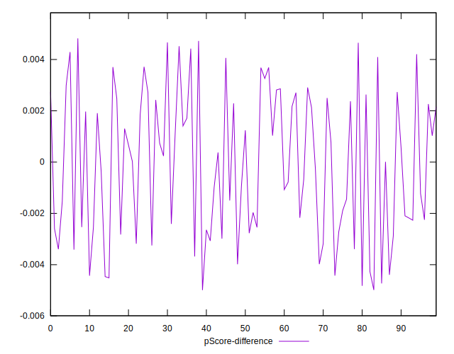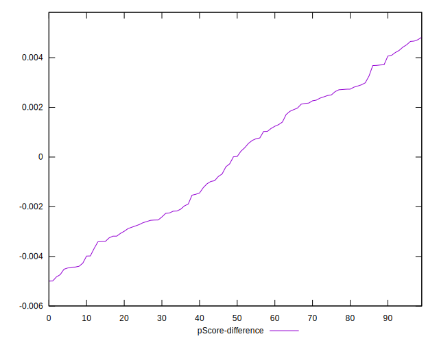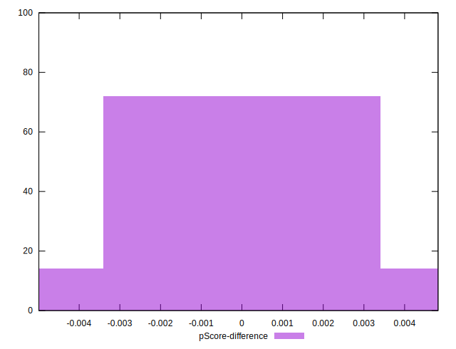