# //first-cpu-idle/samples/pages+cached+noadtech

[→ Parent](../..)


## Raw


```yaml
p90min: 6263.723999999999
p90max: 8333.137
p90range: 2069.4130000000014
p90mean: 6837.97239361702
p90median: 6734.252
p90stdev: 492.217096417187
p90skewness: 1.0202919645369029
p90eccentricity: 1
p90discretization: 1
outlandishness: 1.0117421092703518
confidence: 234.77550396032282
p90confidence: 199.00814614988576

```

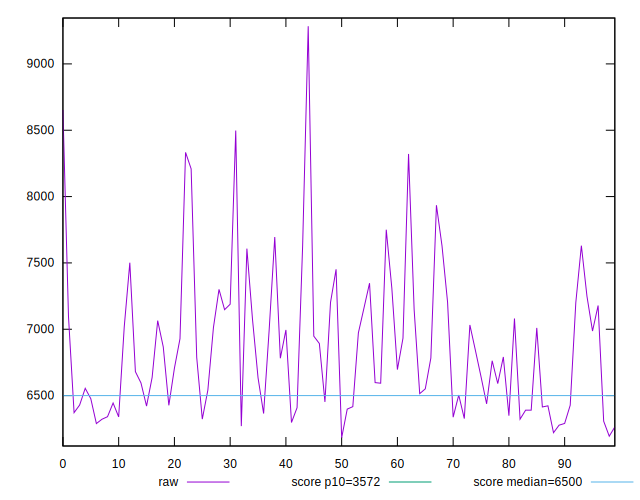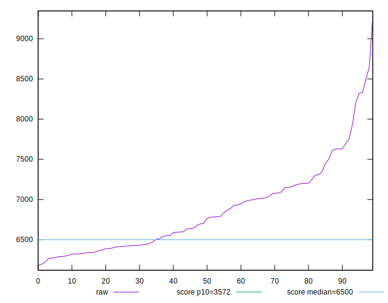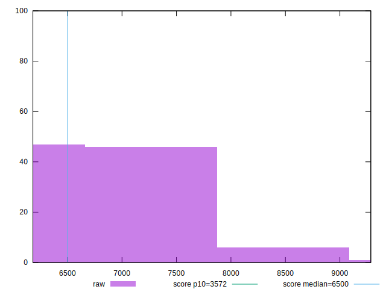
## Score


```yaml
p90min: 0.3
p90max: 0.53
p90range: 0.23000000000000004
p90mean: 0.4594680851063829
p90median: 0.47
p90stdev: 0.05783996669602266
p90skewness: -0.8003222588266681
p90eccentricity: 1.0000000000000007
p90discretization: 4.476190476190476
outlandishness: 0.9840970746006665
confidence: 0.026529428432557352
p90confidence: 0.02338525953147831

```

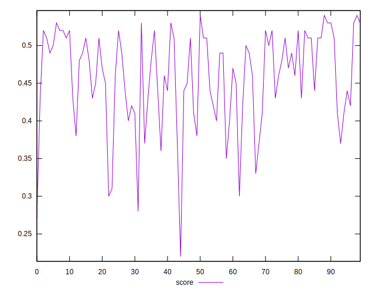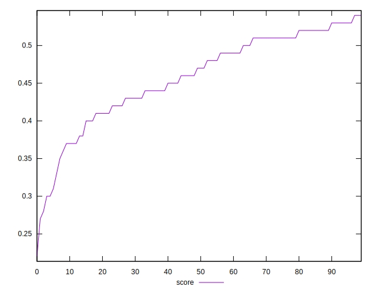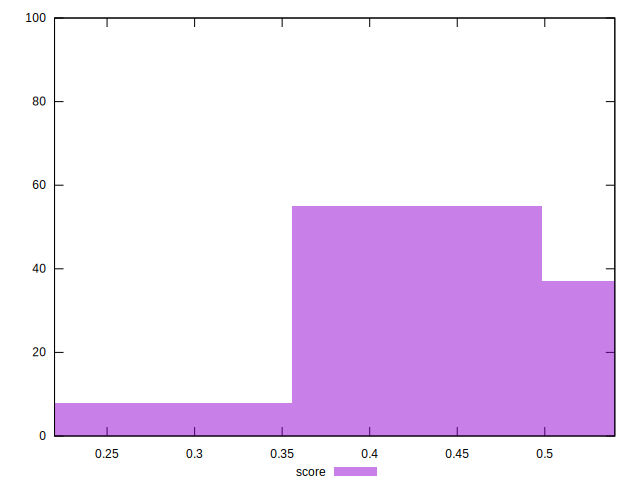
## Raw Estimate

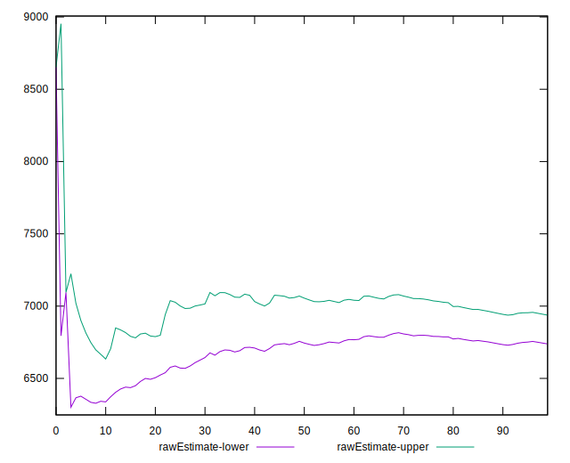
## Score Estimate

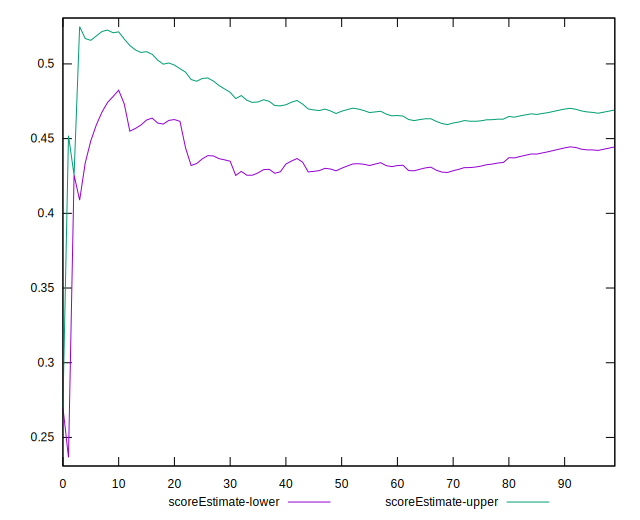
## P Score


```yaml
p90min: 0.2974266432887655
p90max: 0.5315879991639099
p90range: 0.23416135587514436
p90mean: 0.45954070515999884
p90median: 0.4698022775627563
p90stdev: 0.058247554919565445
p90skewness: -0.8007002136295996
p90eccentricity: 1.0000000000000009
p90discretization: 1
outlandishness: 0.984396042328354
confidence: 0.02659735717098265
p90confidence: 0.023550051403500215

```

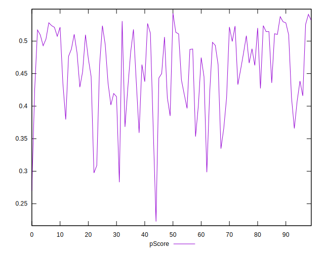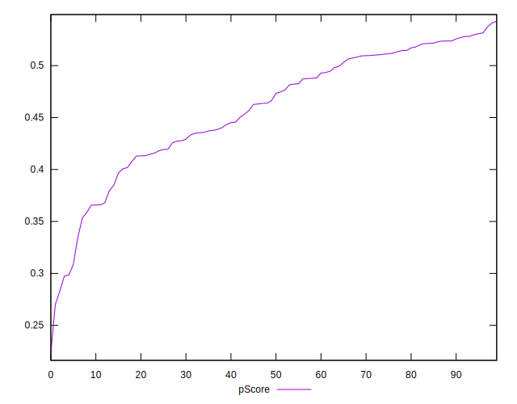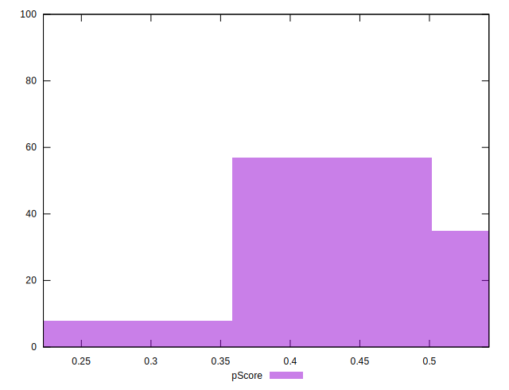
## Score Difference


```yaml
p90min: 0
p90max: 5.551115123125783e-17
p90range: 5.551115123125783e-17
p90mean: 3.543264972207946e-18
p90median: 0
p90stdev: 1.3569671737421592e-17
p90skewness: 3.5685919470918015
p90eccentricity: 0.9999999999999988
p90discretization: 47
outlandishness: 1.9881000000000004
confidence: 6.22730693084422e-18
p90confidence: 5.486349897196453e-18

```

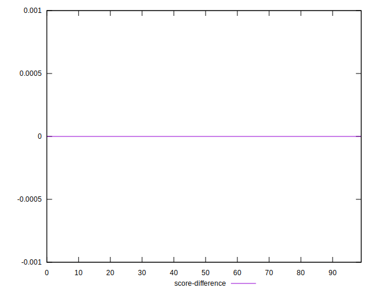
## P Score Difference


```yaml
p90min: -0.0043771550327434405
p90max: 0.004663623796257843
p90range: 0.009040778829001284
p90mean: 0.00014394549471562803
p90median: 0.00010957926221058512
p90stdev: 0.002718001045712679
p90skewness: 0.001217223164059849
p90eccentricity: 1.0000000000000002
p90discretization: 1
outlandishness: 0.9633324586246406
confidence: 0.001128510877155371
p90confidence: 0.0010989141849763755

```

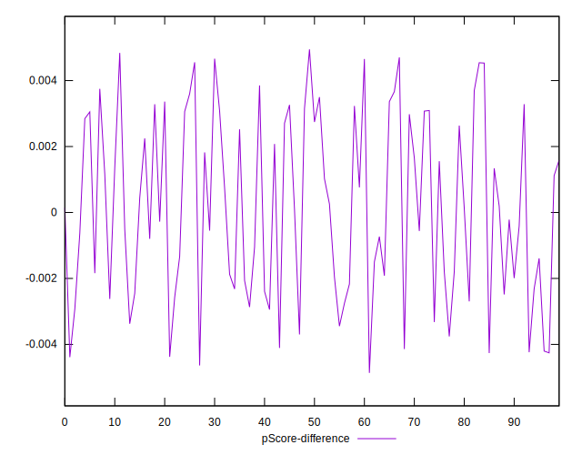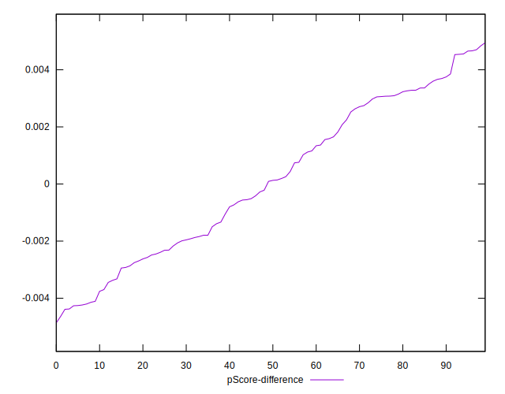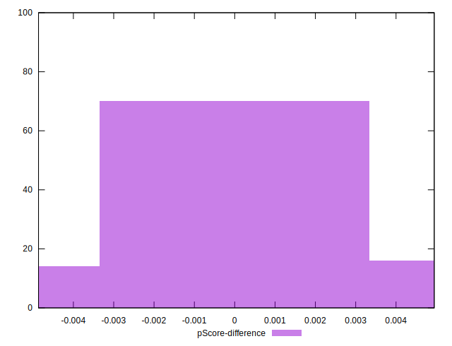