# //first-meaningful-paint/samples/pages+cached+noadtech+nomedia+nocss

[→ Parent](../..)


## Raw


```yaml
p90min: 1614.1460000000002
p90max: 2244.8514999999998
p90range: 630.7054999999996
p90mean: 1707.305797872341
p90median: 1673.7372500000001
p90stdev: 110.01842723971095
p90skewness: 2.194160456647772
p90eccentricity: 1.0000000000000002
p90discretization: 1
outlandishness: 1.0229939166308601
confidence: 66.50358784144564
p90confidence: 44.48151721398936

```

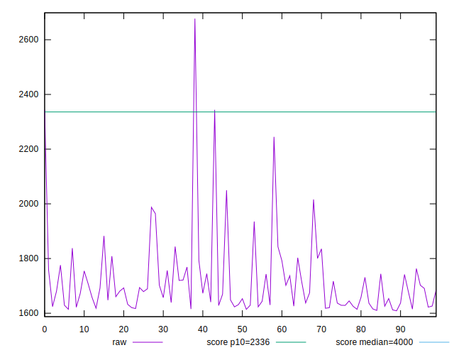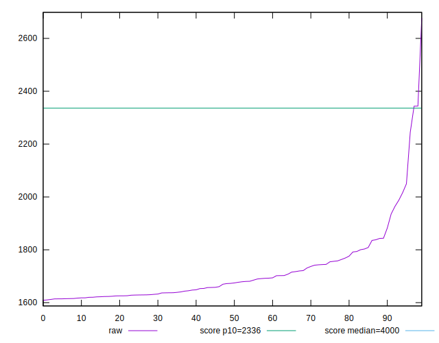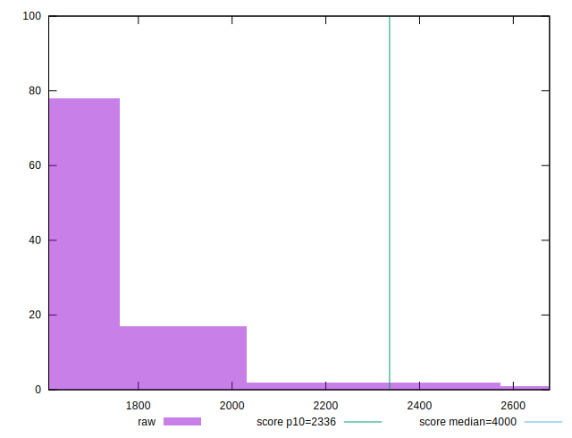
## Score


```yaml
p90min: 0.92
p90max: 0.98
p90range: 0.05999999999999994
p90mean: 0.9761702127659578
p90median: 0.98
p90stdev: 0.009576831859512252
p90skewness: -3.4599223748629333
p90eccentricity: 0.9999999999999984
p90discretization: 15.666666666666666
outlandishness: 0.9943323776479179
confidence: 0.007941507056889643
p90confidence: 0.003872006007559204

```

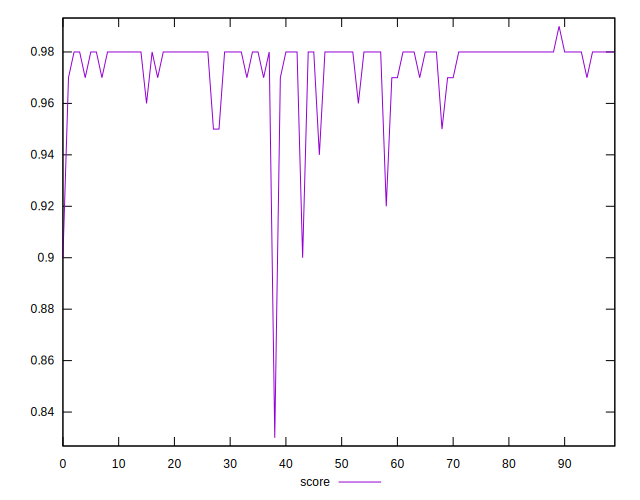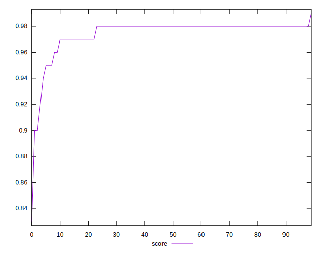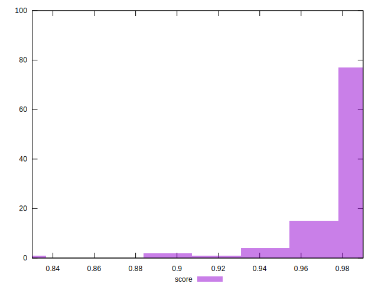
## Raw Estimate

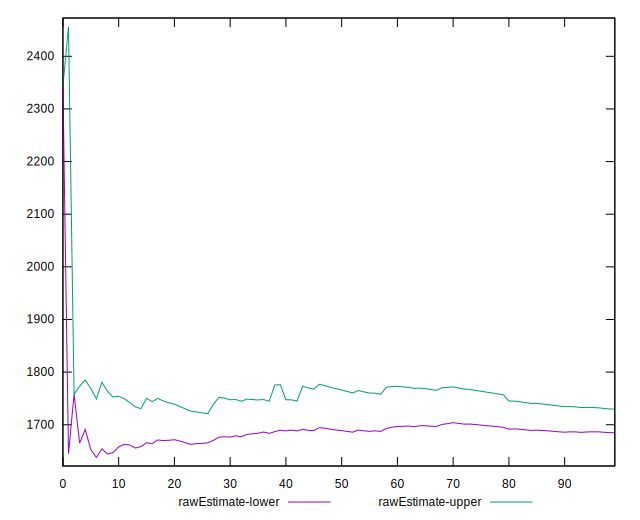
## Score Estimate

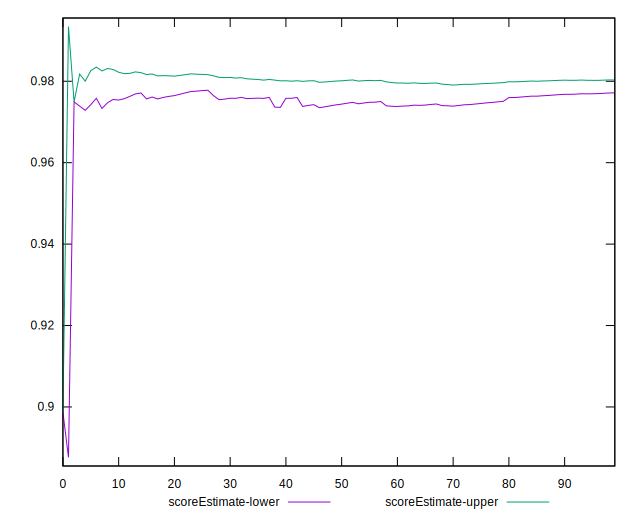
## P Score


```yaml
p90min: 0.9156487265109274
p90max: 0.984701862297966
p90range: 0.06905313578703853
p90mean: 0.9777450506648752
p90median: 0.9810485187208264
p90stdev: 0.010271410646560309
p90skewness: -3.289742609444955
p90eccentricity: 1.0000000000000007
p90discretization: 1
outlandishness: 0.9942029950516327
confidence: 0.008168174486696324
p90confidence: 0.0041528309479597165

```

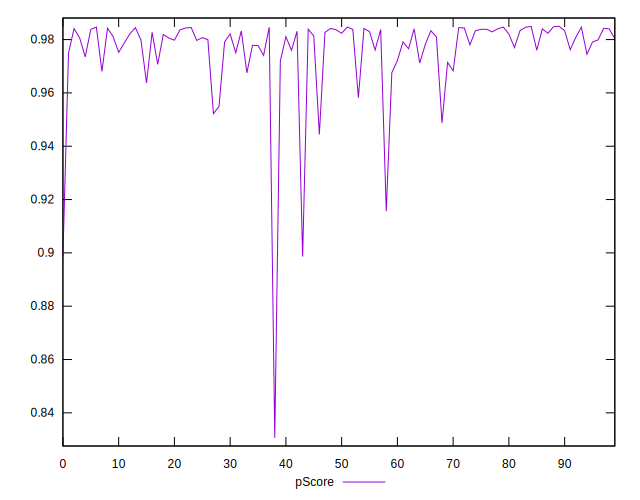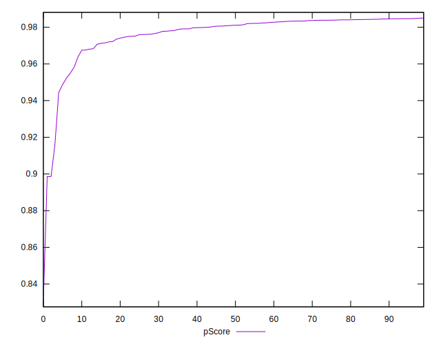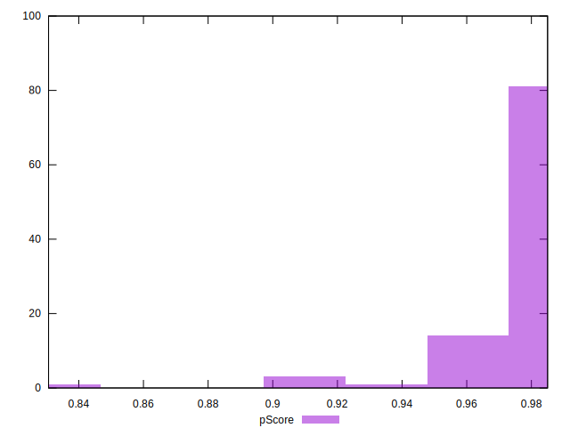
## Score Difference


```yaml
p90min: 0
p90max: 1.1102230246251565e-16
p90range: 1.1102230246251565e-16
p90mean: 2.362176648138631e-18
p90median: 0
p90stdev: 1.6021061506108986e-17
p90skewness: 6.634888026970372
p90eccentricity: 0.9999999999999988
p90discretization: 47
outlandishness: 5.522500000000001
confidence: 9.484951648085961e-18
p90confidence: 6.477470556979047e-18

```

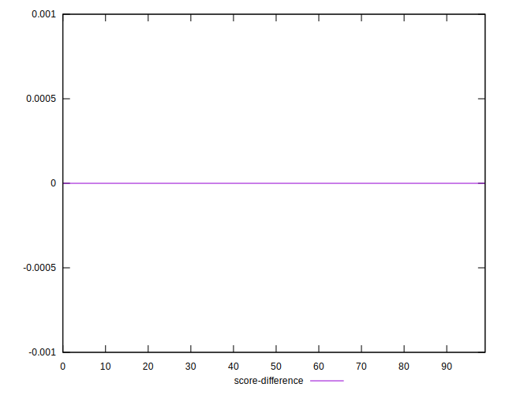
## P Score Difference


```yaml
p90min: -0.004351273489072605
p90max: 0.004814432474983699
p90range: 0.009165705964056303
p90mean: 0.0016025944254826464
p90median: 0.0021823263820216487
p90stdev: 0.002653173255927138
p90skewness: -0.6166282595255277
p90eccentricity: 0.9999999999999997
p90discretization: 1
outlandishness: 0.8841823461572099
confidence: 0.001123304117295216
p90confidence: 0.0010727036807941309

```

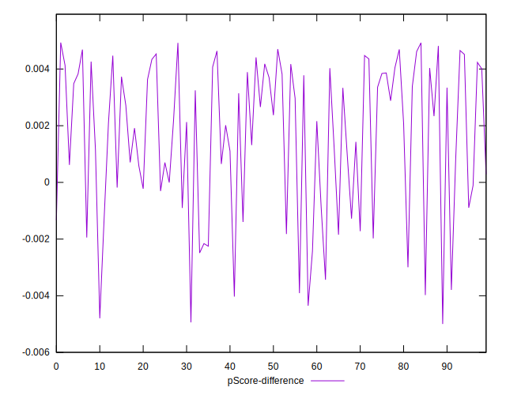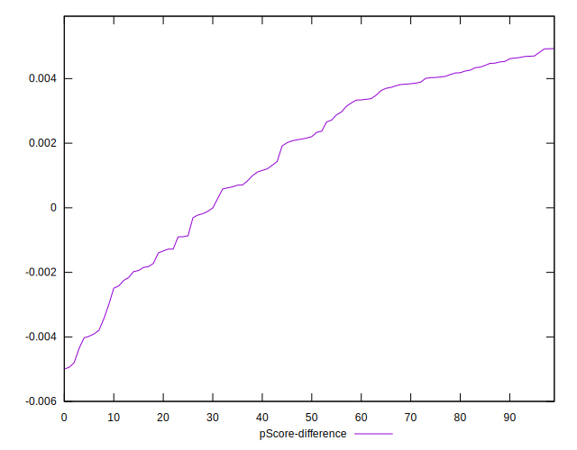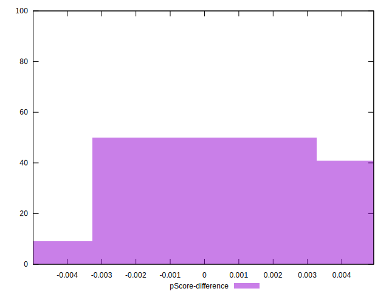