# //first-meaningful-paint/samples/pages+cached+noadtech

[→ Parent](../..)


## Raw


```yaml
p90min: 2123.8900000000003
p90max: 3185.924
p90range: 1062.0339999999997
p90mean: 2374.8987446808515
p90median: 2339.9445
p90stdev: 217.24851200610252
p90skewness: 1.3764761382892445
p90eccentricity: 1.0000000000000004
p90discretization: 1
outlandishness: 1.0251185035998769
confidence: 120.15838320348746
p90confidence: 87.83568052157162

```

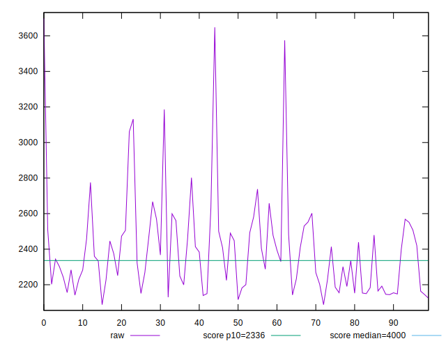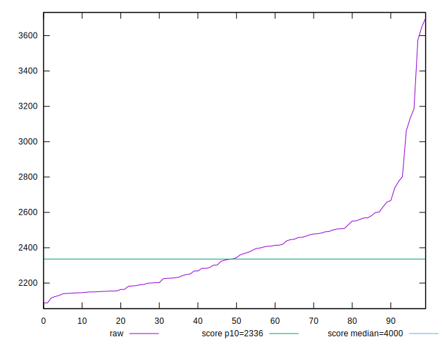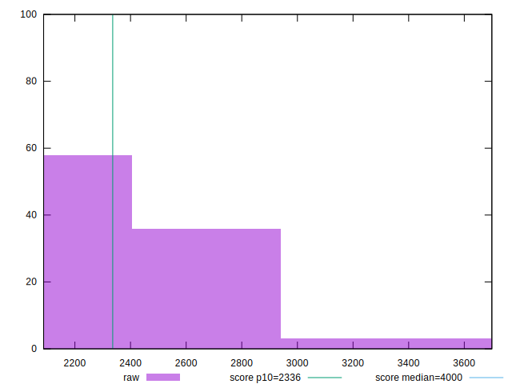
## Score


```yaml
p90min: 0.71
p90max: 0.93
p90range: 0.22000000000000008
p90mean: 0.8898936170212774
p90median: 0.9
p90stdev: 0.04374721099562671
p90skewness: -1.8919237848950188
p90eccentricity: 1.0000000000000016
p90discretization: 5.529411764705882
outlandishness: 0.9832293079760154
confidence: 0.026366404119589164
p90confidence: 0.017687421714601734

```

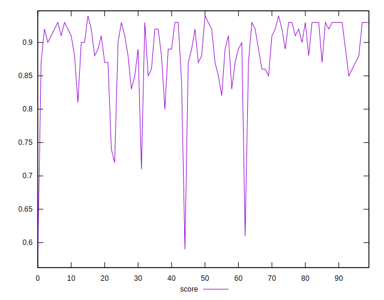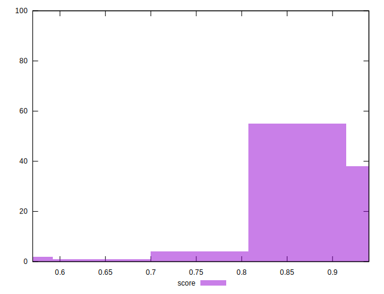
## Raw Estimate

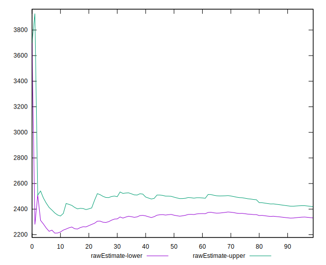
## Score Estimate

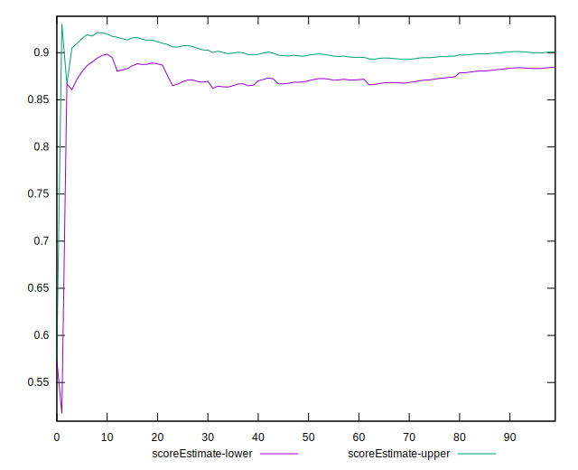
## P Score


```yaml
p90min: 0.7061564718048252
p90max: 0.9342692329713276
p90range: 0.22811276116650236
p90mean: 0.88968606559557
p90median: 0.8992913810708262
p90stdev: 0.04399681679491605
p90skewness: -1.9006278470075992
p90eccentricity: 1.0000000000000004
p90discretization: 1
outlandishness: 0.9830375357235391
confidence: 0.026454784085759356
p90confidence: 0.01778833976020885

```

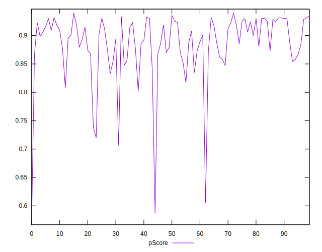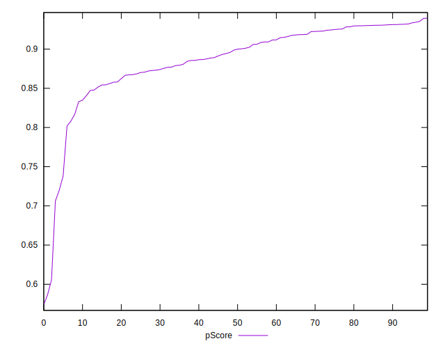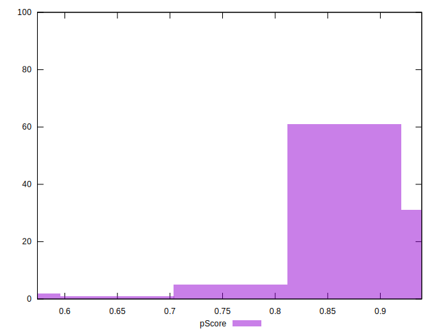
## Score Difference


```yaml
p90min: 0
p90max: 1.1102230246251565e-16
p90range: 1.1102230246251565e-16
p90mean: 4.724353296277262e-18
p90median: 0
p90stdev: 2.2409575331340657e-17
p90skewness: 4.532597979574667
p90eccentricity: 1.0000000000000016
p90discretization: 47
outlandishness: 2.706025000000001
confidence: 1.1103983576888548e-17
p90confidence: 9.06040865942704e-18

```

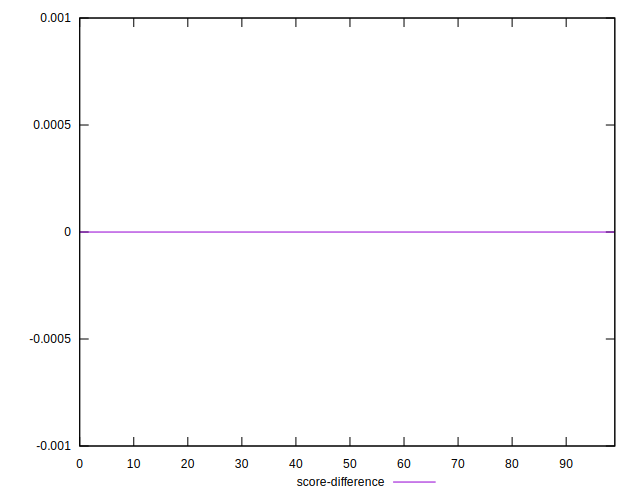
## P Score Difference


```yaml
p90min: -0.004580470665172198
p90max: 0.004391229265723218
p90range: 0.008971699930895416
p90mean: -0.00030383745863599626
p90median: -0.00033331669513114726
p90stdev: 0.0025828505672961747
p90skewness: 0.09037002710960304
p90eccentricity: 0.9999999999999999
p90discretization: 1
outlandishness: 0.9225919270884356
confidence: 0.0010826463540775486
p90confidence: 0.0010442715357130462

```

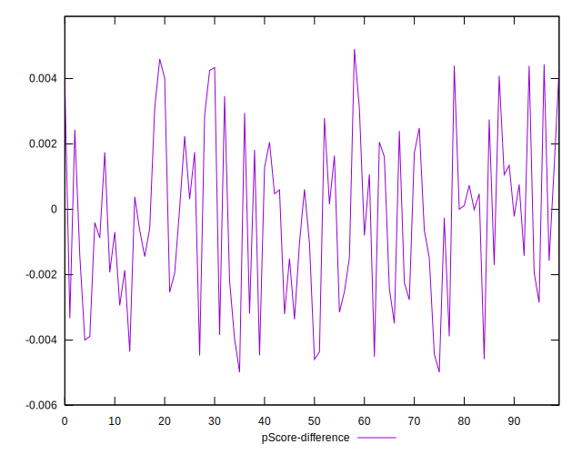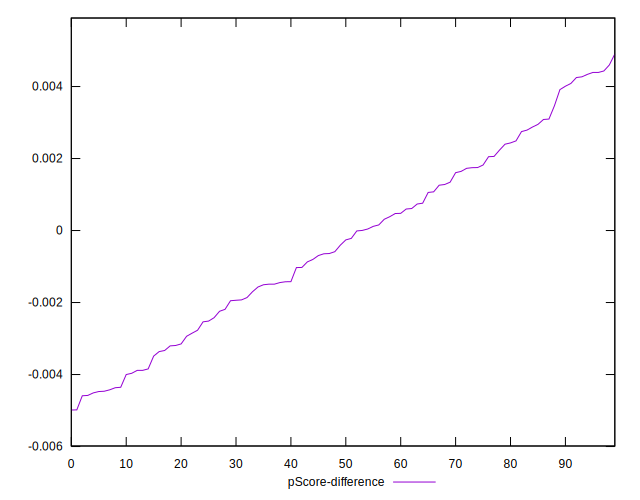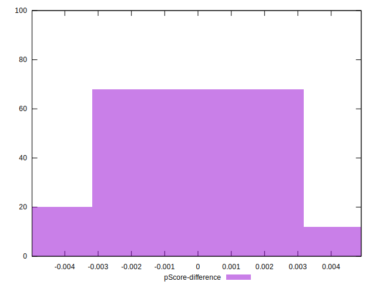