# //first-meaningful-paint/samples/pages

[→ Parent](../..)


## Raw


```yaml
p90min: 2640.3745
p90max: 4197.453000000001
p90range: 1557.0785000000014
p90mean: 3035.7102872340442
p90median: 2858.8805
p90stdev: 359.7777608361499
p90skewness: 1.3601736407305705
p90eccentricity: 0.9999999999999996
p90discretization: 1
outlandishness: 1.0217507541539324
confidence: 174.06157910007823
p90confidence: 145.4616382306121

```

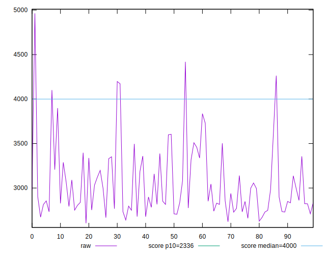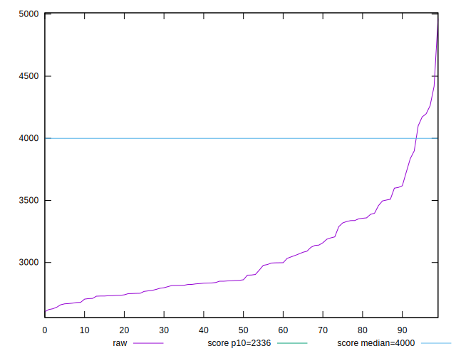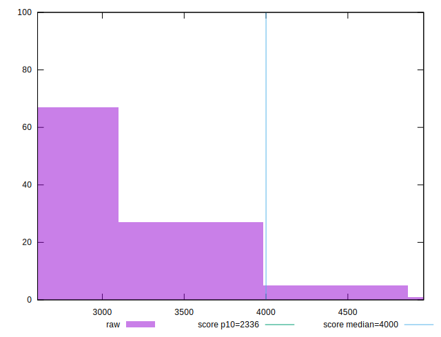
## Score


```yaml
p90min: 0.45
p90max: 0.84
p90range: 0.38999999999999996
p90mean: 0.7426595744680852
p90median: 0.79
p90stdev: 0.09030887343498159
p90skewness: -1.3764278068105982
p90eccentricity: 0.9999999999999997
p90discretization: 3.1333333333333333
outlandishness: 0.9792124485555471
confidence: 0.04274876903019644
p90confidence: 0.03651275344558066

```

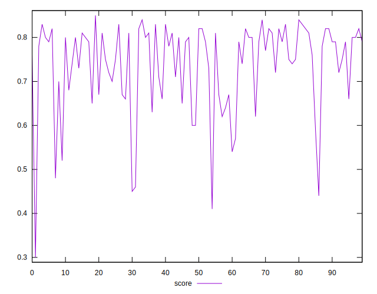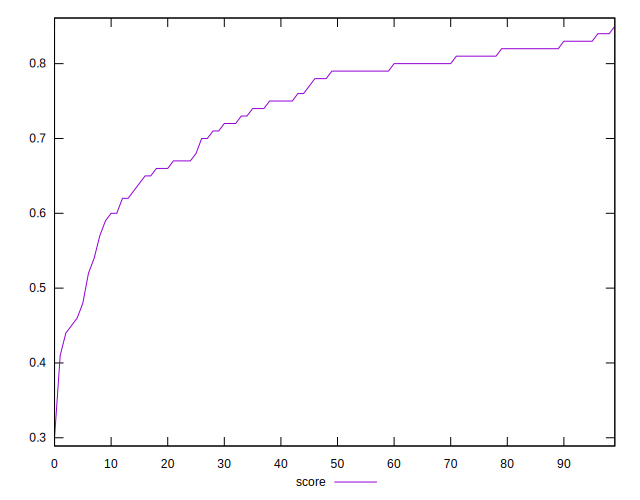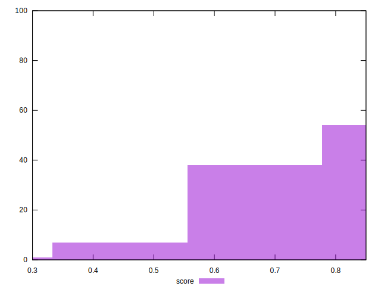
## Raw Estimate

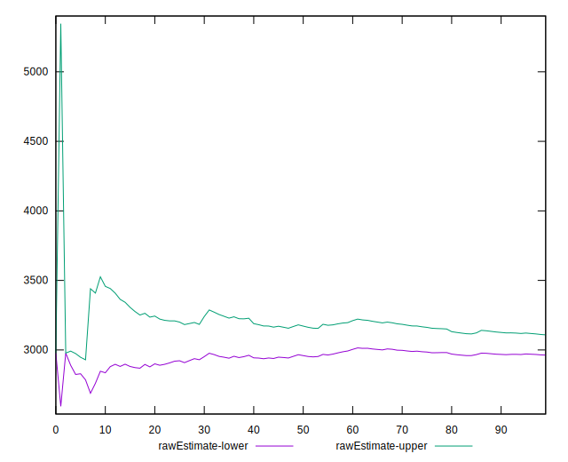
## Score Estimate

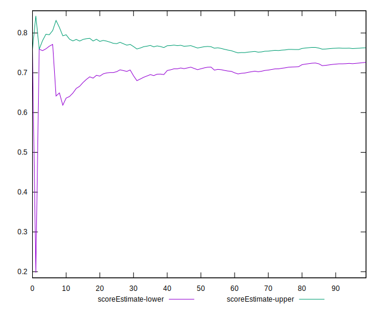
## P Score


```yaml
p90min: 0.4542988060410759
p90max: 0.8388433735221288
p90range: 0.38454456748105287
p90mean: 0.7428667010015624
p90median: 0.7882219630206599
p90stdev: 0.09023207694676225
p90skewness: -1.3704206614125054
p90eccentricity: 1.0000000000000002
p90discretization: 1
outlandishness: 0.9792113099047323
confidence: 0.042726029120093274
p90confidence: 0.036481703880535885

```

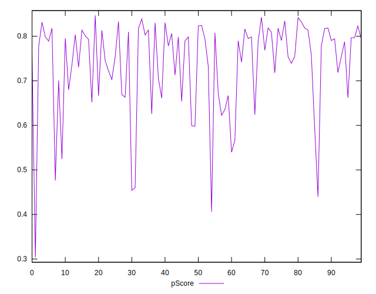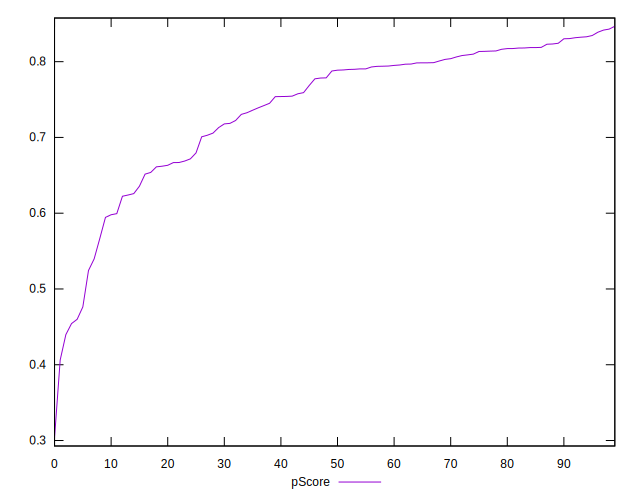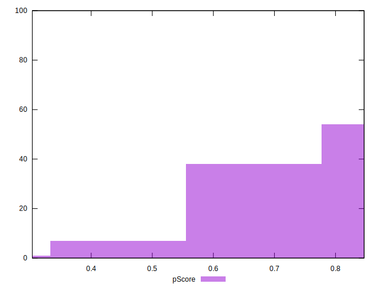
## Score Difference


```yaml
p90min: 0
p90max: 1.1102230246251565e-16
p90range: 1.1102230246251565e-16
p90mean: 2.066904567121302e-17
p90median: 0
p90stdev: 4.2833792791145953e-17
p90skewness: 1.6123175505861924
p90eccentricity: 1.0000000000000007
p90discretization: 31.333333333333332
outlandishness: 1.2125155918367347
confidence: 1.7433797960968427e-17
p90confidence: 1.7318117875185307e-17

```

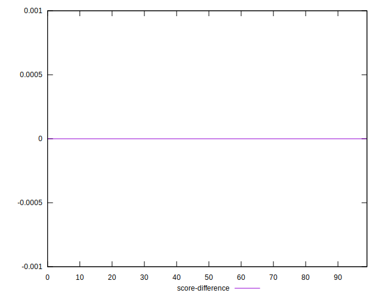
## P Score Difference


```yaml
p90min: -0.004384976986503308
p90max: 0.0043768925159496375
p90range: 0.008761869502452946
p90mean: 0.00022481944665010188
p90median: -0.00016961336997051157
p90stdev: 0.0026643053106107425
p90skewness: 0.054142507526852124
p90eccentricity: 1.0000000000000007
p90discretization: 1
outlandishness: 0.8276896621616936
confidence: 0.0011063405447479693
p90confidence: 0.0010772044784737498

```

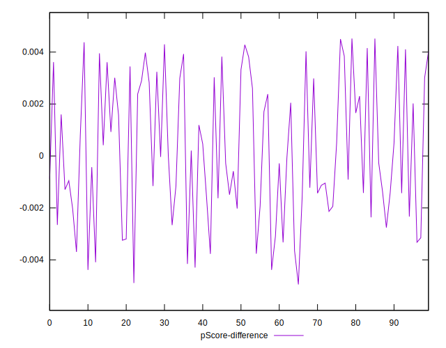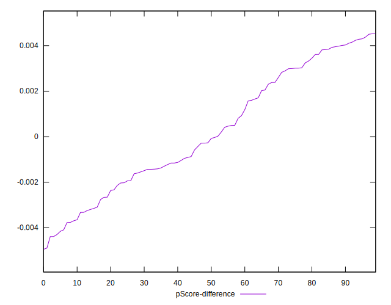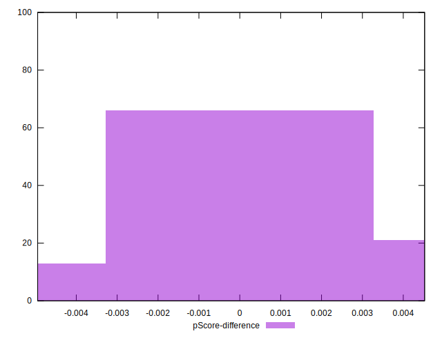