# //interactive/samples/pages+cached+noadtech

[→ Parent](../..)


## Raw


```yaml
p90min: 6529.035
p90max: 9108.028
p90range: 2578.9930000000004
p90mean: 7356.209079787235
p90median: 7267.931500000001
p90stdev: 692.9963551138846
p90skewness: 0.828816706183272
p90eccentricity: 1.0000000000000007
p90discretization: 1
outlandishness: 1.0176678063143916
confidence: 338.7750393614448
p90confidence: 280.1851478213436

```

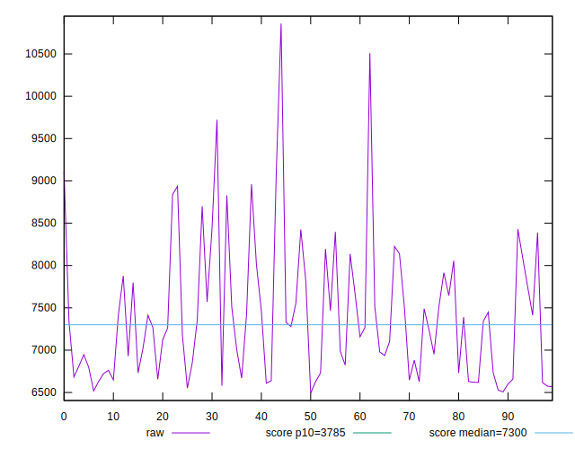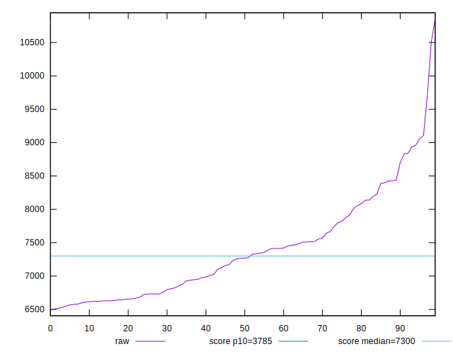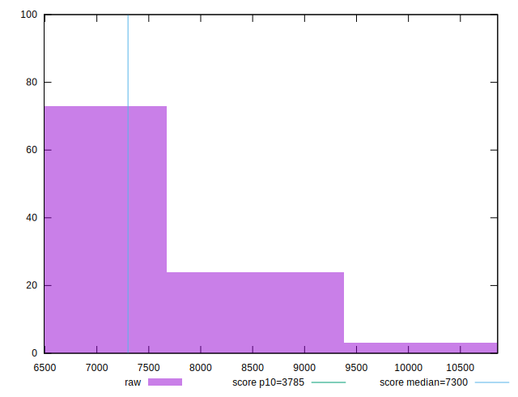
## Score


```yaml
p90min: 0.33
p90max: 0.59
p90range: 0.25999999999999995
p90mean: 0.4974468085106382
p90median: 0.5
p90stdev: 0.06984688680390395
p90skewness: -0.664853583705858
p90eccentricity: 0.9999999999999999
p90discretization: 3.76
outlandishness: 0.9814046254795796
confidence: 0.032048042305845056
p90confidence: 0.028239773787549584

```

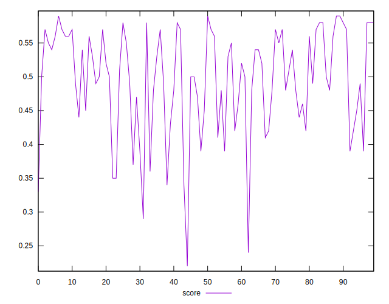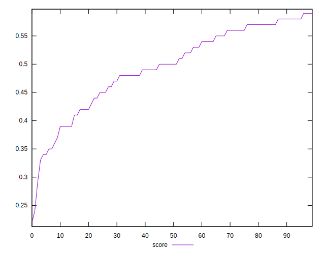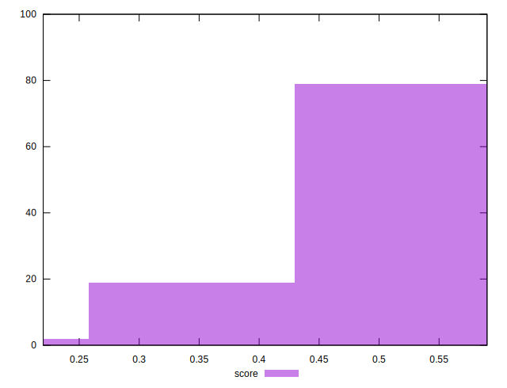
## Raw Estimate

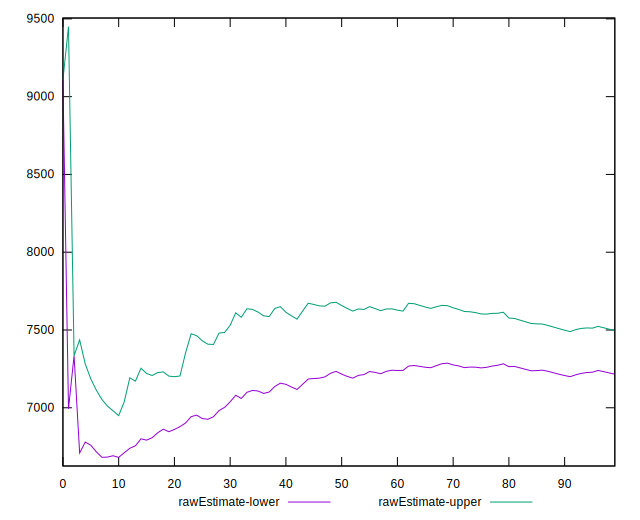
## Score Estimate

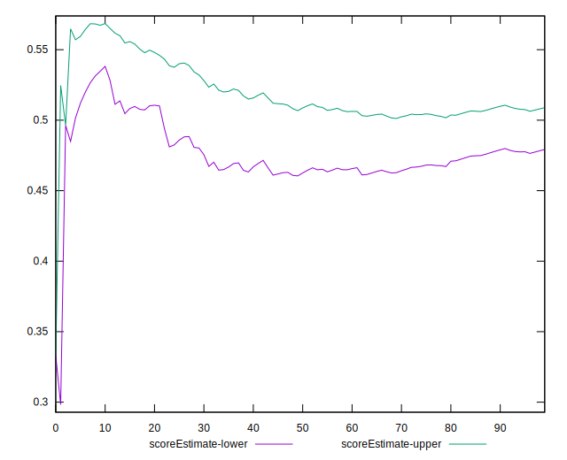
## P Score


```yaml
p90min: 0.332962457101661
p90max: 0.5861976379398575
p90range: 0.25323518083819646
p90mean: 0.4976333047652588
p90median: 0.5034269114793601
p90stdev: 0.07013309013019506
p90skewness: -0.6594421727172198
p90eccentricity: 1
p90discretization: 1
outlandishness: 0.9810694607251986
confidence: 0.03217177684336051
p90confidence: 0.028355488568287002

```

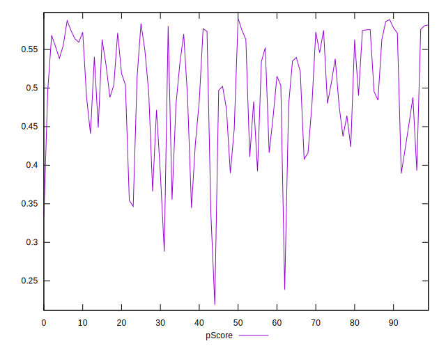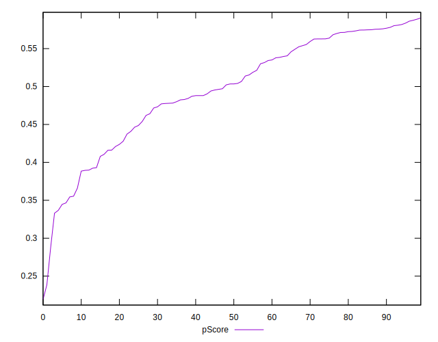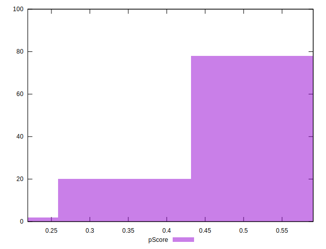
## Score Difference


```yaml
p90min: 0
p90max: 1.1102230246251565e-16
p90range: 1.1102230246251565e-16
p90mean: 1.299197156476247e-17
p90median: 0
p90stdev: 3.281640677745222e-17
p90skewness: 2.3546926126175514
p90eccentricity: 1.0000000000000009
p90discretization: 31.333333333333332
outlandishness: 1.4312859504132236
confidence: 1.4128908803243086e-17
p90confidence: 1.326799155010674e-17

```

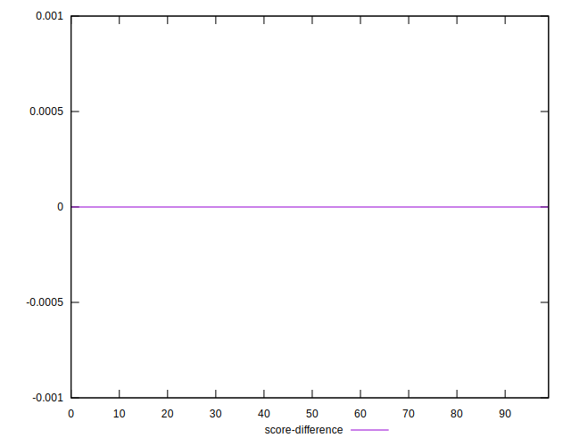
## P Score Difference


```yaml
p90min: -0.004585608015369447
p90max: 0.0045052773212262975
p90range: 0.009090885336595744
p90mean: 0.00010694478048241074
p90median: 0.00004720820135392656
p90stdev: 0.002801747574049733
p90skewness: -0.008503990885177679
p90eccentricity: 1.0000000000000002
p90discretization: 1
outlandishness: 0.8842667061245308
confidence: 0.0011583201774660438
p90confidence: 0.0011327737186499483

```

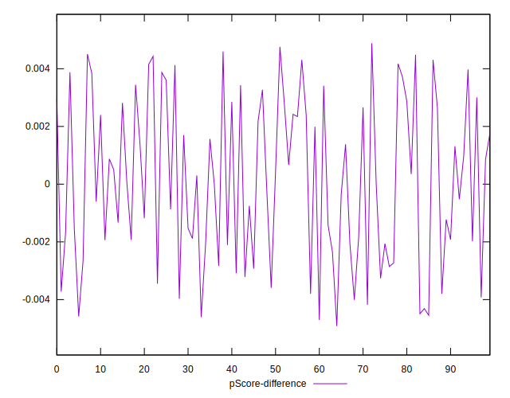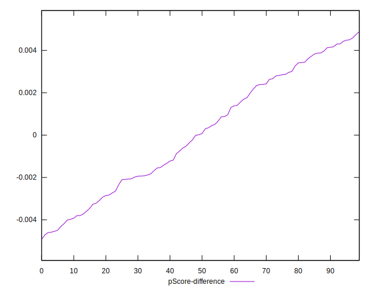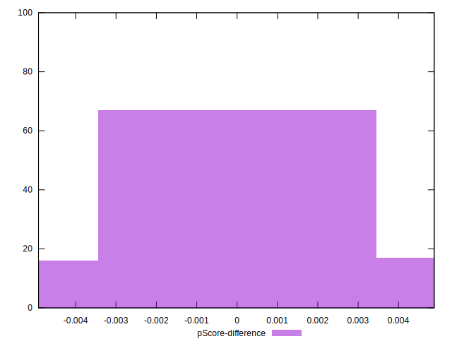