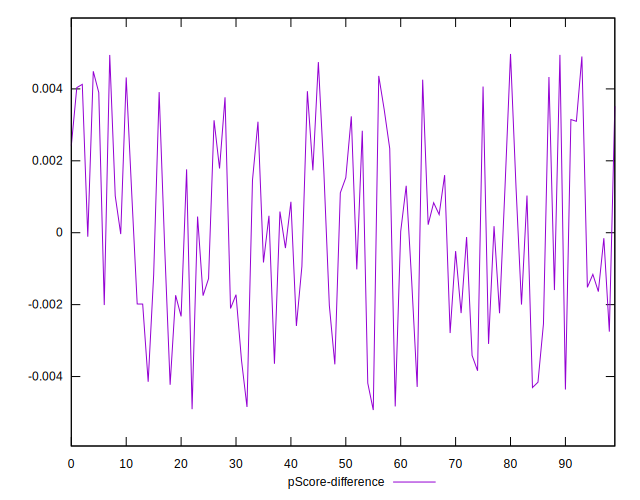

# //interactive/samples/pages+cached

[→ Parent](../..)


## Raw


```yaml
p90min: 14520.024999999998
p90max: 18185.6855
p90range: 3665.660500000002
p90mean: 15947.64879787233
p90median: 15683.545000000002
p90stdev: 1040.8307648424438
p90skewness: 0.509502779291456
p90eccentricity: 0.9999999999999996
p90discretization: 1
outlandishness: 1.0030298854834379
confidence: 448.563345946634
p90confidence: 420.8179733592647

```


## Score


```yaml
p90min: 0.04
p90max: 0.09
p90range: 0.049999999999999996
p90mean: 0.06542553191489363
p90median: 0.07
p90stdev: 0.015413788633435175
p90skewness: -0.14965737632690385
p90eccentricity: 1.0000000000000016
p90discretization: 15.666666666666666
outlandishness: 1.0053404444444438
confidence: 0.006613419202567991
p90confidence: 0.006231944244549825

```


## Raw Estimate


## Score Estimate


## P Score


```yaml
p90min: 0.03746387984864752
p90max: 0.0898472496801101
p90range: 0.05238336983146258
p90mean: 0.06566095066980177
p90median: 0.0678372855643983
p90stdev: 0.015280169887314144
p90skewness: -0.21657781310548907
p90eccentricity: 0.9999999999999992
p90discretization: 1
outlandishness: 1.000791799686918
confidence: 0.0065441519192236085
p90confidence: 0.006177920889509998

```


## Score Difference


```yaml
p90min: 0
p90max: 0
p90range: 0
p90mean: 0
p90median: 0
p90stdev: 0
p90skewness: .nan
p90eccentricity: .nan
p90discretization: 94
outlandishness: .nan
confidence: 0
p90confidence: 0

```


## P Score Difference


```yaml
p90min: -0.004832150231700548
p90max: 0.004901367424148706
p90range: 0.009733517655849254
p90mean: 0.00009063205917942863
p90median: 2.6020785116182e-7
p90stdev: 0.0027158351119644375
p90skewness: 0.05583785417431609
p90eccentricity: 1.0000000000000002
p90discretization: 1
outlandishness: 0.9202004312144817
confidence: 0.0011353312919343433
p90confidence: 0.0010980384769543289

```

