# //largest-contentful-paint/samples/pages+cached+noadtech+nomedia

[→ Parent](../..)


## Raw


```yaml
p90min: 7219.720000000001
p90max: 9874.302000000003
p90range: 2654.582000000002
p90mean: 8043.17995744681
p90median: 7891.980750000001
p90stdev: 601.9854542076924
p90skewness: 1.0369004684358345
p90eccentricity: 1.0000000000000002
p90discretization: 1
outlandishness: 1.0081889274047389
confidence: 271.5521872809005
p90confidence: 243.3885578601099

```

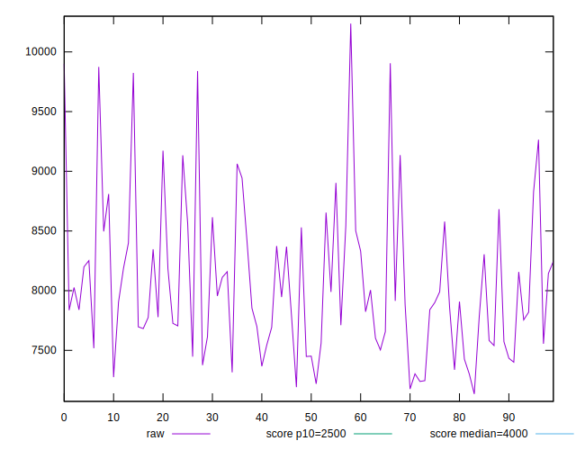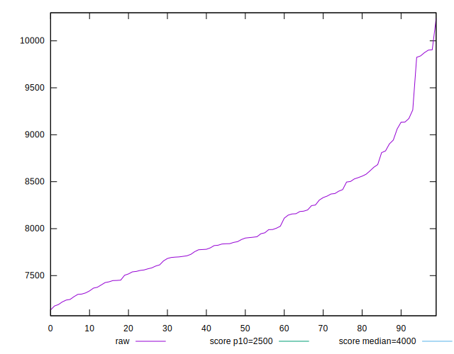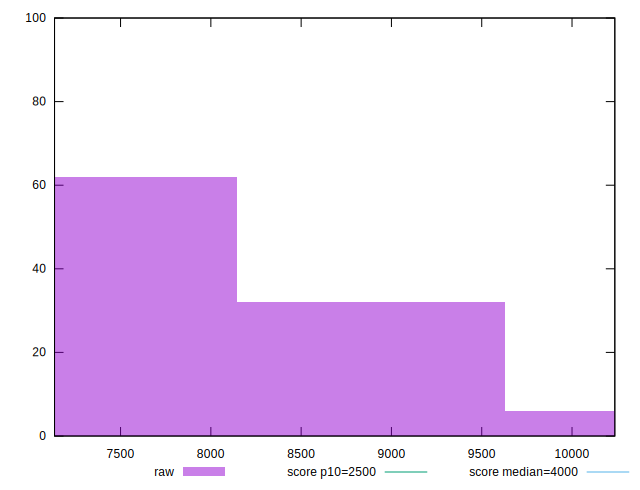
## Score


```yaml
p90min: 0.01
p90max: 0.05
p90range: 0.04
p90mean: 0.03106382978723403
p90median: 0.03
p90stdev: 0.012157484789073752
p90skewness: -0.026371833452152847
p90eccentricity: 0.9999999999999983
p90discretization: 18.8
outlandishness: 1.0087863389003562
confidence: 0.005149299502258451
p90confidence: 0.004915389017020989

```

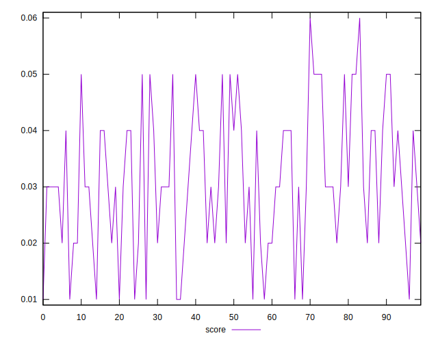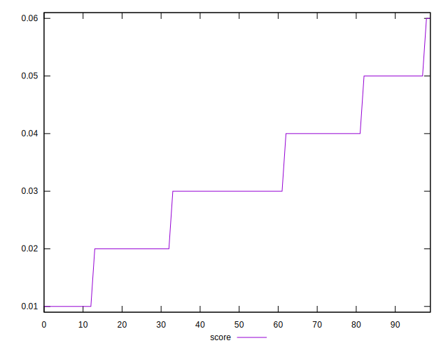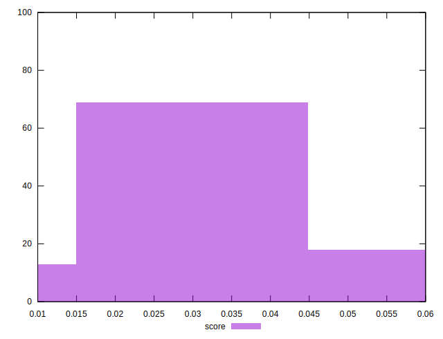
## Raw Estimate

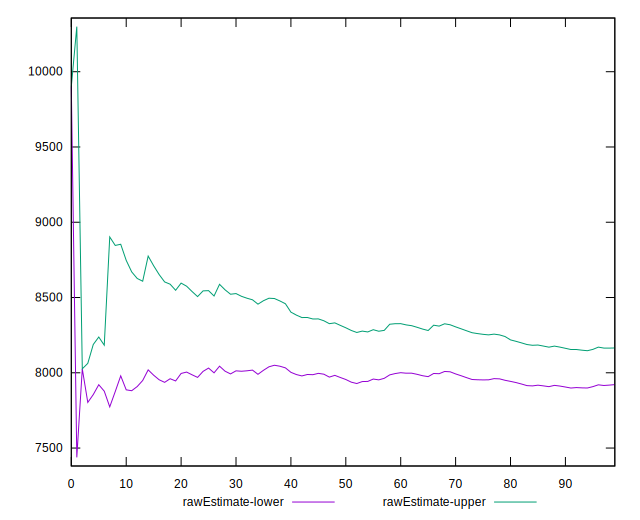
## Score Estimate

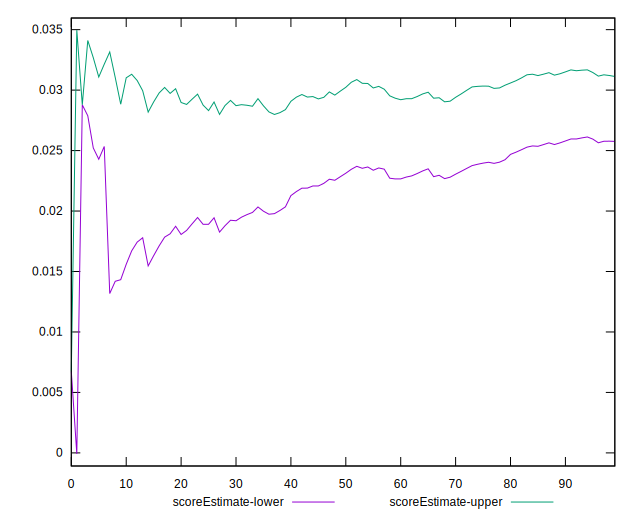
## P Score


```yaml
p90min: 0.006870875829038947
p90max: 0.053680740925903636
p90range: 0.04680986509686469
p90mean: 0.031165985557805267
p90median: 0.03194703497530091
p90stdev: 0.011929510887844882
p90skewness: -0.07762885168327267
p90eccentricity: 1
p90discretization: 1
outlandishness: 0.999550932694805
confidence: 0.005123471897633545
p90confidence: 0.004823216957609908

```

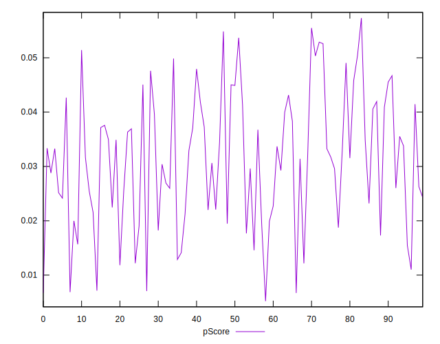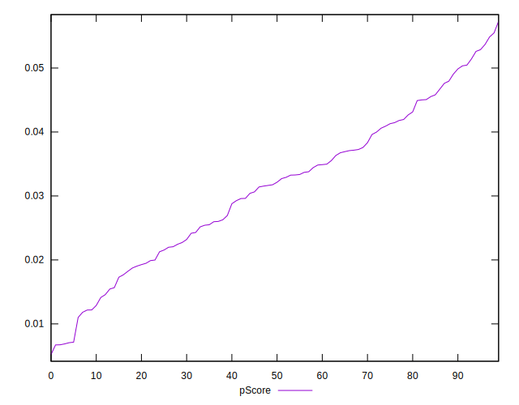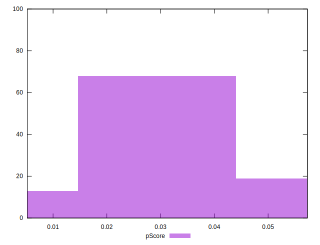
## Score Difference


```yaml
p90min: 0
p90max: 0
p90range: 0
p90mean: 0
p90median: 0
p90stdev: 0
p90skewness: .nan
p90eccentricity: .nan
p90discretization: 94
outlandishness: .nan
confidence: 0
p90confidence: 0

```


## P Score Difference


```yaml
p90min: -0.004801004506369213
p90max: 0.004852421448032482
p90range: 0.009653425954401695
p90mean: -0.00004390957773869024
p90median: 0.00016182595354983717
p90stdev: 0.00282734256000081
p90skewness: -0.08508850357150588
p90eccentricity: 0.9999999999999996
p90discretization: 1
outlandishness: 0.8724195996852099
confidence: 0.001173869709987173
p90confidence: 0.0011431220197185871

```

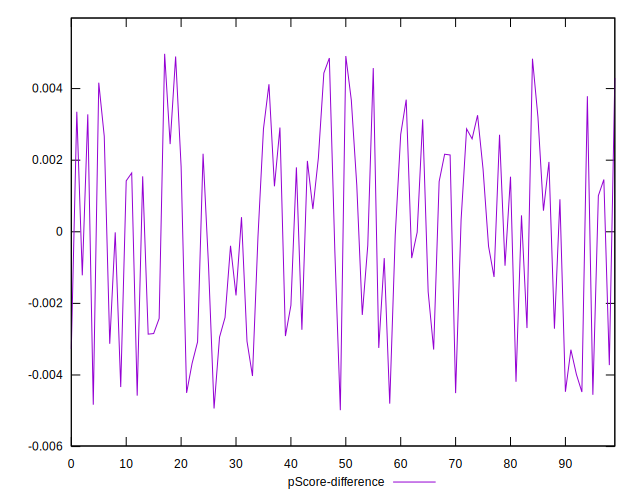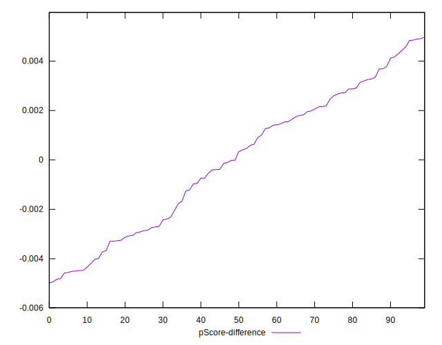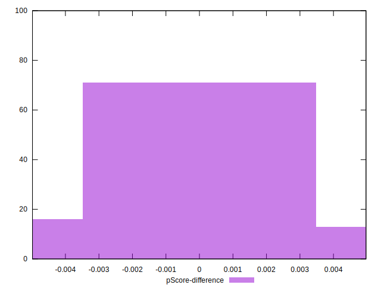